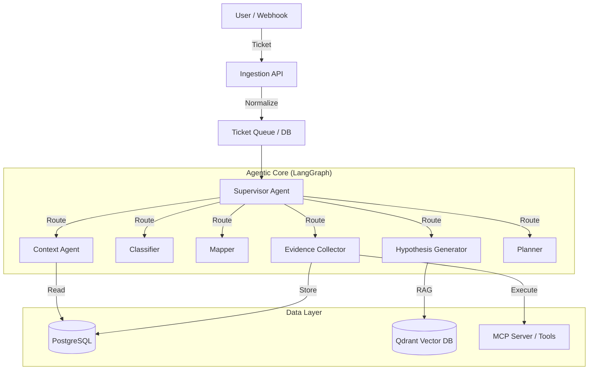

# Support AI Agent Framework (L1/L2)

A modular, multi-agent framework designed to automate L1/L2 technical support. It leverages **LangGraph** for stateful orchestration, **MCP (Model Context Protocol)** for secure tool execution, and a **Strict Multi-Tenant** architecture for data isolation.

### 📚 Documentation

*   [**Architecture Overview**](README.md#architecture)
*   [**API & Frontend Integration Guide**](docs/api_integration.md): How to use the Async Webhook and Polling pattern.
*   [**MCP Integration Guide**](docs/mcp_integration.md): How to add tools.
*   [**Evidence Collector Logic**](docs/evidence_collector_technical.md): Deep dive into the "Smart Selection" agent.
*   [**Adaptive Execution & Learning**](docs/architecture/002_adaptive_execution_learning.md): How the agent learns from tool errors using RAG.
*   [**Onboarding Plan**](onboarding_plan.md)

## 🏗️ Architecture Overview

The system is divided into a **Control Plane** (Tenant Management) and a **Data Plane** (Ticket Resolution).



### Key Components

| Component | Responsibility |
| :--- | :--- |
| **Supervisor** | Orchestrates the workflow, managing state and iterations. |
| **Context Agent** | Fetches customer-specific inventory, baselines, and constraints. |
| **Classifier** | Determines the technical domain (Network, Database, Auth) and severity. |
| **Evidence Collector** | Safely executes read-only tools via MCP to gather diagnostics. Uses **Smart Targeting** to distinguish between executor devices and targets. |
| **Audit System** | "Bitacora" that logs every agent step and tool call for compliance. |
| **Response Agent** | Synthesizes a structured **Engineering Report** with context, diagnosis, and remediation plans. |
| **Investigator** | Verifies hypotheses using ROLE-BASED argument sanitization to prevent hallucinations. |

### ✨ Key Features

*   **Case-Based Reasoning (SOTA RAG)**: Agents consult a Qdrant Vector database of past resolved tickets to prioritize successful remediation plans over generic troubleshooting.
*   **Adaptive Tool Execution**: If an MCP tool fails due to missing parameters, the system queries the Vector DB for documented fixes and auto-recovers mid-flight.
*   **Smart Device Targeting**: Intelligently distinguishes between the device *executing* a command (firewall) and the *target* (subnet/IP) to prevent "Device NOT FOUND" errors.
*   **Active Diagnosis Loop**: Autonomous cycle of `Hypothesis` -> `Plan` -> `Investigate` -> `Verify` until a high-confidence root cause is found.
*   **Supervisor Quality Control**: evaluating the quality of the diagnosis before closing the ticket. If the confidence is low, it loops back for more evidence.
*   **Structured Engineering Reports**: Output is not just a chat summary but a professional technical document ready for IT Operations.
*   **Asynchronous Frontend-Ready API**: Uses the REST Async Job pattern (HTTP 202) for integrating securely with long-running Webhooks or UIs.


---

## 🚀 Getting Started

### Prerequisites

*   **Python 3.12+**
*   **Docker** (for Postgres & Qdrant)
*   **uv** (Fast Python Package Manager)

### 1. Installation

Clone the repository and sync dependencies:

```bash
git clone <repo-url>
cd support_ai_agent
uv sync
```

### 2. Configuration

Create a `.env` file in the root directory:

```ini
# Application
APP_ENV=development
LOG_LEVEL=INFO

# Database (PostgreSQL)
DB_HOST=127.0.0.1
DB_PORT=5432
DB_USER=postgres
DB_PASS=change_me_strong
DB_NAME=app

# Vector Store (Qdrant)
QDRANT_URL=http://127.0.0.1:6333

# LLM Governance
OPENAI_API_KEY=sk-...
LLM_MAIN_MODEL=gpt-4o
LLM_FAST_MODEL=gpt-4o-mini
```

### 3. Database Initialization

Start your infrastructure (e.g., via `docker-compose`) and then run:

```bash
# 1. Run Migrations (Create Tables)
uv run alembic upgrade head

# 2. Initialize Vector Collections
uv run python src/main.py init-db
```

### 4. Seed Data (Multi-Tenancy)

Register a tenant and seed their context/inventory:

```bash
# Register 'fake_client'
uv run python src/main.py register-tenant --file data/tenants/fake_client/tenant.yaml

# Seed Context (Inventory, Topology)
uv run python src/main.py seed-context --file data/tenants/fake_client/context.yaml
```

---

## 🏃 Usage

### Running an End-to-End Test

Simulate an incoming ticket (CLI Mode) using the new testing mock wrapper:

```bash
uv run python run_mock.py --file ticket_prueba.txt --fast
```

This will:
1.  Create a mock ticket from `fake_client`.
2.  Spin up the Agent Graph.
3.  Execute the full Triage Pipeline (Context -> Classify -> Scope -> Evidence -> Plan).
4.  Print the **Final Answer** and **Resolution Plan**.
5.  Log all steps to the Audit System.

### Starting the API

To accept real webhooks:

```bash
uv run uvicorn src.ingestion.api:app --reload
```

---

## 🛡️ Security & Governance

*   **LLM Profiles**: Configurable via `.env` (`LLM_MAIN_MODEL`, `LLM_FAST_MODEL`) to balance cost vs. reasoning power.
*   **Audit Trail**: Every agent action is logged to the `agent_runs` and `agent_events` tables.
*   **Strict Isolation**: All data queries are scoped by `customer_id`.

## 📂 Project Layout

```text
src/
├── agents/         # Agent Logic (LangGraph Nodes)
├── core/           # Data Models, ORM, Audit Service
├── capabilities/   # Tool Definitions
├── ingestion/      # API & Normalization
├── mcp/            # MCP Client Integration
└── utils/          # Helpers (Seeding, Logging)
```
