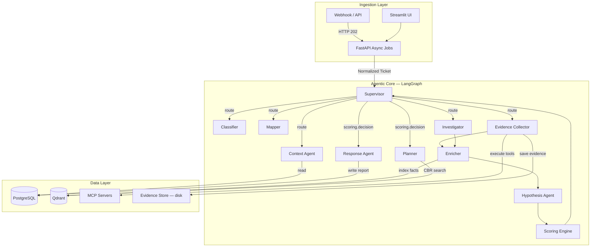

# Support AI Agent Framework

A production-grade, multi-agent system that automates **L1/L2 technical support** for IT infrastructure. Built on **LangGraph** for stateful orchestration, **MCP (Model Context Protocol)** for secure tool execution, and a strict **multi-tenant** architecture with per-tenant data isolation.

---

## Architecture



### Agent Flow

| Step | Agent | Reads | Writes | Doc |
|:---|:---|:---|:---|:---|
| 1 | **Supervisor** | `meta.iterations` | `meta.iterations` | [docs/agents/supervisor.md](docs/agents/supervisor.md) |
| 2 | **Context Agent** | `customer_id` | `client_context` (inventory, baselines) | [docs/agents/context_agent.md](docs/agents/context_agent.md) |
| 3 | **Classifier** | `ticket.text` | `classification` (domains, confidence) | [docs/agents/classifier.md](docs/agents/classifier.md) |
| 4 | **Mapper** | `ticket`, `client_context` | `components` (devices, services) | [docs/agents/mapper.md](docs/agents/mapper.md) |
| 5 | **Evidence Collector** | `components`, `ticket` | `evidence_refs` (tool outputs) | [docs/agents/evidence_collector.md](docs/agents/evidence_collector.md) |
| 6 | **Enricher** | `evidence_refs`, `facts` | `facts` (key-value + ATT&CK mapping) | [docs/agents/enricher.md](docs/agents/enricher.md) |
| 7 | **Hypothesis Agent** | `facts`, `ticket` | `hypotheses` (ranked, with status) | [docs/agents/hypothesis.md](docs/agents/hypothesis.md) |
| 8 | **Scoring Engine** | `hypotheses`, `evidence_refs`, `facts`, `ticket.severity` | `scoring` (risk, confidence, decision gate) | — |
| 9 | **Investigator** | `hypotheses`, `components` | `evidence_refs`, `hypotheses.status` | [docs/agents/investigator.md](docs/agents/investigator.md) |
| 10 | **Planner** | `ticket`, `hypotheses`, `facts`, `evidence_refs` | `plan` (diagnosis, remediation, rollback) | [docs/agents/planner.md](docs/agents/planner.md) |
| 11 | **Response Agent** | entire state | `final_answer`, `handoff` | [docs/agents/response.md](docs/agents/response.md) |

### Sub-chains

The graph defines fixed edge chains that bypass the supervisor:

```
evidence_collector → enricher → hypothesis → scoring → supervisor
investigator       → enricher → hypothesis → scoring → supervisor
```

This means every evidence-gathering action automatically triggers fact extraction, hypothesis update, and risk scoring before the supervisor re-evaluates.

---

## Scoring / Decision Engine

The scoring agent runs after every hypothesis update and produces a **deterministic** (no LLM call) decision:

| Output | Description |
|:---|:---|
| `risk_score` (1-10) | `severity_weight × (2.0 − confidence) × 2.5` |
| `confidence` (0-1.0) | Weighted: 50% hypothesis confidence + 30% evidence coverage + 20% fact density |
| `decision` | `proceed_to_plan` · `needs_more_evidence` · `escalate_to_human` |

**Thresholds:** confidence ≥ 0.7 → proceed, < 0.3 on critical/high → escalate.

---

## Key Features

- **Case-Based Reasoning (CBR):** The planner queries Qdrant for past resolved tickets to learn from historical fixes before generating a new plan.
- **Adaptive Tool Execution:** If a tool fails, the `AdaptiveExecutor` queries the vector DB for documented fixes and auto-recovers. Learned fixes are persisted for future use. See [Adaptive Execution & Learning](docs/architecture/002_adaptive_execution_learning.md).
- **Smart Device Targeting:** Distinguishes between executor devices (firewalls, routers) and targets (subnets, IPs) to prevent argument mismatches. See [Evidence Collector Technical](docs/evidence_collector_technical.md).
- **Tool Governance:** Two-layer safety: keyword blocklist (`is_safe_tool`) + per-tenant `CapabilityScope` ORM allowlists (`is_tool_allowed_for_tenant`).
- **MITRE ATT&CK Enrichment:** The enricher maps evidence to ATT&CK tactics/techniques when applicable.
- **Structured Engineering Reports:** Output is a formatted technical document, not a chat summary.
- **Async API:** REST job pattern (HTTP 202 + polling). See [API Integration Guide](docs/api_integration.md).
- **Full Audit Trail:** Every agent step and tool call is logged to PostgreSQL. See [SOCi Compliance Analysis](docs/architecture/soci_compliance_analysis.md).

---

## Data Layer

### PostgreSQL (Relational)

Managed via Alembic migrations. Key tables:

| Table | Purpose |
|:---|:---|
| `platform_tenants` | Tenant registry (customer_id, plan, status) |
| `capability_scopes` | Per-tenant tool allowlists |
| `tickets` | Normalized ticket storage |
| `agent_runs` | Execution sessions with full `state_json` snapshots |
| `agent_events` | Granular step-by-step audit log |
| `tool_call_audits` | Every tool invocation with args/result |

See [Data Layer Blueprint](docs/planning/data_layer_blueprint.md) for schema details.

### Qdrant (Vector)

5 collections with mandatory `customer_id` isolation and payload indexes:

| Collection | Purpose | Key Indexes |
|:---|:---|:---|
| `knowledge_base` | KB chunks (runbooks, docs) | `customer_id`, `source` |
| `evidence` | Tool output snapshots | `customer_id`, `tool_name`, `run_id` |
| `tool_knowledge` | Learned tool usage insights | `customer_id`, `tool_name` |
| `resolved_tickets` | Past cases for CBR | `customer_id`, `vendor`, `resolution_status` |
| `adaptive_fixes` | Error→fix pairs for self-healing | `customer_id`, `tool_name` |

### MCP (Tool Execution)

Tools are served by external MCP servers (stdio or SSE transport). The system auto-discovers tools at startup via `CapabilityRegistry`. See [MCP Integration Guide](docs/mcp_integration.md).

---

## Getting Started

### Prerequisites

- **Python 3.12+**
- **Docker** (PostgreSQL + Qdrant)
- **uv** (package manager)

### 1. Install

```bash
git clone <repo-url>
cd support_ai_agent
uv sync
```

### 2. Configure

Create `.env` in the project root:

```ini
APP_ENV=development
LOG_LEVEL=INFO

# PostgreSQL
DB_HOST=127.0.0.1
DB_PORT=5432
DB_USER=postgres
DB_PASS=change_me
DB_NAME=support_agent_db

# Qdrant
QDRANT_URL=http://127.0.0.1:6333

# LLM (per-agent model governance)
OPENAI_API_KEY=sk-...
LLM_MODEL_CLASSIFIER=gpt-5-nano
LLM_MODEL_INVESTIGATOR=gpt-5.2
LLM_MODEL_PLANNER=gpt-5.2
LLM_MODEL_RESPONSE=gpt-4o-mini
LLM_REASONING_EFFORT=low
```

See `src/config.py` for the full list of configurable models per agent.

### 3. Initialize

```bash
# PostgreSQL schema
uv run alembic upgrade head

# Qdrant collections + indexes
uv run python -m src.utils.init_qdrant

# Register a tenant
uv run python src/main.py register-tenant --file data/tenants/fake_client/tenant.yaml

# Seed context
uv run python src/main.py seed-context --file data/tenants/fake_client/context.yaml
```

### 4. Run

**CLI test (mock ticket):**

```bash
uv run python run_mock.py --file ticket_prueba.txt --fast
```

**Web stack:**

```bash
# Terminal 1: API
uv run uvicorn src.ingestion.api:app --reload

# Terminal 2: UI
uv run streamlit run streamlit_app.py
```

---

## Project Layout

```
src/
├── agents/              # LangGraph node functions
│   ├── supervisor.py    # Orchestration + routing
│   ├── scoring.py       # Decision engine (risk/confidence gate)
│   ├── context_agent.py # Tenant context fetcher
│   ├── classifier.py    # Domain classification
│   ├── mapper.py        # Component identification
│   ├── evidence_collector.py  # Tool execution loop
│   ├── enricher.py      # Fact extraction + ATT&CK mapping
│   ├── hypothesis.py    # Root cause hypothesis generation
│   ├── investigator.py  # Hypothesis verification via tools
│   ├── planner.py       # Resolution plan generation (CBR)
│   └── response.py      # Final report + HITL handler
├── core/
│   ├── models.py        # Pydantic models + GlobalState TypedDict
│   ├── qdrant.py        # Vector store (tenant-aware, indexed)
│   ├── safety.py        # Tool safety + governance checks
│   ├── evidence_store.py # Content-addressable evidence (disk + Qdrant)
│   ├── adaptive_executor.py # Self-healing tool execution
│   ├── audit.py         # Audit service (PostgreSQL)
│   ├── orm.py           # SQLAlchemy ORM models
│   ├── database.py      # Async PostgreSQL engine
│   ├── registry.py      # MCP tool discovery
│   └── llm.py           # Per-agent LLM factory
├── retrieval/
│   └── case_retriever.py # CBR: past case search + ranking
├── ingestion/
│   └── api.py           # FastAPI async job endpoints
├── mcp/
│   └── client.py        # MCP transport (stdio/SSE)
├── capabilities/        # Tool definitions
└── utils/               # Seeding, init, helpers

docs/
├── agents/              # Per-agent documentation (10 files)
├── architecture/        # ADRs and system design
├── planning/            # Implementation plans and blueprints
├── api_integration.md   # Webhook/polling guide
├── mcp_integration.md   # How to add MCP tools
└── evidence_collector_technical.md  # Smart targeting deep dive
```

---

## Documentation Index

### Agents
| Agent | Doc |
|:---|:---|
| Supervisor | [docs/agents/supervisor.md](docs/agents/supervisor.md) |
| Context Agent | [docs/agents/context_agent.md](docs/agents/context_agent.md) |
| Classifier | [docs/agents/classifier.md](docs/agents/classifier.md) |
| Mapper | [docs/agents/mapper.md](docs/agents/mapper.md) |
| Evidence Collector | [docs/agents/evidence_collector.md](docs/agents/evidence_collector.md) |
| Enricher | [docs/agents/enricher.md](docs/agents/enricher.md) |
| Hypothesis | [docs/agents/hypothesis.md](docs/agents/hypothesis.md) |
| Investigator | [docs/agents/investigator.md](docs/agents/investigator.md) |
| Planner | [docs/agents/planner.md](docs/agents/planner.md) |
| Response | [docs/agents/response.md](docs/agents/response.md) |

### Architecture & Design
| Topic | Doc |
|:---|:---|
| Adaptive Execution & Learning | [docs/architecture/002_adaptive_execution_learning.md](docs/architecture/002_adaptive_execution_learning.md) |
| Investigator Flow | [docs/architecture/003_adaptive_investigator_flow.md](docs/architecture/003_adaptive_investigator_flow.md) |
| Agent Communication Analysis | [docs/architecture/004_agent_communication_analysis.md](docs/architecture/004_agent_communication_analysis.md) |
| SOCi Compliance | [docs/architecture/soci_compliance_analysis.md](docs/architecture/soci_compliance_analysis.md) |
| Data Layer Blueprint | [docs/planning/data_layer_blueprint.md](docs/planning/data_layer_blueprint.md) |
| Model Governance | [docs/planning/model_governance.md](docs/planning/model_governance.md) |

### Integration
| Topic | Doc |
|:---|:---|
| API (Async Jobs) | [docs/api_integration.md](docs/api_integration.md) |
| MCP Tools | [docs/mcp_integration.md](docs/mcp_integration.md) |
| Evidence Collector Technical | [docs/evidence_collector_technical.md](docs/evidence_collector_technical.md) |
