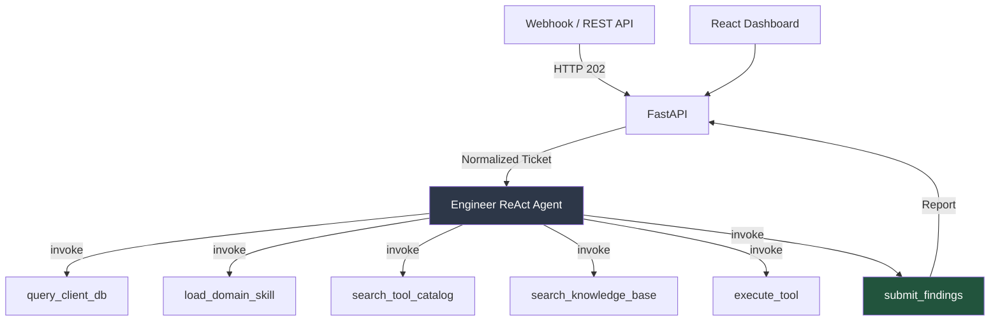

# Documentation Index

> Single-agent L1/L2 technical support framework. Engineer ReAct agent with meta-tools, MCP read-only tool execution, multi-tenant isolation.

**Start here:** [Setup / Quickstart](setup/quickstart.md)

## Pipeline

## Table of Contents

### Setup
| Doc | Description |
|---|---|
| [Quickstart](setup/quickstart.md) | Clone, configure, migrate, run |
| [Configuration](setup/configuration.md) | Full env var reference from `src/config.py` |
| [Deployment](setup/deployment.md) | Docker, production, scaling |

### Architecture
| Doc | Description |
|---|---|
| [Overview](architecture/overview.md) | System components, data flow, tech stack |
| [Data Layer](architecture/data_layer.md) | PostgreSQL + Qdrant schema, tenant isolation |
| [Observability](architecture/observability.md) | Langfuse integration, trace/span model |
| [Safety and Governance](architecture/safety_and_governance.md) | Tool safety, blocked keywords, HITL gates |

### Agent
| Doc | Description |
|---|---|
| [Engineer](agents/engineer.md) | ReAct agent: meta-tools, skills system, reasoning loop |

### Integrations
| Doc | Description |
|---|---|
| [API Reference](integrations/api_reference.md) | REST endpoints, payloads, lifecycle |
| [MCP Tools](integrations/mcp_tools.md) | MCP server setup, tool discovery, capability packs |
| [Webhooks](integrations/webhooks.md) | Webhook ingestion flow, normalizers |

### Planning (Design Specs)
| Doc | Description |
|---|---|
| [Redesign Minimal Agent Architecture](planning/Redesign%20Minimal%20Agent%20Architecture.md) | Engineer ReAct architecture design |
| [Skills Implementation](planning/skills_implementation.md) | Domain skill system design |
| [Data Layer Blueprint](planning/data_layer_blueprint.md) | Data layer design decisions |
| [Model Governance](planning/model_governance.md) | LLM model selection rationale |
| [Onboarding Plan](planning/onboarding_plan.md) | Tenant onboarding process |

### Legacy
| Doc | Description |
|---|---|
| [Legacy Agents](legacy/) | Old 13-agent pipeline documentation (archived) |
