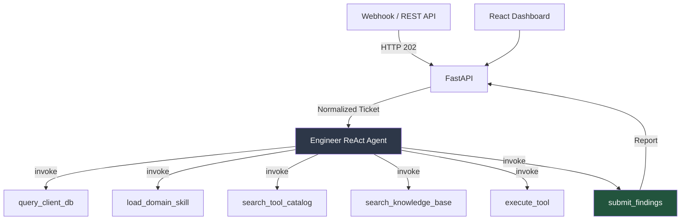

# Documentation Index

> Single-agent L1/L2 technical support framework. Engineer ReAct agent with meta-tools, MCP read-only tool execution, multi-tenant isolation.

**Start here:** [Setup / Quickstart](setup/quickstart.md)

## Pipeline

## Table of Contents

### Setup
| Doc | Description |
|---|---|
| [Quickstart](setup/quickstart.md) | Clone, configure, migrate, run |
| [Configuration](setup/configuration.md) | Full env var reference from `src/config.py` |
| [Deployment](setup/deployment.md) | Docker, production, scaling |

### Operations (Runbooks)
| Doc | Description |
|---|---|
| [Operations Manual index](operations/README.md) | All runbooks, grouped by daily vs maintenance |
| [CLI Reference](operations/cli_reference.md) | Every CLI command, utility module, and script |
| [Tenant Onboarding](operations/tenant_onboarding.md) | New customer end to end |
| [API Keys & Users](operations/api_keys_and_users.md) | Admin bootstrap, JWT users, key lifecycle |
| [Ticket Operations](operations/ticket_operations.md) | Submit, follow, interpret, triage |
| [Tool Catalog](operations/tool_catalog.md) | Indexing lifecycle, forced re-index |
| [Database Migrations](operations/database_migrations.md) | Alembic procedures |
| [Docker Compose](operations/docker_compose.md) | Stack ops, observability profile, scaling |
| [Gateway Operations](operations/gateway_operations.md) | Run modes, name-freeze, add a device |
| [Gateway Secrets](operations/gateway_secrets.md) | Token encryption, master key rotation |
| [Gateway Upgrades](operations/gateway_upgrades.md) | Add appliance pack, upgrade fastmcp |
| [Backup & Restore](operations/backup_restore.md) | PG + Qdrant + evidence DR |
| [Production Redeploy](operations/production_redeploy.md) | Safe upgrade of a running deployment, rollback |

### Architecture
| Doc | Description |
|---|---|
| [Overview](architecture/overview.md) | System components, data flow, tech stack (1 page) |
| [Components Guide](architecture/components.md) | How each component works, medium depth |
| [MCP Gateway](architecture/mcp_gateway.md) | OpenAPI→MCP gateway: appliance packs, name-freeze, inventory |
| [Data Layer](architecture/data_layer.md) | PostgreSQL + Qdrant schema, tenant isolation |
| [Observability](architecture/observability.md) | Langfuse integration, trace/span model |
| [Safety and Governance](architecture/safety_and_governance.md) | Tool safety, blocked keywords, access model |

### Agent
| Doc | Description |
|---|---|
| [Engineer](agents/engineer.md) | ReAct agent: meta-tools, skills system, reasoning loop |

### Modules
| Doc | Description |
|---|---|
| [Device Assessments](assessments.md) | Deterministic definition-driven assessments: collection, evaluation, scoring, reporting |
| [Outbound Notifications](notifications.md) | n8n webhook egress: `ticket.ingested` / `run.completed` events, persisted deliveries, manual resend |

### Integrations
| Doc | Description |
|---|---|
| [API Reference](integrations/api_reference.md) | All HTTP surfaces: Platform API, legacy webhook ingestion, gateway admin API |
| [MCP Tools](integrations/mcp_tools.md) | MCP server setup, tool discovery, capability packs |

### Planning (Active)
| Doc | Description |
|---|---|
| [Planning index](planning/README.md) | Folder purpose, contents, archive policy |
| [Roadmap](planning/roadmap.md) | Planned work: report export service (MD → HTML / plain text) |

`planning/assessment/` holds the Device Assessment module's source material (the FortiGate hardening manual is path-referenced by the definition YAMLs — do not move it).

### Legacy (Archived)
| Doc | Description |
|---|---|
| [Legacy Agents](legacy/agents/README.md) | Old 13-agent pipeline documentation |
| [Legacy Planning Specs](legacy/planning/) | Implemented/superseded design specs: minimal-agent redesign, skills system, data layer blueprint, model governance, onboarding, skill drafts, legacy tool-selection designs |
| [Tool Selection Pipeline](legacy/architecture/tool_selection_pipeline.md) | Legacy 4-phase ToolSelector design |
| [Adaptive Execution](legacy/architecture/adaptive_execution.md) | Legacy self-healing executor |
