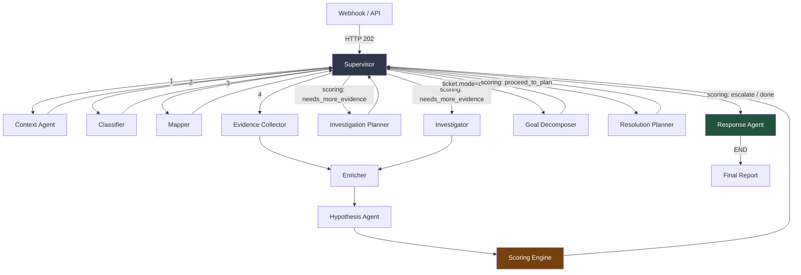

# Documentation Index

> Multi-agent L1/L2 technical support framework. LangGraph orchestration, MCP read-only tools, multi-tenant isolation.

**Start here:** [Setup / Quickstart](setup/quickstart.md)

## Pipeline

## Table of Contents

### Setup
| Doc | Description |
|---|---|
| [Quickstart](setup/quickstart.md) | Clone, configure, migrate, run |
| [Configuration](setup/configuration.md) | Full env var reference from `src/config.py` |
| [Deployment](setup/deployment.md) | Docker, production, scaling |
| [Frontend Setup](setup/quickstart.md#8-frontend-dashboard) | Dashboard dev/prod setup |

### Architecture
| Doc | Description |
|---|---|
| [Overview](architecture/overview.md) | System components, data flow, tech stack |
| [Data Layer](architecture/data_layer.md) | PostgreSQL + Qdrant schema, tenant isolation |
| [Observability](architecture/observability.md) | Langfuse integration, trace/span model |
| [Safety and Governance](architecture/safety_and_governance.md) | Tool safety, blocked keywords, HITL gates |
| [Adaptive Execution](architecture/adaptive_execution.md) | Self-healing executor, learning loop |

### Agents
| Doc | Description |
|---|---|
| [Agent Index](agents/README.md) | Pipeline table, routing logic, links to all agents |
| [Supervisor](agents/supervisor.md) | Orchestration and routing |
| [Context Agent](agents/context_agent.md) | Tenant context loading |
| [Classifier](agents/classifier.md) | Domain classification |
| [Mapper](agents/mapper.md) | Component identification |
| [Evidence Collector](agents/evidence_collector.md) | Tool discovery and execution |
| [Enricher](agents/enricher.md) | Fact and topology extraction |
| [Hypothesis](agents/hypothesis.md) | Root cause generation, path analysis |
| [Investigation Planner](agents/investigation_planner.md) | Structured question planning |
| [Goal Decomposer](agents/goal_decomposer.md) | Change/request ticket decomposition |
| [Investigator](agents/investigator.md) | Hypothesis verification |
| [Scoring](agents/scoring.md) | Decision gate (deterministic) |
| [Resolution Planner](agents/resolution_planner.md) | Remediation plan generation |
| [Response](agents/response.md) | Final report and HITL handler |

### Integrations
| Doc | Description |
|---|---|
| [API Reference](integrations/api_reference.md) | REST endpoints, payloads, lifecycle |
| [MCP Tools](integrations/mcp_tools.md) | MCP server setup, tool discovery, capability packs |
| [Webhooks](integrations/webhooks.md) | Webhook ingestion flow, normalizers |

### Planning (Design Specs)
| Doc | Description |
|---|---|
| [Framework Spec](planning/framework_spec.md) | Architecture bible (detailed design) |
| [Data Layer Blueprint](planning/data_layer_blueprint.md) | Data layer design decisions |
| [Model Governance](planning/model_governance.md) | LLM model selection rationale |
| [Onboarding Plan](planning/onboarding_plan.md) | Tenant onboarding process |
| [Tool Selector Design](planning/tool_selector_design.md) | Semantic tool selection pipeline |
| [Implementation Plan](planning/implementation_plan.md) | Phase-by-phase implementation roadmap |

### Research (Archive)
| Doc | Description |
|---|---|
| [SOCi Compliance Analysis](research/soci_compliance_analysis.md) | Compliance analysis (Spanish) |
| [Agent Communication Analysis](research/agent_communication_analysis.md) | Agent communication patterns (Spanish) |
| [Multiagent Ticket Analysis](research/multiagent_ticket_analysis.md) | Ticket handling analysis (Spanish) |
| [Observability Frameworks](research/observability_frameworks.md) | Observability research (Spanish) |
| [State of the Art Agents](research/sota_agents.docx) | AI agent architectures survey (Spanish, docx) |
| [Adaptive Investigator Flow](research/adaptive_investigator_flow.md) | Investigator flow design (archived) |
| [Framework v1](research/multiagent_framework_v1.md) | Superseded by framework_spec.md |
