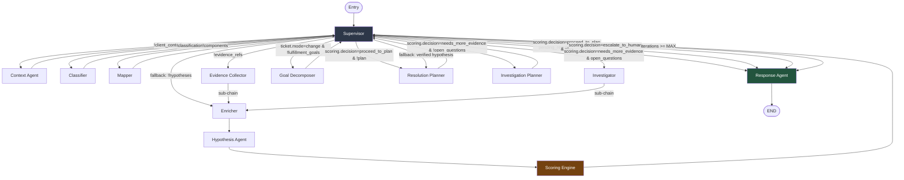
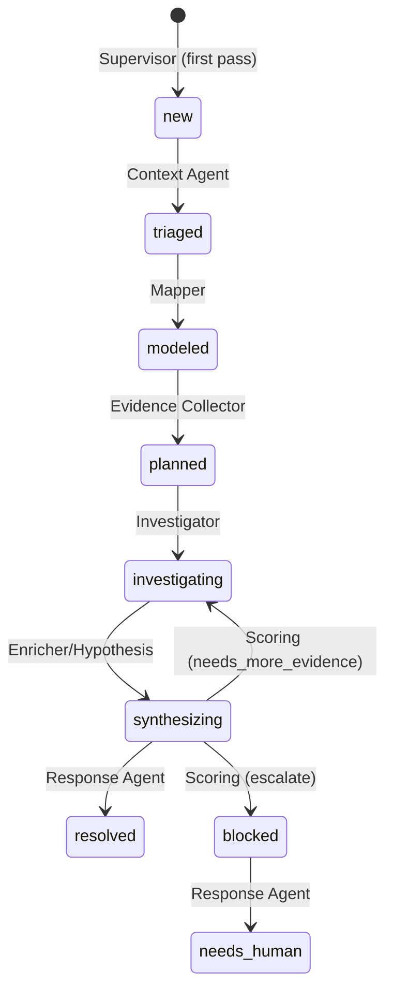

# Agent Pipeline

> 13 specialized agents orchestrated by LangGraph. The Supervisor routes between agents based on state; sub-chains bypass the supervisor for tightly coupled sequences.

## Routing Logic



## Agent Summary

| # | Agent | Node Name | LLM Profile | Reads | Writes |
|---|---|---|---|---|---|
| 1 | [Supervisor](supervisor.md) | `supervisor` | — (deterministic) | `meta`, `scoring`, `case_status` | `meta.iterations`, `case_status` |
| 2 | [Context Agent](context_agent.md) | `context_agent` | `LLM_MODEL_CONTEXT` | `customer_id` | `client_context`, `topology_nodes`, `topology_edges` |
| 3 | [Classifier](classifier.md) | `classifier_agent` | `LLM_MODEL_CLASSIFIER` | `ticket.text` | `classification` |
| 4 | [Mapper](mapper.md) | `mapper_agent` | `LLM_MODEL_MAPPER` | `ticket`, `client_context` | `components` |
| 5 | [Evidence Collector](evidence_collector.md) | `evidence_collector` | `LLM_MODEL_EVIDENCE_COLLECTOR` | `components`, `ticket`, `path_analysis` | `evidence_refs` |
| 6 | [Enricher](enricher.md) | `enricher_agent` | `LLM_MODEL_ENRICHER` | `evidence_refs`, `facts`, `topology_*` | `facts`, `structured_facts`, `topology_nodes`, `topology_edges` |
| 7 | [Hypothesis](hypothesis.md) | `hypothesis_agent` | `LLM_MODEL_HYPOTHESIS` | `facts`, `ticket`, `topology_*`, `baselines`, `known_changes` | `hypotheses`, `path_analysis` |
| 8 | [Scoring](scoring.md) | `scoring_agent` | — (deterministic) | `hypotheses`, `evidence_refs`, `facts`, `ticket.severity`, `open_questions` | `scoring` |
| 9 | [Investigation Planner](investigation_planner.md) | `investigation_planner` | `LLM_MODEL_HYPOTHESIS` | `hypotheses`, `facts`, `evidence_refs` | `open_questions` |
| 10 | [Goal Decomposer](goal_decomposer.md) | `goal_decomposer` | `LLM_MODEL_HYPOTHESIS` | `ticket`, `client_context`, `classification` | `fulfillment_goals` |
| 11 | [Investigator](investigator.md) | `investigator_agent` | `LLM_MODEL_INVESTIGATOR` | `hypotheses`, `open_questions`, `components` | `evidence_refs`, `open_questions.status` |
| 12 | [Resolution Planner](resolution_planner.md) | `planner_agent` | `LLM_MODEL_PLANNER` | `ticket`, `hypotheses`, `facts`, `evidence_refs` | `plan` |
| 13 | [Response](response.md) | `response_agent` | `LLM_MODEL_RESPONSE` | entire state | `final_answer`, `handoff` |

## Sub-Chains

These fixed-edge chains bypass the supervisor for tightly coupled processing:

```
evidence_collector  → enricher → hypothesis → scoring → supervisor
investigator        → enricher → hypothesis → scoring → supervisor
```

Every evidence-gathering action triggers fact extraction, hypothesis update, and scoring before the supervisor re-evaluates.

## Case Status Lifecycle



## See Also

- [Pipeline Diagram](../README.md) - Full system pipeline
- [Architecture Overview](../architecture/overview.md) - System-level design
- [Scoring Decision Gate](scoring.md) - How routing decisions are made
