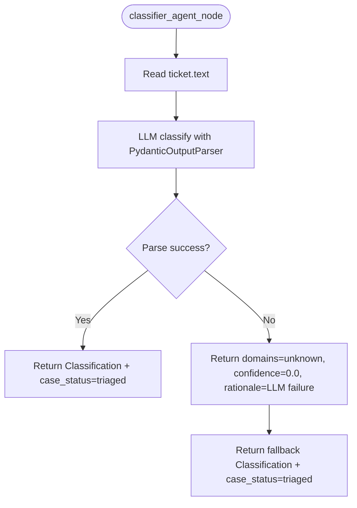

# Classifier Agent

> Classifies the ticket text into one or more technical domains using LLM-driven structured extraction.

## Overview

The classifier agent receives the raw ticket text and determines which IT domains are relevant (e.g., network, auth, database, hardware, application, cloud, security, storage, virtualization, identity, monitoring, devops). It produces a `Classification` object containing the domain list, a confidence score, and a rationale.

The agent is domain-agnostic by design. The prompt does not bias toward any specific technology area; it provides a broad set of example domains and lets the LLM determine the best fit from the ticket content.

Structured output is enforced via `PydanticOutputParser` with the `Classification` model. If LLM output fails to parse, a fallback classification with `domains=["unknown"]` and `confidence=0.0` is returned, ensuring the pipeline always progresses.

## When Called

Routed by the supervisor when `classification` is missing or has empty `domains` (priority 3).

```python
if not state.get("classification") or not state.get("classification").domains:
    return "classifier_agent"
```

Return: Fixed edge to supervisor.

## Flow Diagram



## Input / Output Contract

### Input (read from `GlobalState`)

| Field | Type | Source |
|---|---|---|
| `ticket` | `Ticket` | Ingestion layer (specifically `ticket.text`) |

### Output (written to `GlobalState`)

| Field | Type | Description |
|---|---|---|
| `classification` | `Classification` | Contains `domains: List[str]`, `confidence: float`, `rationale: str` |
| `case_status` | `CaseStatus` | Set to `"triaged"` |

### Input Example

```json
{
  "ticket": {
    "id": "INC-4012",
    "mode": "incident",
    "text": "Users in Building-7 cannot authenticate to file shares since 08:00. Kerberos errors in event logs.",
    "severity": "high",
    "source": "webhook:servicenow"
  }
}
```

### Output Example

```json
{
  "classification": {
    "domains": ["auth", "infrastructure"],
    "confidence": 0.88,
    "rationale": "Kerberos authentication failures indicate an auth-domain issue; NTP/domain-controller involvement points to infrastructure."
  },
  "case_status": "triaged"
}
```

### Where Output Goes

`classification` is consumed by the [Mapper](mapper.md) (domain context for component extraction), [Evidence Collector](evidence_collector.md) (relational detection uses domain list), and [Response Agent](response.md) (report metadata).

## Configuration

| Variable | Default | Description |
|---|---|---|
| `LLM_MODEL_CLASSIFIER` | `gpt-5-nano` | Model used for classification |

## Key Implementation Details

- Uses `LLMFactory.get_model_for_agent("classifier")` to obtain the configured model.
- `PydanticOutputParser` injects format instructions into the prompt automatically.
- The prompt lists example domains but does not constrain output to a fixed enum; any domain string is valid.
- Confidence is a float between 0 and 1, representing the LLM's self-assessed certainty.
- On any exception (network, parsing, model error), the fallback ensures the pipeline does not stall.
- Sets `case_status` to `"triaged"` on both success and failure paths.

## See Also

- [agents/mapper.md](mapper.md)
- [agents/evidence_collector.md](evidence_collector.md)
- [agents/supervisor.md](supervisor.md)
