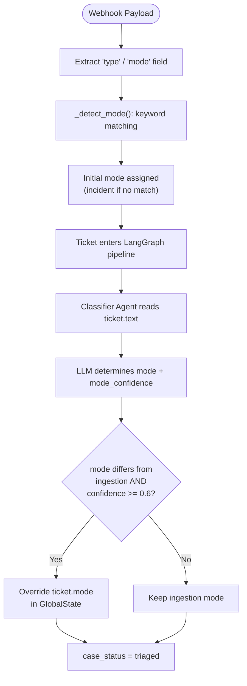
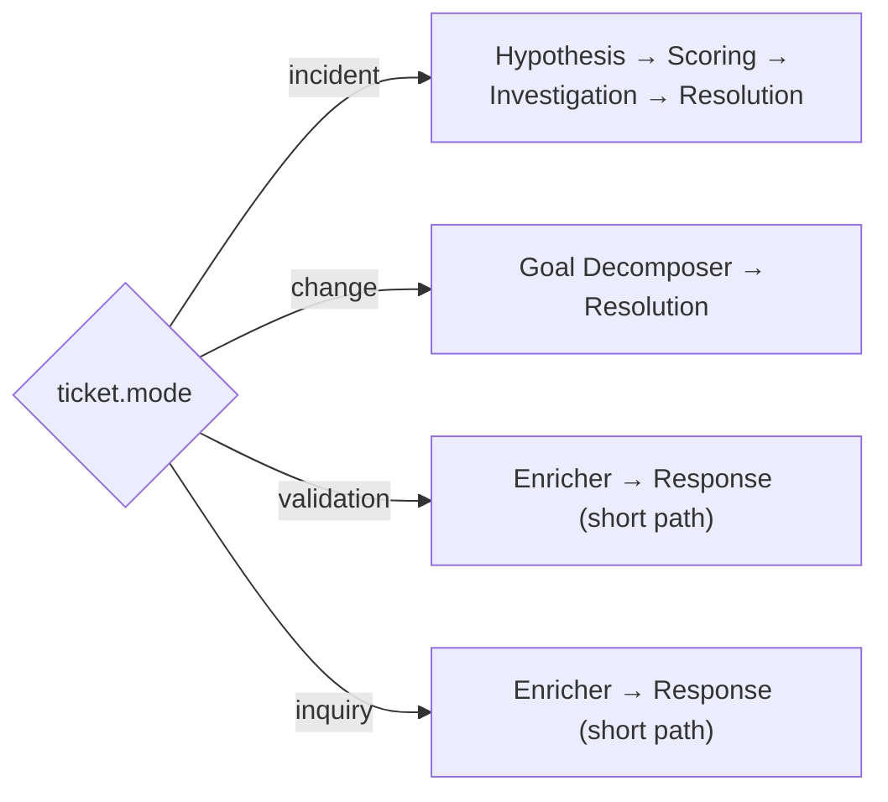
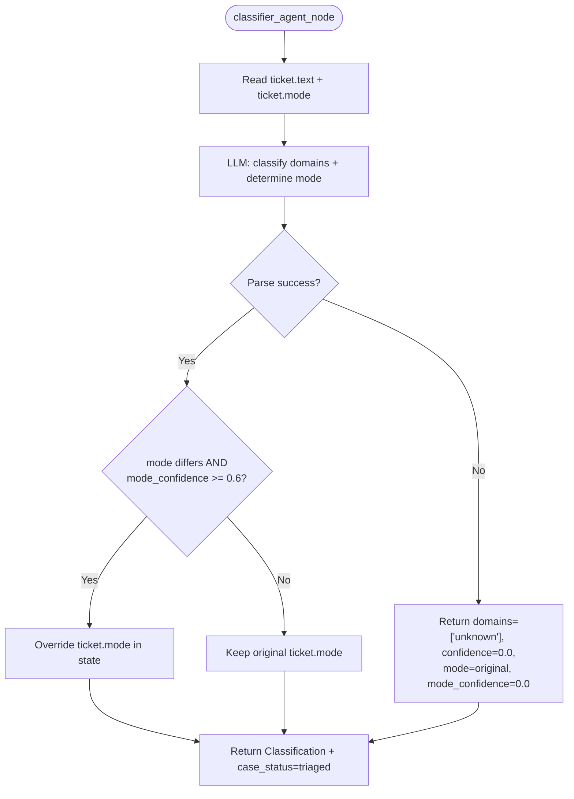

# Classifier Agent

> Classifies the ticket into technical domains and determines the ticket mode (category) using LLM-driven structured extraction, with optional override of the ingestion-assigned mode.

## Overview

The classifier agent performs two classifications on each ticket:

1. **Domain classification** — determines which IT domains are relevant (e.g., network, auth, database, hardware, application, cloud, security, storage, virtualization, identity, monitoring, devops).
2. **Ticket mode (category) selection** — determines the operational intent of the ticket: `incident`, `change`, `validation`, or `inquiry`.

Both classifications are LLM-driven. The agent is domain-agnostic by design: prompts do not bias toward any technology area. Structured output is enforced via `PydanticOutputParser` with the `Classification` model. On failure, a fallback classification ensures the pipeline always progresses.

---

## Ticket Mode (Category) System

### Available Modes

Defined in `src/core/models.py:32`:

```python
TicketMode = Literal["incident", "change", "validation", "inquiry"]
```

| Mode | Intent | Example |
|------|--------|---------|
| `incident` | Something is broken, degraded, or not working as expected. Failures, errors, outages, performance issues. | "Users in Building-7 cannot authenticate to file shares since 08:00." |
| `change` | Request to implement, deploy, modify, provision, upgrade, or migrate. Includes service requests for new resources. | "Add new site-to-site VPN tunnel between FW-MAIN and FW-BRANCH-07." |
| `validation` | Request to verify, audit, or confirm that a configuration, setup, policy, or state is correct and compliant. | "Verify that OSPF routing is configured correctly across all border routers." |
| `inquiry` | Question seeking information, explanation, or documentation about how something works or is configured. | "How is the SSL certificate renewal configured on our load balancers?" |

### Two-Layer Mode Selection

Ticket mode is determined through two sequential stages: a deterministic first-pass at ingestion, followed by an LLM re-evaluation in the classifier agent.

#### Layer 1: Ingestion — Deterministic Keyword Detection

**File:** `src/ingestion/normalizers/generic.py:12-21`

When a ticket is ingested via webhook, the normalizer extracts the `type` or `mode` field from the raw payload and runs keyword matching to assign an initial mode:

```python
_CHANGE_KW = ("change", "implement", "deploy", "provision", "install", "migrate", "upgrade")
_VALIDATION_KW = ("validation", "validate", "verify", "audit", "check", "compliance")
_INQUIRY_KW = ("inquiry", "question", "info", "information", "how", "explain")

def _detect_mode(raw: str) -> TicketMode:
    """Keyword-based first-pass mode detection from the raw type field."""
    s = raw.lower()
    if any(k in s for k in _CHANGE_KW):
        return "change"
    if any(k in s for k in _VALIDATION_KW):
        return "validation"
    if any(k in s for k in _INQUIRY_KW):
        return "inquiry"
    return "incident"
```

Key characteristics:
- Operates on the **metadata field** (`type` / `mode` from the source system), not the ticket body.
- Priority order: `change` > `validation` > `inquiry` > `incident` (first match wins).
- Falls back to `"incident"` when no keywords match or the field is absent.
- Purely deterministic — no LLM involved.

The normalizer reads the field at `src/ingestion/normalizers/generic.py:34`:

```python
mode_str = raw_data.get("type", raw_data.get("mode", "incident"))
mode: TicketMode = _detect_mode(mode_str)
```

#### Layer 2: Classifier Agent — LLM Re-evaluation and Override

**File:** `src/agents/classifier.py:10-56`

The classifier agent analyzes the **full ticket text** (not just the metadata field) and independently determines the mode. If the LLM's confidence meets the override threshold, it replaces the ingestion-assigned mode.

**Override threshold:**

```python
_MODE_OVERRIDE_THRESHOLD = 0.6
```

**Override logic:**

```python
if (classification.mode_confidence >= _MODE_OVERRIDE_THRESHOLD
        and classification.mode != ticket.mode):
    result["ticket"] = ticket.model_copy(update={"mode": classification.mode})
```

This means:
- If the classifier agrees with ingestion, no change occurs regardless of confidence.
- If the classifier disagrees but confidence < 0.6, the ingestion mode is preserved.
- If the classifier disagrees and confidence >= 0.6, the mode is overridden and the updated ticket is written to `GlobalState`.

On classification failure (exception), the fallback preserves the original ticket mode with `mode_confidence=0.0`.

### Mode Selection Flow



### Mode in the Classification Model

The `Classification` model (`src/core/models.py:206-212`) carries both the domain and mode results:

```python
class Classification(BaseModel):
    domains: List[str] = Field(default_factory=list)
    confidence: float = 0.0
    rationale: str = ""
    mode: TicketMode = "incident"
    mode_confidence: float = 0.0
```

---

## How Ticket Mode Affects Downstream Routing

The supervisor router (`src/agents/supervisor.py:69-86`) uses `ticket.mode` to determine the pipeline path after initial evidence collection. Each mode maps to a distinct execution path.

### Path by Mode



#### Incident (full hypothesis path)

Standard diagnostic pipeline: evidence collection, enrichment, hypothesis generation, scoring gate, investigation planning, investigator loops, resolution planning, response.

#### Change (goal decomposition path)

```python
if ticket_mode == "change" and not state.get("fulfillment_goals") and not state.get("hypotheses"):
    return "goal_decomposer"
```

Routed to the [Goal Decomposer](goal_decomposer.md), which breaks the requested action into structured `FulfillmentGoal` objects with preconditions, validation criteria, and sub-goal dependencies. Bypasses hypothesis generation entirely.

#### Validation and Inquiry (short path)

```python
if ticket_mode in ("validation", "inquiry"):
    has_facts = state.get("facts") or state.get("structured_facts")
    if has_facts:
        return "response_agent"
    else:
        return "enricher_agent"
```

Skips the hypothesis generation and scoring gate loop. After evidence collection and enrichment produce facts, the pipeline routes directly to the response agent.

### Mode-Specific Response Guardrails

The [Response Agent](response.md) (`src/agents/response.py:50-66`) applies mode-specific formatting and language rules:

| Mode | Guardrails |
|------|-----------|
| `validation` | Prohibited hedging language ("probably", "likely", etc.). Each check must use exactly one of: "Confirmed", "Not confirmed", "Inconclusive". Table format required. |
| `inquiry` | Direct factual answers. Every statement must cite an evidence snapshot. "Inconclusive" if evidence is insufficient. |
| `incident` / `change` | General guardrails apply (evidence-backed conclusions, pipeline-respect rule). |

---

## When Called

Routed by the supervisor when `classification` is missing or has empty `domains` (priority 3).

```python
if not state.get("classification") or not state.get("classification").domains:
    return "classifier_agent"
```

Return: Fixed edge to supervisor.

## Flow Diagram



## Input / Output Contract

### Input (read from `GlobalState`)

| Field | Type | Source |
|---|---|---|
| `ticket` | `Ticket` | Ingestion layer (`ticket.text` for classification, `ticket.mode` as baseline) |

### Output (written to `GlobalState`)

| Field | Type | Description |
|---|---|---|
| `classification` | `Classification` | Contains `domains`, `confidence`, `rationale`, `mode`, `mode_confidence` |
| `case_status` | `CaseStatus` | Set to `"triaged"` |
| `ticket` | `Ticket` (conditional) | Only written if mode is overridden (updated copy with new mode) |

### Input Example

```json
{
  "ticket": {
    "id": "INC-4012",
    "mode": "incident",
    "text": "Users in Building-7 cannot authenticate to file shares since 08:00. Kerberos errors in event logs.",
    "severity": "high",
    "source": "webhook:servicenow"
  }
}
```

### Output Example (mode override)

```json
{
  "classification": {
    "domains": ["auth", "infrastructure"],
    "confidence": 0.88,
    "rationale": "Kerberos authentication failures indicate an auth-domain issue.",
    "mode": "incident",
    "mode_confidence": 0.92
  },
  "case_status": "triaged"
}
```

### Output Example (mode override triggered)

When the classifier determines the ticket was miscategorized at ingestion:

```json
{
  "classification": {
    "domains": ["cloud", "devops"],
    "confidence": 0.85,
    "rationale": "Request to provision new cloud resources.",
    "mode": "change",
    "mode_confidence": 0.78
  },
  "ticket": {
    "id": "INC-5500",
    "mode": "change",
    "text": "Please deploy a new staging environment for the payments service.",
    "severity": "medium",
    "source": "webhook:servicenow"
  },
  "case_status": "triaged"
}
```

### Where Output Goes

- `classification.domains` — consumed by the [Mapper](mapper.md) (domain context for component extraction), [Evidence Collector](evidence_collector.md) (domain list for intent generation), and [Response Agent](response.md) (report metadata).
- `classification.mode` / `ticket.mode` — consumed by the [Supervisor](supervisor.md) router for pipeline path selection.

## Configuration

| Variable | Default | Description |
|---|---|---|
| `LLM_MODEL_CLASSIFIER` | `gpt-5.4-nano` | Model used for classification |
| `_MODE_OVERRIDE_THRESHOLD` | `0.6` | Minimum `mode_confidence` to override ingestion-assigned mode (hardcoded in `classifier.py`) |

## Key Implementation Details

- Uses `LLMFactory.get_model_for_agent("classifier")` to obtain the configured model.
- `PydanticOutputParser` injects format instructions into the prompt automatically.
- The prompt lists example domains but does not constrain output to a fixed enum; any domain string is valid.
- Confidence is a float between 0 and 1, representing the LLM's self-assessed certainty.
- The LLM receives the current mode from ingestion as context (`Current mode from ticket system: {current_mode}`), allowing it to confirm or challenge the initial assignment.
- On any exception (network, parsing, model error), the fallback preserves the original mode and ensures the pipeline does not stall.
- Sets `case_status` to `"triaged"` on both success and failure paths.

## Implementation Reference

| Component | File | Lines |
|-----------|------|-------|
| `TicketMode` type definition | `src/core/models.py` | 32 |
| `Classification` model (with `mode`, `mode_confidence`) | `src/core/models.py` | 206-212 |
| Keyword-based `_detect_mode()` | `src/ingestion/normalizers/generic.py` | 7-21 |
| Normalizer mode extraction | `src/ingestion/normalizers/generic.py` | 34-35 |
| Classifier agent (LLM + override logic) | `src/agents/classifier.py` | 10-68 |
| Supervisor mode-aware routing | `src/agents/supervisor.py` | 69-86 |
| Response mode-specific guardrails | `src/agents/response.py` | 50-66 |

## See Also

- [agents/supervisor.md](supervisor.md) — routing logic that consumes ticket mode
- [agents/goal_decomposer.md](goal_decomposer.md) — change ticket path
- [agents/response.md](response.md) — mode-specific output formatting
- [agents/mapper.md](mapper.md) — consumes domain classification
- [agents/evidence_collector.md](evidence_collector.md) — consumes domain classification
