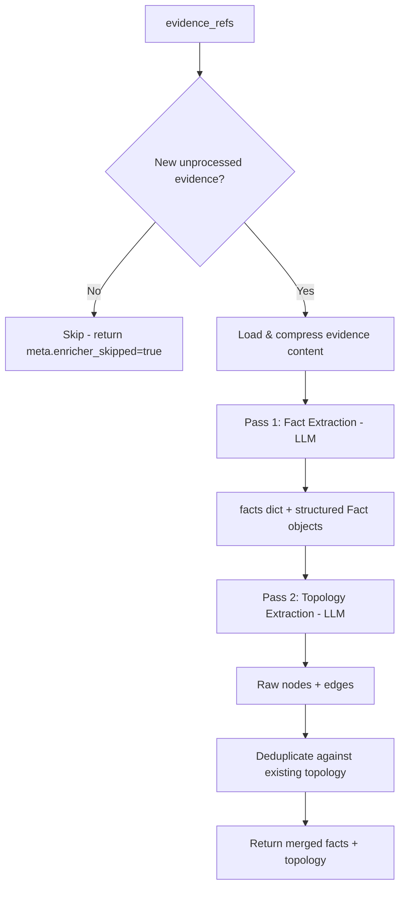

# Enricher Agent

> Two-pass extraction agent that derives structured facts and topology relationships from raw evidence.

## Overview

The Enricher agent (`src/agents/enricher.py`) processes evidence snapshots collected during investigation and extracts two categories of structured data: key-value facts and topology graph elements.

It operates incrementally. On each invocation, it identifies evidence items that have not yet been processed (tracked via `_processed_evidence_ids` in the facts dictionary) and runs two LLM passes per new evidence item. Previously enriched evidence is skipped entirely.

Pass 1 (Fact Extraction) produces both a flat dictionary of key-value facts and structured `Fact` objects with full provenance (`source_evidence_id`, `confidence`, `timestamp`). When evidence suggests attack-related behavior, the LLM includes MITRE ATT&CK tactic/technique mappings.

Pass 2 (Topology Extraction) identifies entities and their relationships from the evidence content. Extracted nodes and edges are deduplicated against existing topology before merging. Edges are deduplicated by `(source_id, target_id, relation)` with higher-confidence entries winning.

## Flow Diagram

## Input / Output Contract

| Field | Type | Source |
|---|---|---|
| **Input** | | |
| `evidence_refs` | `List[EvidenceSnapshot]` | Evidence collector / Investigator |
| `facts` | `Dict` | Previous enrichment passes |
| `structured_facts` | `List[Fact]` | Previous enrichment passes |
| `topology_nodes` | `List[TopologyNode]` | Previous enrichment passes |
| `topology_edges` | `List[TopologyEdge]` | Previous enrichment passes |
| `components` | `List[Component]` | Mapper agent |
| **Output** | | |
| `facts` | `Dict` | Merged flat facts (includes `_processed_evidence_ids`) |
| `structured_facts` | `List[Fact]` | Appended structured facts with provenance |
| `topology_nodes` | `List[TopologyNode]` | Merged and deduplicated by node ID |
| `topology_edges` | `List[TopologyEdge]` | Merged and deduplicated by (source, target, relation) |
| `case_status` | `str` | Set to `"synthesizing"` |

## Configuration

| Variable | Default | Purpose |
|---|---|---|
| `LLM_MODEL_ENRICHER` | `gpt-5-mini` | LLM profile for both extraction passes |

## Key Implementation Details

- Incremental processing: tracks enriched evidence IDs in `facts["_processed_evidence_ids"]` to avoid reprocessing.
- Evidence content is loaded from `storage_ref` file path, compressed via `compress_json_payload` before inclusion in prompts.
- If evidence file cannot be loaded, falls back to `ref.summary` as input.
- Both LLM calls use `response_format={"type": "json_object"}` for reliable structured output.
- Fact confidence is set to `1.0` for all LLM-extracted facts (confidence reflects extraction certainty, not factual certainty).
- Node types: `device`, `interface`, `subnet`, `service`, `host`, `vm`, `container`, `dns_name`, `vrf`, `tunnel`, `application`, `database`, `api`, `storage`, `cluster`, `queue`, `endpoint`.
- Edge relations: `connects_to`, `depends_on`, `serves`, `hosts`, `routes_to`, `calls_api`, `queries`, `reads_from`, `writes_to`, `authenticates_via`, `publishes_to`, `subscribes_to`, `replicates_to`, `load_balances`, `proxies`, `mounts`, `dns_resolves`, `policy_allow`, `policy_deny`, `nat`.
- Node deduplication: by ID, keeps first seen.
- Edge deduplication: by `(source_id, target_id, relation)`, higher confidence wins.
- Each topology node/edge carries `evidence_ref` linking back to the source evidence snapshot ID.

## See Also

- [Hypothesis Agent](hypothesis.md) -- consumes enriched facts and topology
- [Evidence Collector](evidence_collector.md) -- produces the evidence_refs this agent processes
- [Investigator Agent](investigator.md) -- also produces evidence_refs consumed here
