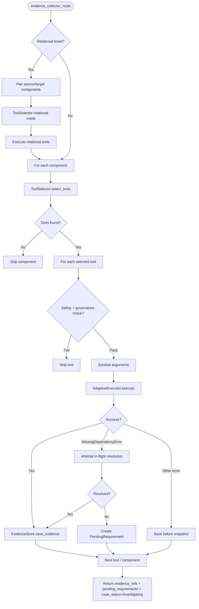

# Evidence Collector Agent

> Discovers and executes read-only tools to gather evidence for each component, using a centralized ToolSelector pipeline with keyword-intent semantic search.

## Overview

The evidence collector is the primary data-gathering agent. For each component in the ticket scope, it runs a multi-step pipeline: generate keyword intents, search the tool catalog via semantic vector search (Qdrant), evaluate candidate tools for relevance, bind arguments, and execute selected tools through the `AdaptiveExecutor`.

Before the per-component loop, a relational pre-loop checks whether the ticket involves cross-component concerns (connectivity, routing, NAT, etc.). If so, it pairs source (executor) and target components and runs relational tool queries to collect path-level evidence.

All tool executions are subject to safety checks (`SAFETY_BLOCKED_KEYWORDS`), tenant governance (`CapabilityScope`), and argument sanitization. Evidence is stored as immutable `EvidenceSnapshot` records via the `EvidenceStore`, namespaced by `customer_id` and `run_id`.

When the `AdaptiveExecutor` raises a `MissingDependencyError`, the agent attempts in-flight resolution by selecting a different tool to fetch the missing data. If resolution fails, the dependency becomes a `PendingRequirement` that triggers a human-in-the-loop gate via the supervisor.

## Flow Diagram

## Input / Output Contract

### Input (read from `GlobalState`)

| Field | Type | Source |
|---|---|---|
| `components` | `List[Component]` | Mapper agent |
| `ticket` | `Ticket` | Ingestion layer (specifically `ticket.text`) |
| `path_analysis` | `PathAnalysis` (optional) | Hypothesis agent |
| `client_context` | `ClientContext` | Context agent |
| `customer_id` | `str` | Ingestion layer |
| `classification` | `Classification` | Classifier agent (used for relational detection) |
| `facts` | `Dict` | Enricher agent (prior cycle) |
| `evidence_refs` | `List[EvidenceSnapshot]` | Previous evidence (accumulated) |
| `meta` | `Dict` | Pipeline metadata (run_id) |

### Output (written to `GlobalState`)

| Field | Type | Description |
|---|---|---|
| `evidence_refs` | `List[EvidenceSnapshot]` | Accumulated evidence (previous + new snapshots) |
| `pending_requirements` | `List[PendingRequirement]` | Unresolved missing dependencies requiring human input |
| `missing_info` | `List[str]` | Human-readable descriptions of missing dependencies |
| `case_status` | `CaseStatus` | Set to `"investigating"` |

## Configuration

| Variable | Default | Description |
|---|---|---|
| `LLM_MODEL_EVIDENCE_COLLECTOR` | `gpt-4.1-mini` | Model used for intent generation and tool evaluation |
| `MCP_SERVER_TIMEOUT` | varies | Timeout for MCP tool execution |
| `SAFETY_BLOCKED_KEYWORDS` | (list) | Keywords that block tool execution (e.g., delete, drop, shutdown) |

## Key Implementation Details

- Uses the centralized `ToolSelector` pipeline (keyword intents, semantic search, LLM evaluation) rather than direct tool matching.
- Relational pre-loop detects cross-component tickets via keyword regex and domain classification; pairs executor-role components with target-role components.
- Relational evidence is capped at 10 snapshots to bound execution time.
- Per-component tool selection is capped at 5 tools via `max_tools=5`.
- Argument sanitizer (`sanitize_tool_args`) maps component data to tool parameters based on role (executor vs. target).
- `AdaptiveExecutor` provides self-healing execution with retry logic and learning from failures.
- In-flight resolution on `MissingDependencyError`: searches for `status`/`info`/`get` tools in the registry, executes one to fetch missing data.
- Failed tool executions still produce an `EvidenceSnapshot` with error content, ensuring no evidence gaps.
- Evidence snapshots are immutable once stored; `tool_call_id` is set to `"auto"` for per-component and `"relational"` for cross-component evidence.
- New evidence is appended to existing `evidence_refs`, preserving evidence from prior pipeline iterations.

## See Also

- [agents/enricher.md](enricher.md)
- [architecture/adaptive_execution.md](../architecture/adaptive_execution.md)
- [integrations/mcp_tools.md](../integrations/mcp_tools.md)
- [agents/mapper.md](mapper.md)
