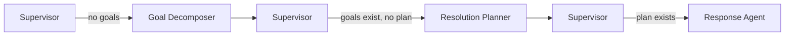
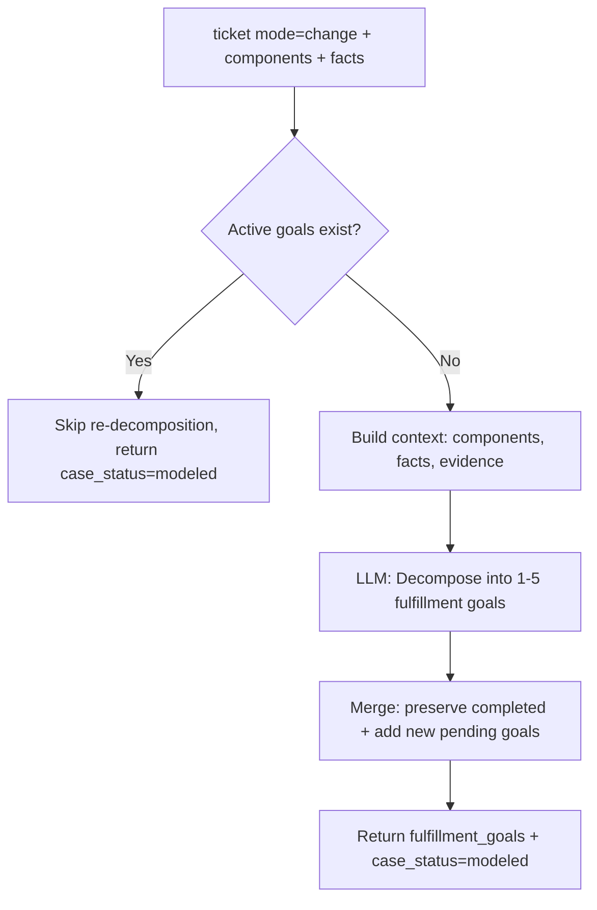

# Goal Decomposer Agent

> Decomposes change tickets into structured fulfillment goals instead of hypotheses.

## Overview

The Goal Decomposer (`src/agents/goal_decomposer.py`) handles tickets where the intent is fulfillment rather than troubleshooting. When `ticket.mode` is `"change"`, the supervisor routes to this agent instead of continuing the hypothesis-driven investigation path.

Rather than diagnosing what went wrong, the agent produces a set of `FulfillmentGoal` objects that describe what needs to be accomplished. Each goal includes preconditions that must hold before execution, validation criteria that define how to confirm completion, and optional sub-goal references that form a dependency DAG.

The agent is domain-agnostic: the prompt is technology-neutral and works across networking, infrastructure, cloud, application, database, security, and any other IT domain.

The agent is re-entrant. If goals from a prior decomposition are still pending or in progress, it skips re-decomposition. Completed goals from prior runs are preserved and merged with newly generated goals.

## When Called

Routed by the supervisor when `ticket.mode == "change"` and no fulfillment goals exist yet.

```python
if ticket_mode == "change":
    goals = state.get("fulfillment_goals")
    if not goals:
        return "goal_decomposer"
```

Return: Fixed edge → supervisor.

## Change Ticket Lifecycle

The supervisor manages the full change ticket lifecycle:

```
goal_decomposer → supervisor → planner_agent → supervisor → response_agent
```

After goals are produced, the supervisor routes to the Resolution Planner (which generates an implementation plan from goals), then to the Response Agent (which presents the goals and plan).



## Agent Flow Diagram



## Input / Output Contract

| Field | Type | Source |
|---|---|---|
| **Input** | | |
| `ticket` | `Ticket` | Ingestion (mode=change or request) |
| `components` | `List[Component]` | Mapper agent |
| `facts` | `Dict` | Enricher agent |
| `evidence_refs` | `List[EvidenceSnapshot]` | Evidence collector |
| `fulfillment_goals` | `List[FulfillmentGoal]` | Previous iteration |
| **Output** | | |
| `fulfillment_goals` | `List[FulfillmentGoal]` | Merged list (completed preserved + new pending) |
| `case_status` | `str` | Set to `"modeled"` |

### Input Example

```json
{
  "ticket": {
    "id": "CHG-0891",
    "mode": "change",
    "text": "Add new site-to-site VPN tunnel between FW-MAIN and FW-BRANCH-07. Use IKEv2 with AES-256-GCM.",
    "severity": "medium"
  },
  "components": [
    { "id": "fw-main", "ref": "FW-MAIN", "role": "firewall", "vendor": "fortinet" },
    { "id": "fw-branch-07", "ref": "FW-BRANCH-07", "role": "firewall", "vendor": "fortinet" }
  ],
  "facts": {},
  "evidence_refs": []
}
```

### Output Example

```json
{
  "fulfillment_goals": [
    {
      "id": "g1",
      "description": "Configure IKEv2 Phase 1 proposal on both FW-MAIN and FW-BRANCH-07 with AES-256-GCM and matching PSK or certificate authentication",
      "preconditions": ["Both firewalls are reachable and have management access", "WAN IP addresses for both endpoints are known"],
      "validation_criteria": ["IKE SA established between both peers", "Phase 1 status shows ESTABLISHED"],
      "status": "pending",
      "sub_goals": []
    },
    {
      "id": "g2",
      "description": "Configure IPsec Phase 2 selectors with the required subnet pairs and AES-256-GCM encryption",
      "preconditions": ["Phase 1 proposal configured (g1)"],
      "validation_criteria": ["IPsec SA established", "Traffic selectors match required subnets"],
      "status": "pending",
      "sub_goals": []
    },
    {
      "id": "g3",
      "description": "Add firewall policies on both ends permitting VPN traffic for the specified subnets",
      "preconditions": ["VPN tunnel established (g2)"],
      "validation_criteria": ["Policy hit counters incrementing", "Bidirectional traffic passes through tunnel"],
      "status": "pending",
      "sub_goals": []
    }
  ],
  "case_status": "modeled"
}
```

### Where Output Goes

`fulfillment_goals` are consumed by:
- [Supervisor](supervisor.md) — presence triggers routing to resolution planner (skipping hypothesis/scoring gate)
- [Resolution Planner](resolution_planner.md) — generates an implementation plan from goals (pre-checks, implementation steps, validation, rollback)
- [Response Agent](response.md) — includes goals with status, preconditions, and validation criteria in the final report

## Configuration

| Variable | Default | Purpose |
|---|---|---|
| `LLM_MODEL_HYPOTHESIS` | `gpt-5.4` | Shared LLM profile (via `goal_decomposer` agent key) |

## Key Implementation Details

- Uses `PydanticOutputParser` with `FulfillmentGoalList` schema for structured output.
- LLM temperature set to `0.0` for deterministic goal decomposition.
- Generates 1-5 goals per decomposition pass.
- Each `FulfillmentGoal` contains: `id`, `description`, `preconditions`, `validation_criteria`, `status`, `sub_goals` (list of child goal IDs).
- Goal statuses: `pending`, `in_progress`, `completed`, `blocked`.
- Goals are ordered by dependency -- prerequisite goals appear first.
- `sub_goals` field references child goal IDs, forming a directed acyclic graph.
- Merge strategy: preserves goals with status `completed` from prior iterations; replaces pending/in_progress goals with fresh decomposition.
- Skip condition: if any goals have status `pending` or `in_progress`, the agent returns early to avoid disrupting active work.
- Context includes: formatted components (with vendor info), facts, and evidence summaries (max 8 items).
- Domain-agnostic: the prompt contains no technology-specific terminology or bias.

## Pipeline Integration Notes

The graph defines a hard-edge chain `evidence_collector → enricher → hypothesis → scoring → supervisor`. This means the first pass through the pipeline always runs enricher/hypothesis/scoring for change tickets. This is by design — the enricher produces useful facts and topology data. When the supervisor re-evaluates after this chain, it detects `ticket.mode == "change"` and routes to the goal decomposer, bypassing the hypothesis-driven scoring gate from that point forward.

The change ticket path through the supervisor is:
1. No goals → `goal_decomposer`
2. Goals exist, no plan → `planner_agent`
3. Plan exists → `response_agent`

## See Also

- [Supervisor Agent](supervisor.md) — routes change tickets through the goal lifecycle
- [Resolution Planner](resolution_planner.md) — generates implementation plan from goals
- [Response Agent](response.md) — presents goals and plan in the final report
- [Classifier Agent](classifier.md) — determines ticket mode (may override ingestion mode to "change")
