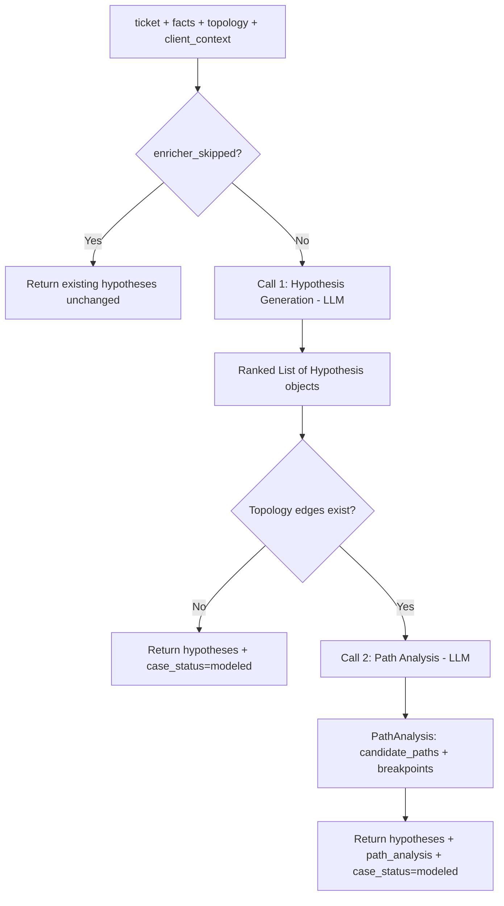

# Hypothesis Agent

> Generates ranked root cause hypotheses and performs path analysis on the topology graph.

## Overview

The Hypothesis agent (`src/agents/hypothesis.py`) is the core reasoning engine of the pipeline. It takes enriched facts, topology, and ticket context to produce ranked hypotheses about root cause (for incidents) or system state (for validation inquiries).

The agent makes two LLM calls. The first generates or updates a ranked list of `Hypothesis` objects, each with supporting/disconfirming facts, evidence references, confidence scores, and suggested next playbooks. The second call performs path analysis over the topology graph, identifying candidate flow paths, likely breakpoints, missing evidence, and suggested read-only diagnostic probes.

The agent operates iteratively. On subsequent passes it receives its own prior hypotheses and updates their status based on new facts: `proposed` to `verifying`, `verifying` to `verified` or `rejected`. It preserves hypothesis IDs across iterations for traceability.

A dual-role adaptation mechanism inspects ticket intent. For validation/inquiry tickets, the agent formulates neutral verification hypotheses. For incident/problem tickets, it formulates troubleshooting hypotheses targeting root cause. The configuration-first principle is enforced: hypotheses must be verifiable via existing configuration rather than live traffic analysis.

## Flow Diagram

## Input / Output Contract

| Field | Type | Source |
|---|---|---|
| **Input** | | |
| `ticket` | `Ticket` | Ingestion |
| `facts` | `Dict` | Enricher agent |
| `structured_facts` | `List[Fact]` | Enricher agent |
| `topology_nodes` | `List[TopologyNode]` | Enricher agent |
| `topology_edges` | `List[TopologyEdge]` | Enricher agent |
| `client_context` | `ClientContext` | Context agent (baselines, known_changes) |
| `hypotheses` | `List[Hypothesis]` | Previous iteration (for refinement) |
| `meta` | `Dict` | Enricher skip flag |
| **Output** | | |
| `hypotheses` | `List[Hypothesis]` | Ranked hypotheses with status, evidence_refs, confidence |
| `path_analysis` | `PathAnalysis` | Candidate paths, breakpoints, missing evidence, probes |
| `case_status` | `str` | Set to `"modeled"` |

## Configuration

| Variable | Default | Purpose |
|---|---|---|
| `LLM_MODEL_HYPOTHESIS` | `gpt-5.2` | LLM profile for both hypothesis generation and path analysis |
| `TEST_MODE_FAST` | `false` | When true, limits output to exactly 1 hypothesis |

## Key Implementation Details

- Skips entirely when `meta.enricher_skipped` is true (no new data to reason about).
- Uses `PydanticOutputParser` with `HypothesisList` schema for structured output from Call 1.
- Call 2 (path analysis) uses raw JSON output with `response_format={"type": "json_object"}`.
- Hypothesis fields: `id`, `summary`, `required_facts`, `supporting_facts`, `disconfirming_facts`, `evidence_refs`, `confidence`, `rank`, `status`, `next_playbooks`, `rationale`.
- Hypothesis statuses: `proposed`, `verifying`, `verified`, `rejected`.
- PathAnalysis contains: `candidate_paths` (each with hops, constraints, confidence, status), `most_likely_breakpoints`, `missing_evidence`, `suggested_probes`.
- Path constraint types: `reachability`, `access_control`, `configuration`, `dependency`.
- Path status values: `viable`, `blocked`, `incomplete`.
- Configuration-first principle enforced in path analysis prompts: never suggests packet captures, debug flows, or sniffers.
- State formatters (`format_topology_edges`, `format_baselines`, `format_known_changes`, `format_facts`, `format_hypotheses`) handle truncation for prompt size management.

## See Also

- [Scoring Agent](scoring.md) -- consumes hypotheses for decision gating
- [Investigation Planner](investigation_planner.md) -- generates questions from hypotheses
- [Enricher Agent](enricher.md) -- produces the facts and topology consumed here
