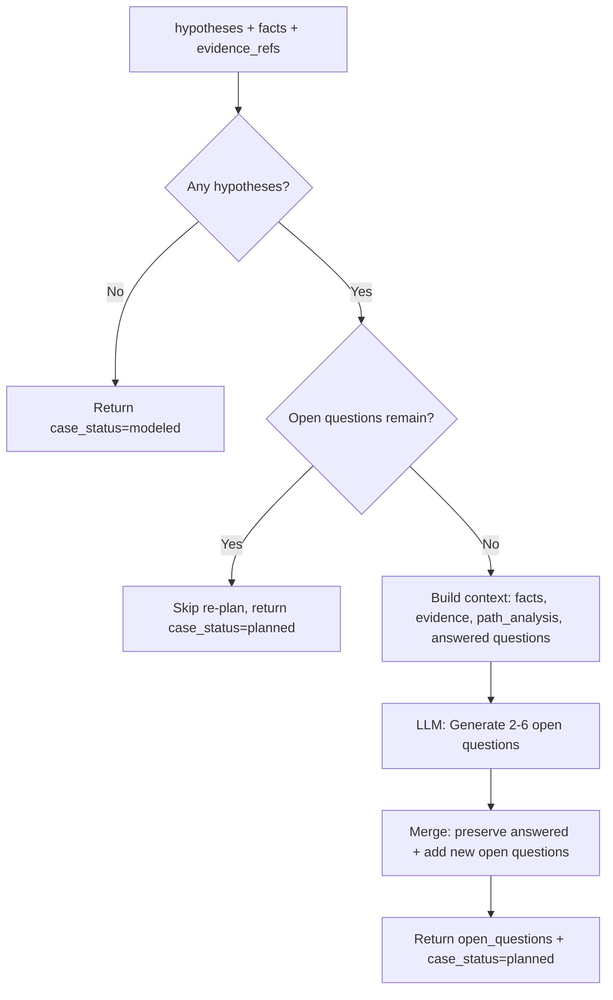

# Investigation Planner Agent

> Generates structured open questions to drive targeted investigation of active hypotheses.

## Overview

The Investigation Planner (`src/agents/investigation_planner.py`) bridges hypothesis generation and evidence gathering. Rather than allowing the Investigator to gather evidence ad-hoc, this agent produces a prioritized list of `OpenQuestion` objects that specify exactly what needs to be answered, why it matters, and what constitutes a complete answer.

Each question is linked to a source hypothesis via `source_hypothesis_id` and includes dependency ordering (`depends_on`) so that prerequisite questions are answered first. The `done_when` field provides a concrete, verifiable completion criterion.

The agent is re-entrant. If open questions from a prior iteration remain unanswered, it skips re-planning to avoid discarding in-progress work. When all prior questions have been answered, it generates a fresh batch incorporating the new knowledge. Previously answered questions are preserved in state for audit and context.

## Flow Diagram

## Input / Output Contract

| Field | Type | Source |
|---|---|---|
| **Input** | | |
| `hypotheses` | `List[Hypothesis]` | Hypothesis agent |
| `facts` | `Dict` | Enricher agent |
| `evidence_refs` | `List[EvidenceSnapshot]` | Evidence collector / Investigator |
| `structured_facts` | `List[Fact]` | Enricher agent |
| `open_questions` | `List[OpenQuestion]` | Previous iteration |
| `path_analysis` | `PathAnalysis` | Hypothesis agent |
| `ticket` | `Ticket` | Ingestion |
| **Output** | | |
| `open_questions` | `List[OpenQuestion]` | Merged list (answered preserved + new open) |
| `case_status` | `str` | Set to `"planned"` |

## Configuration

| Variable | Default | Purpose |
|---|---|---|
| `LLM_MODEL_HYPOTHESIS` | `gpt-5.2` | Shared LLM profile (via `investigation_planner` agent key) |

## Key Implementation Details

- Uses `PydanticOutputParser` with `OpenQuestionList` schema for structured output.
- LLM temperature set to `0.0` for deterministic question generation.
- Generates 2-6 questions per planning pass targeting active (proposed/verifying) hypotheses.
- Each `OpenQuestion` contains: `id`, `question`, `why`, `depends_on` (list of question IDs), `done_when`, `status`, `source_hypothesis_id`, `answer`.
- Question statuses: `open`, `answered`, `irrelevant`.
- Merge strategy: preserves questions with status `answered` or `irrelevant` from prior iterations; replaces all `open` questions with the new plan.
- Questions are ordered by diagnostic value -- the most discriminating questions appear first.
- All questions must be answerable by read-only tool execution (configuration checks, status queries, log inspections).
- Context includes: formatted facts, hypothesis summaries, evidence summaries (max 10), path analysis, and previously answered questions with their answers.

## See Also

- [Investigator Agent](investigator.md) -- consumes open questions to guide tool execution
- [Hypothesis Agent](hypothesis.md) -- produces the hypotheses that drive question generation
- [Scoring Agent](scoring.md) -- evaluates progress after investigation cycles
