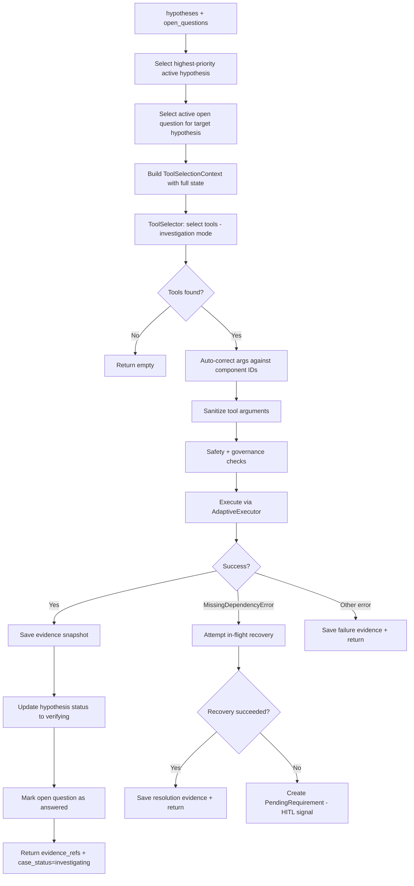

# Investigator Agent

> Verifies hypotheses by executing targeted tool calls guided by open questions.

## Overview

The Investigator agent (`src/agents/investigator.py`) is the primary tool execution node in the investigation loop. It selects the highest-priority active hypothesis and its related open questions, then uses the `ToolSelector` pipeline to identify and execute verification tools.

The agent builds rich context for tool selection including: ticket text, hypothesis details, active investigation question, existing facts, evidence summaries, topology, baselines, known changes, and path analysis. The `ToolSelector` operates in `"investigation"` mode, producing targeted tool selections with arguments.

Tool execution uses the `AdaptiveExecutor` for self-healing capabilities. When a tool fails due to missing dependencies (`MissingDependencyError`), the agent attempts in-flight recovery by selecting a resolution tool to fetch the missing information. If recovery fails, it creates a `PendingRequirement` that surfaces as a human-in-the-loop signal.

Evidence produced by each tool call is stored as an immutable snapshot via `EvidenceStore`, and the active open question (if any) is marked as answered with the evidence summary.

## Flow Diagram

## Input / Output Contract

| Field | Type | Source |
|---|---|---|
| **Input** | | |
| `hypotheses` | `List[Hypothesis]` | Hypothesis agent |
| `open_questions` | `List[OpenQuestion]` | Investigation planner |
| `components` | `List[Component]` | Mapper agent |
| `ticket` | `Ticket` | Ingestion |
| `facts` | `Dict` | Enricher agent |
| `evidence_refs` | `List[EvidenceSnapshot]` | Previous collection passes |
| `topology_nodes` | `List[TopologyNode]` | Enricher agent |
| `topology_edges` | `List[TopologyEdge]` | Enricher agent |
| `client_context` | `ClientContext` | Context agent |
| `path_analysis` | `PathAnalysis` | Hypothesis agent |
| `customer_id` | `str` | Ingestion |
| **Output** | | |
| `hypotheses` | `List[Hypothesis]` | Updated (target set to `verifying`, evidence_refs appended) |
| `evidence_refs` | `List[EvidenceSnapshot]` | Appended with new snapshots |
| `open_questions` | `List[OpenQuestion]` | Active question marked `answered` |
| `pending_requirements` | `List[PendingRequirement]` | Created on unrecoverable missing dependencies |
| `case_status` | `str` | Set to `"investigating"` |

## Configuration

| Variable | Default | Purpose |
|---|---|---|
| `LLM_MODEL_INVESTIGATOR` | `gpt-5.2` | LLM profile for tool selection context |
| `MCP_SERVER_TIMEOUT` | `30` | Timeout for MCP tool execution |
| `SAFETY_BLOCKED_KEYWORDS` | (list) | Keywords that block unsafe tool execution |

## Key Implementation Details

- Hypothesis selection priority: `verifying` status first, then by `rank` (ascending).
- Open question selection: prefers questions linked to target hypothesis via `source_hypothesis_id`; falls back to any open question.
- Uses centralized `ToolSelector` in `"investigation"` mode with `max_intents=2`, `max_tools=3`.
- Argument auto-correction: matches LLM-generated argument values against known component IDs by `id`, `ref`, or `role`.
- Smart argument sanitization via `sanitize_tool_args`: distinguishes executor roles (firewall, router, switch, loadbalancer, gateway, server, host, hypervisor, appliance, controller) from target roles (subnet, endpoint, url, dns_name, user, network, vm, container, pod). Executors map to `device` param; targets map to `target` param.
- Safety check via `is_safe_tool` blocks execution of tools matching blocked keywords.
- Governance check via `is_tool_allowed_for_tenant` enforces per-tenant tool access control.
- `AdaptiveExecutor` provides retry logic and self-healing with context-aware error recovery.
- `MissingDependencyError` triggers an in-flight recovery loop: the agent selects a resolution tool from the registry to fetch the missing information before falling back to `PendingRequirement`.
- All evidence (success, failure, recovery) is stored via `EvidenceStore` as immutable, tenant-scoped snapshots.
- Evidence snapshots are linked to hypotheses via `hypothesis.evidence_refs`.

## See Also

- [Investigation Planner](investigation_planner.md) -- produces the open questions consumed here
- [Enricher Agent](enricher.md) -- processes evidence produced by this agent
- [Adaptive Execution](../architecture/adaptive_execution.md) -- self-healing execution architecture
