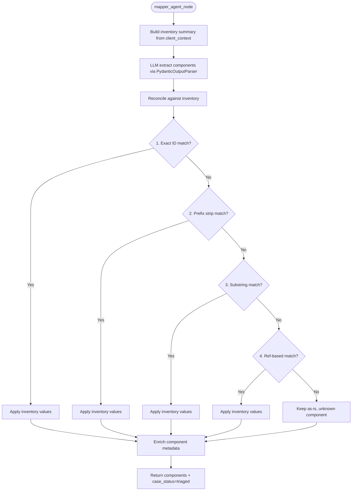

# Mapper Agent

> Identifies technical components from the ticket and reconciles them against the tenant's inventory using a 4-strategy deterministic post-processing pipeline.

## Overview

The mapper agent extracts components (devices, IPs, URLs, services, users, applications, databases, clusters, containers, APIs, storage, endpoints) from the ticket text using an LLM call. It receives the tenant's inventory summary as context so the LLM can attempt to match components to known assets.

After LLM extraction, a deterministic reconciliation pipeline corrects component IDs against the real inventory. This is necessary because LLMs frequently hallucinate or reformat identifiers. The 4-strategy reconciliation runs in priority order: exact ID match, prefix strip, substring match, and ref-based match. When a component matches an inventory item, it inherits the canonical `id`, `vendor`, and `ref` from inventory.

Finally, each reconciled component passes through a metadata enrichment step (`derive_component_metadata`) that computes tool-ready metadata from raw identifiers (e.g., deriving subnet masks, protocol hints).

## When Called

Routed by the supervisor when the `components` list is absent (priority 4).

```python
if not state.get("components"):
    return "mapper_agent"
```

Return: Fixed edge to supervisor.

## Flow Diagram



## Input / Output Contract

### Input (read from `GlobalState`)

| Field | Type | Source |
|---|---|---|
| `ticket` | `Ticket` | Ingestion layer (specifically `ticket.text`) |
| `client_context` | `ClientContext` | Context agent (specifically `inventory`) |

### Output (written to `GlobalState`)

| Field | Type | Description |
|---|---|---|
| `components` | `List[Component]` | Reconciled components with id, ref, role, vendor, priority, metadata |
| `case_status` | `CaseStatus` | Set to `"triaged"` |
| `missing_info` | `List[str]` | Set to `["mapper_error"]` on failure |

### Input Example

```json
{
  "ticket": {
    "id": "INC-4012",
    "text": "Users in Building-7 cannot authenticate to file shares since 08:00. Kerberos errors in event logs. Domain controller DC-NORTH, NTP source ntp-pool.corp.local."
  },
  "client_context": {
    "customer_id": "tenant_acme",
    "inventory": [
      { "id": "dc-north", "ref": "DC-NORTH", "role": "server", "vendor": "microsoft" },
      { "id": "ntp-pool", "ref": "ntp-pool.corp.local", "role": "service" }
    ]
  }
}
```

### Output Example

```json
{
  "components": [
    { "id": "dc-north", "ref": "DC-NORTH", "role": "server", "vendor": "microsoft", "priority": 1, "metadata": {} },
    { "id": "ntp-pool", "ref": "ntp-pool.corp.local", "role": "service", "vendor": null, "priority": 2, "metadata": {} },
    { "id": "file-share-01", "ref": "file-share-01", "role": "service", "vendor": null, "priority": 3, "metadata": {} }
  ],
  "case_status": "triaged"
}
```

### Where Output Goes

`components` is consumed by the [Evidence Collector](evidence_collector.md) (per-component tool selection), [Investigator](investigator.md) (investigation tool context), [Enricher](enricher.md) (topology context), and [Response Agent](response.md) (report metadata).

## Configuration

| Variable | Default | Description |
|---|---|---|
| `LLM_MODEL_MAPPER` | `gpt-5-nano` | Model used for component extraction |

## Key Implementation Details

- Inventory summaries are capped: items listed individually when <= 50, otherwise only the count is shown.
- Reconciliation is case-insensitive; all comparisons use `.lower()`.
- Prefix strip handles common LLM-generated prefixes: `comp_`, `component_`, `asset_`, `device_`, `host_`.
- Substring match checks both directions: inventory ID within generated ID, and generated ID within inventory ID.
- Ref-based match catches cases where the LLM used the human-readable name as the component ID.
- `_apply_inventory` overwrites `id` with canonical value, sets `ref` only if the component had none, and merges `vendor`.
- `derive_component_metadata` (from `src/utils/arg_sanitizer.py`) adds derived fields to component metadata for downstream tool argument binding.
- On LLM failure, returns an empty component list with `missing_info` flag.

## See Also

- [agents/evidence_collector.md](evidence_collector.md)
- [agents/context_agent.md](context_agent.md)
- [agents/classifier.md](classifier.md)
