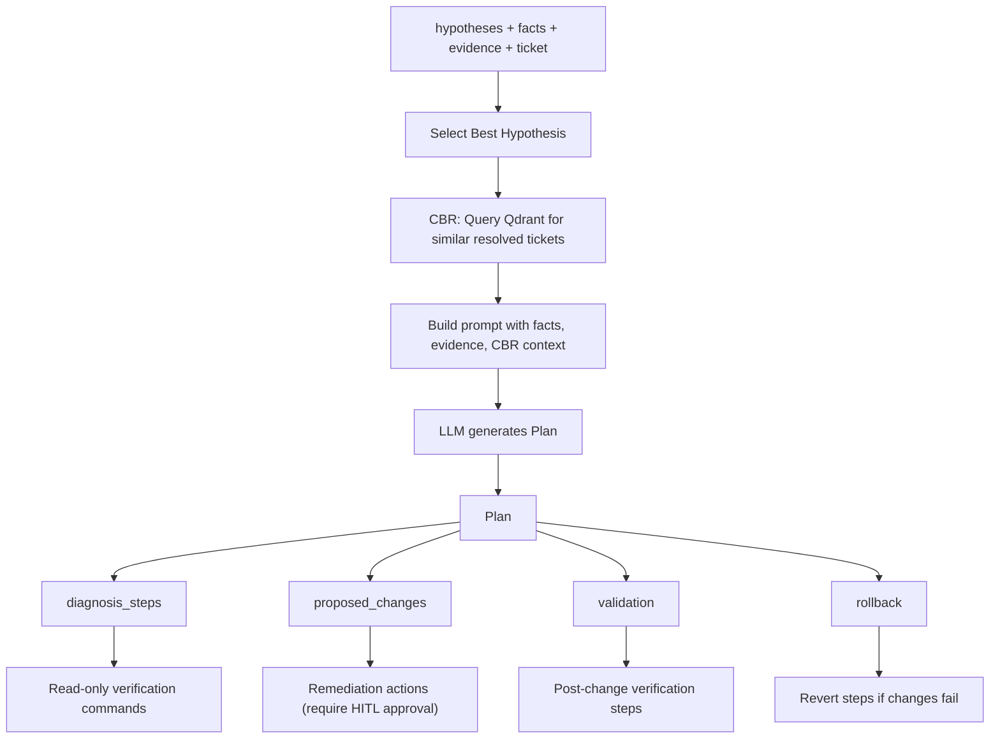

# Resolution Planner Agent

> Generates a structured, safety-first resolution plan once the scoring gate approves proceeding to plan.

## Overview

The Resolution Planner runs after the Scoring Agent emits a `proceed_to_plan` decision. It takes the verified hypothesis, collected facts, evidence snapshots, and the original ticket, then produces a four-section execution plan: diagnosis verification, proposed changes, validation, and rollback.

The agent uses Case-Based Reasoning (CBR) via `CaseRetriever` to query Qdrant for past resolved tickets with similar problems. These historical resolutions are injected into the LLM prompt so the planner can prioritize proven tools and strategies.

Every proposed change is flagged for human approval (HITL gate). Rollback steps are mandatory. Diagnosis steps are read-only verification commands that confirm the hypothesis before any mutation is attempted.

The source file is `src/agents/planner.py`; the node function is `resolution_planner_agent_node`. A backward-compatible alias `planner_agent_node` is also exported.

## Flow Diagram

## Input / Output Contract

### Input

| Field | Type | Source |
|---|---|---|
| `ticket` | `Ticket` | Ingestion |
| `hypotheses` | `List[Hypothesis]` | HypothesisAgent (best/verified selected by rank) |
| `facts` | `Dict` | Enricher |
| `evidence_refs` | `List[EvidenceSnapshot]` | EvidenceCollector / Investigator |
| `customer_id` | `str` | State (used for tenant-scoped CBR retrieval) |

### Output

| Field | Type | Description |
|---|---|---|
| `plan` | `Plan` | Contains `diagnosis_steps`, `proposed_changes`, `validation`, `rollback` |
| `case_status` | `str` | Set to `"resolved"` on success |

Each `PlanStep` contains: `step_id`, `description`, `tool`, `args`, `expected_outcome`, and risk level.

## Configuration

| Variable | Purpose |
|---|---|
| `LLM_MODEL_PLANNER` | Model used for plan generation (e.g., `gpt-5.2`) |
| `LLM_TEMPERATURE_DEFAULT` | Set to `0.0` for deterministic, precise planning |

## Key Implementation Details

- **CBR retrieval**: uses `CaseRetriever` backed by Qdrant `resolved_tickets` collection. Retrieves up to 3 similar cases. Failures are non-fatal; the planner proceeds without historical context.
- **Prompt structure**: system message defines safety-first guidelines; user message injects ticket text, hypothesis summary/rationale, facts summary, evidence summary (last 10 items), CBR context, and Pydantic format instructions.
- **Output parsing**: uses `PydanticOutputParser` with the `Plan` model for structured JSON output directly from the LLM.
- **Safety-first design**: diagnosis steps are read-only verification; proposed changes require HITL approval before execution; rollback is mandatory.
- **Fallback**: on LLM failure, returns an empty `Plan()` (signals human intervention required).
- **Internal facts excluded**: facts prefixed with `_` are filtered out of the prompt context.

## See Also

- [agents/response.md](response.md) -- consumes the plan for final report synthesis
- [agents/scoring.md](scoring.md) -- gates entry to the planner via `proceed_to_plan`
- [architecture/safety_and_governance.md](../architecture/safety_and_governance.md) -- HITL approval framework
