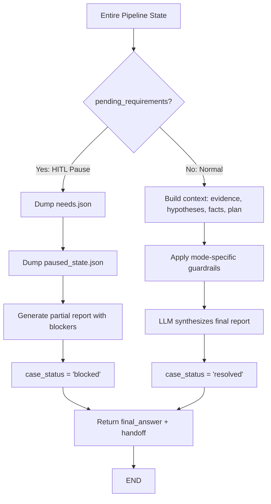

# Response Agent

> Final synthesis node that compiles a structured technical report and handoff package, terminating the graph.

## Overview

The Response Agent is the terminal node of the pipeline. It reads the entire accumulated state and produces a professional engineering report in markdown format, along with a `HandoffPackage` for downstream systems or L2 teams.

The agent operates in two modes depending on the presence of pending requirements. In normal mode (plan exists, no blockers), it invokes the LLM to synthesize a complete technical report with diagnosis, evidence, and next steps. In HITL pause mode (pending requirements exist), it dumps the requirements and full state to disk for external resolution, then returns a partial report explaining what is blocked.

The report enforces strict language guardrails: evidence-backed conclusions only, no speculation, definitive statements over probabilistic hedging. Mode-specific rules apply for validation tickets (table format with Confirmed/Not confirmed/Inconclusive) and inquiry tickets (direct factual answers with citations).

## Flow Diagram

## Input / Output Contract

### Input

| Field | Type | Source |
|---|---|---|
| `ticket` | `Ticket` | Ingestion |
| `plan` | `Plan` (optional) | ResolutionPlanner |
| `hypotheses` | `List[Hypothesis]` | HypothesisAgent |
| `evidence_refs` | `List[EvidenceSnapshot]` | EvidenceCollector / Investigator |
| `facts` | `Dict` | Enricher |
| `pending_requirements` | `List[PendingRequirement]` | Any agent |
| `client_context` | `str` | ContextAgent |
| `classification` | `Classification` | Classifier |
| `components` | `List[Component]` | Mapper |

### Output

| Field | Type | Description |
|---|---|---|
| `final_answer` | `str` | Markdown technical report |
| `handoff` | `HandoffPackage` | `case_file_artifacts` (evidence/report refs), `recommended_escalation` (team, reason, priority) |
| `case_status` | `str` | `"resolved"` (normal) or `"blocked"` (HITL pause) |

## Configuration

| Variable | Purpose |
|---|---|
| `LLM_MODEL_RESPONSE` | Model used for report synthesis (e.g., `gpt-5-mini`) |

## Key Implementation Details

- **Normal mode**: LLM receives a system prompt defining the IT Support Engineer role with a strict four-section output format (Conclusion, Context, Evidence, Next Steps) plus language guardrails. User message contains ticket text, mode, client context, facts, evidence log, hypothesis history, and current plan.
- **HITL pause mode**: writes `data/needs.json` (user-friendly format with `"value": null` fields for the operator to fill) and `data/paused_state.json` (full serialized state for resume). Returns instructions for resuming execution via CLI command.
- **Mode-specific guardrails**:
  - *Validation*: prohibits hedging language ("probably", "likely", "might"); requires table format with Confirmed/Not confirmed/Inconclusive status per check item; inconclusive items must specify the exact next probe (tool name + arguments).
  - *Inquiry*: requires direct factual answers; every statement must cite an evidence snapshot; uses "Inconclusive" instead of speculation.
- **General guardrails**: prefer definitive statements over probabilistic hedging; every conclusion must cite at least one evidence snapshot; use "Inconclusive" instead of "probably", "likely", "might", "could be", "appears to", "seems like".
- **HandoffPackage**: in normal mode, artifacts are `storage_ref` values from evidence snapshots with recommended escalation to L2_Ops; in HITL mode, artifact is the `needs.json` file path.
- **State serialization**: uses a custom `StateEncoder` that handles `datetime`, `UUID`, and Pydantic V2 models (`model_dump(mode='json')`) for the paused state checkpoint.
- **Fallback**: on LLM failure, returns `"Error generating report. Please check logs."` as `final_answer`.

## See Also

- [agents/supervisor.md](supervisor.md) -- routes to response as the terminal node
- [integrations/api_reference.md](../integrations/api_reference.md) -- external API that consumes the handoff package
- [agents/scoring.md](scoring.md) -- gates whether response receives a plan or pending requirements
