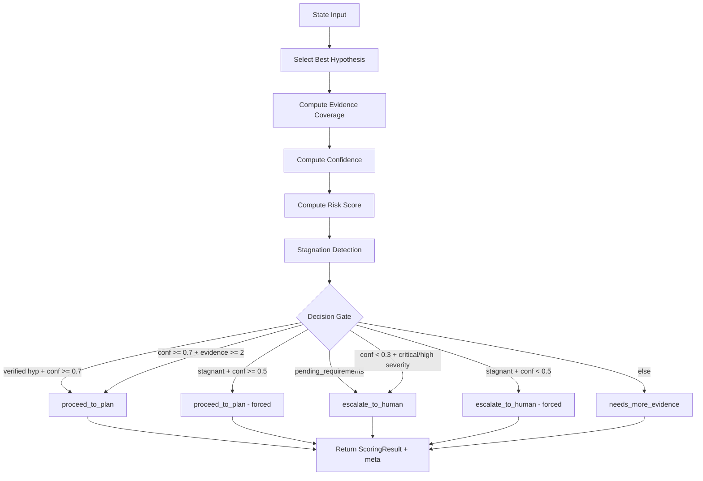

# Scoring / Decision Engine Agent

> Deterministic decision gate that evaluates state after every hypothesis update to route the pipeline toward planning, further investigation, or human escalation -- with no LLM calls.

## Overview

The Scoring Agent is a pure-state-analysis node that runs after the hypothesis sub-chain (enricher, hypothesis, scoring, supervisor). It computes a composite confidence score, a severity-weighted risk score, and applies a deterministic decision gate to choose the next pipeline action.

Because it makes no LLM calls, the node is fast, reproducible, and free of hallucination risk. Every decision is fully explainable through its formulaic rationale.

The agent also implements stagnation detection: it tracks whether investigation cycles are producing new facts. After two consecutive cycles with no new facts, it forces the pipeline forward (proceed or escalate) to prevent infinite loops.

## When Called

Invoked via fixed sub-chain edge from the [Hypothesis Agent](hypothesis.md), not by the supervisor directly. Runs after every enricher --> hypothesis cycle.

```python
# Fixed edge — not supervisor-routed
workflow.add_edge("hypothesis_agent", "scoring_agent")
```

Return: Fixed edge --> supervisor.

## Flow Diagram



## Input / Output Contract

### Input

| Field | Type | Source |
|---|---|---|
| `hypotheses` | `List[Hypothesis]` | HypothesisAgent |
| `evidence_refs` | `List[EvidenceSnapshot]` | EvidenceCollector / Investigator |
| `facts` | `Dict` | Enricher |
| `ticket` | `Ticket` | Ingestion |
| `ticket.severity` | `str` | Ticket field (`critical`, `high`, `medium`, `low`) |
| `pending_requirements` | `List[PendingRequirement]` | Any agent that detects missing info |
| `open_questions` | `List[OpenQuestion]` | InvestigationPlanner |
| `meta` | `Dict` | Previous scoring pass (stagnation tracking) |

### Output

| Field | Type | Description |
|---|---|---|
| `scoring` | `ScoringResult` | Contains `risk_score`, `confidence`, `evidence_coverage`, `decision`, `rationale`, `missing_facts` |
| `meta` | `Dict` | Updated with `_last_fact_count` and `_stagnant_cycles` |

### Input Example

```json
{
  "hypotheses": [
    { "id": "h1", "summary": "NTP time skew exceeds Kerberos tolerance", "status": "proposed", "rank": 1, "confidence": 0.75, "required_facts": ["ntp_offset_dc_north", "kerberos_max_tolerance"], "supporting_facts": ["ntp_offset_dc_north"] }
  ],
  "evidence_refs": [{ "id": "ev-001" }],
  "facts": { "ntp_offset_dc_north": "+347 seconds" },
  "ticket": { "id": "INC-4012", "severity": "high" },
  "open_questions": [],
  "meta": {}
}
```

### Output Example

```json
{
  "scoring": {
    "risk_score": 5.8,
    "confidence": 0.52,
    "evidence_coverage": 0.5,
    "decision": "needs_more_evidence",
    "rationale": "1 of 2 required facts covered (50%). Confidence 52% below 70% threshold. No open questions — investigation planning needed.",
    "missing_facts": ["kerberos_max_tolerance"]
  },
  "meta": { "_last_fact_count": 1, "_stagnant_cycles": 0 }
}
```

### Where Output Goes

`scoring` is the primary routing signal consumed by the [Supervisor](supervisor.md) -- its `decision` field determines whether the pipeline proceeds to planning, gathers more evidence, or escalates. `meta._last_fact_count` and `meta._stagnant_cycles` are consumed by the [Scoring Agent](scoring.md) itself on subsequent passes for stagnation detection.

## Configuration

| Constant | Value | Description |
|---|---|---|
| `CONFIDENCE_PROCEED` | `0.7` | Confidence threshold to proceed to plan |
| `CONFIDENCE_ESCALATE` | `0.3` | Confidence floor; below this on critical/high severity triggers escalation |
| `SEVERITY_WEIGHTS` | `critical=4.0, high=3.0, medium=2.0, low=1.0` | Multipliers for risk score computation |

No environment variables. All thresholds are constants in `src/agents/scoring.py`.

## Key Implementation Details

- **Best hypothesis selection**: highest-rank active hypothesis (status in `proposed`, `verifying`, `verified`), sorted ascending by `rank`.
- **Evidence coverage**: `covered_facts / required_facts` when the hypothesis declares required facts; falls back to `evidence_count / 3.0` (capped at 1.0) otherwise.
- **Confidence formula** (weighted average):
  - Hypothesis confidence x 0.40
  - Evidence coverage x 0.25
  - Fact density (`real_facts / 5.0`, capped at 1.0) x 0.15
  - Question completion (`answered / total open_questions`) x 0.20
  - If no open questions exist, question completion defaults to 0.5.
- **Risk score**: `min(severity_weight * (2.0 - confidence) * 2.5, 10.0)`, floored at 1.0.
- **Stagnation detection**: compares current real fact count against `meta._last_fact_count`. Increments `meta._stagnant_cycles` when no new facts appear. After 2 stagnant cycles, forces a decision.
- **Decision gate priority order**:
  1. `pending_requirements` present --> `escalate_to_human`
  2. Verified hypothesis + confidence >= 0.7 --> `proceed_to_plan`
  3. Confidence >= 0.7 + evidence >= 2 --> `proceed_to_plan`
  4. Confidence < 0.3 + severity critical/high --> `escalate_to_human`
  5. Stagnant + confidence >= 0.5 --> `proceed_to_plan` (forced)
  6. Stagnant + confidence < 0.5 --> `escalate_to_human` (forced)
  7. Otherwise --> `needs_more_evidence`
- **No LLM call**: entire node is deterministic arithmetic and conditional logic.

## See Also

- [agents/supervisor.md](supervisor.md) -- consumes `scoring.decision` to route the graph
- [agents/hypothesis.md](hypothesis.md) -- produces the hypotheses scored here
- [agents/README.md](README.md) -- agent pipeline overview
