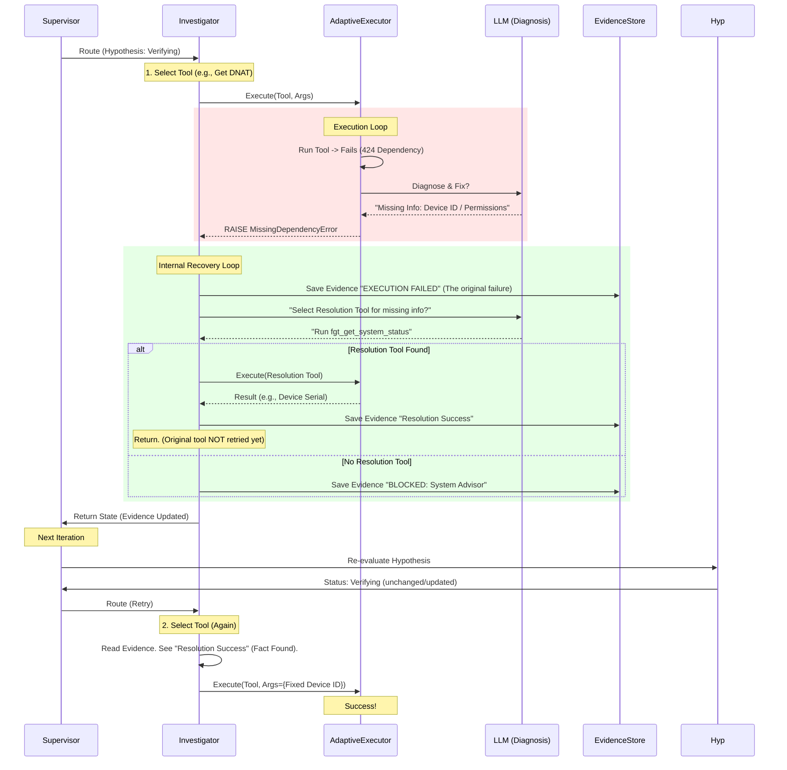

# Adaptive Investigator Flow

This document details the interaction between the `Investigator` agent, the `AdaptiveExecutor`, and the `Internal Recovery Loop`.

## High-Level Architecture

The system uses a "Fail-Fast but Recover-Smart" approach. When a tool fails, instead of blindly retrying, we identify *why* it failed (Missing Dependency) and immediately attempt to find that information.

## detailed Components

### 1. AdaptiveExecutor
- **Role**: Wraps low-level tool execution.
- **Behavior**:
    - Retries transient errors (timeouts).
    - Uses LLM to diagnose schema errors.
    - **Crucial**: If it detects missing *context* (e.g., "I need an IP, you gave me a hostname"), it does *not* halluciation. It raises `MissingDependencyError`.

### 2. Investigator (The Agent)
- **Role**: High-level planner of verification steps.
- **Behavior**:
    - Selects a tool based on the Hypothesis.
    - **Catching Failure**: When `AdaptiveExecutor` raises `MissingDependencyError`, the Investigator enters the **Internal Recovery Loop**.

### 3. Internal Recovery Loop (New)
- **Goal**: Don't just give up; try to fix the blocker *in-flight*.
- **Logic**:
    1.  The agent asks the LLM: *"What tool can I run NOW to get this missing info?"* (e.g., Discovery tools).
    2.  If found, it executes it immediately.
    3.  It saves the result as Evidence.
    4.  **Important**: It then *yields* back to the Supervisor.
        - *Why?* Because updating the state and letting the `Investigator` "think" freshly in the next turn (with the new Evidence in context) is more robust than trying to hot-fix the arguments blindly in code.

## Why Evidence Might Be "Missing"

In previous versions, when `MissingDependencyError` was caught, we saved a "System Advisor" note but *discarded* the original "Failed Tool" event.
**Correction**: The log now ensures two pieces of evidence are saved:
1.  `[Tool Name]`: EXECUTION FAILED (The 424/400 error).
2.  `[system_advisor]`: BLOCKED (The explanation of what is missing).

This ensures the Final Report shows "We tried X, it failed, so we looked for Y."
