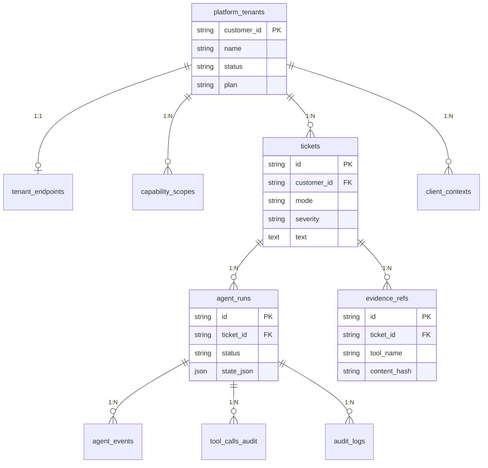

# Data Layer

> PostgreSQL + Qdrant schema, tenant isolation, and data flow.

## Overview

The platform uses a **two-plane architecture** with strict tenant isolation:

- **Control Plane** (global): tenant registry, tool governance, infrastructure pointers
- **Data Plane** (per-tenant): tickets, evidence, audit trail, client context

## Entity Relationship Diagram



**Storage backends:**

| Backend | Technology | Purpose |
|---|---|---|
| Relational DB | PostgreSQL (async via `asyncpg`) | ORM tables, audit, tenant registry |
| Vector DB | Qdrant | Semantic search (tools, knowledge base, evidence, cases) |
| Object Store | Local filesystem (`data/evidence/`) | Raw evidence blobs |

---

## PostgreSQL — ORM Tables

### Control Plane

#### `platform_tenants`
Tenant registry. Every customer has one row.

| Column | Type | Description |
|---|---|---|
| `customer_id` | String (PK) | Unique tenant identifier |
| `name` | String | Human-readable name |
| `status` | String | `active` / `suspended` |
| `plan` | String | `standard` / `enterprise` |
| `created_at` | DateTime | Auto-set |

**Relationships:** → `tenant_endpoints` (1:1), → `capability_scopes` (1:N)

#### `tenant_endpoints`
Infrastructure pointers for DB-per-tenant or multi-region setups.

| Column | Type | Description |
|---|---|---|
| `customer_id` | FK → `platform_tenants` (PK) | |
| `pg_dsn_ref` | String | Reference to tenant's DB connection |
| `qdrant_url_ref` | String | Reference to tenant's Qdrant |
| `object_store_ref` | String | Reference to tenant's object store |

> **Status:** Schema exists but not actively used. All tenants share the same DB.

#### `capability_scopes`
Tool allowlists and rate limits per tenant. Used by `is_tool_allowed_for_tenant()`.

| Column | Type | Description |
|---|---|---|
| `id` | Integer (PK) | Auto-increment |
| `customer_id` | FK → `platform_tenants` | |
| `scope_name` | String | e.g., `network_read`, `default` |
| `allowed_tools` | JSON | Glob patterns: `["fgt74_*", "ping", "dns*"]` |
| `rate_limit` | Integer (optional) | Max calls per period |

**Seeded via:** `data/tenants/<id>/tenant.yaml` → `seed_tenant()` CLI

---

### Data Plane (TenantMixin = `customer_id` indexed)

#### `tickets`
Ingested ticket records.

| Column | Type | Description |
|---|---|---|
| `id` | String (PK) | Internal UUID |
| `customer_id` | String (indexed) | Tenant isolation |
| `external_id` | String (optional) | ServiceNow/Jira ID |
| `mode` | String | `incident` / `change` |
| `severity` | String | `low` / `medium` / `high` / `critical` |
| `source` | String | `webhook:servicenow`, `cli_test`, etc. |
| `text` | Text | Full ticket body |
| `raw_payload` | JSON | Original webhook payload |

**Relationships:** → `agent_runs`, → `audit_logs`, → `evidence_refs`

#### `agent_runs`
Each execution session for a ticket.

| Column | Type | Description |
|---|---|---|
| `id` | String (PK) | Run UUID |
| `ticket_id` | FK → `tickets` | |
| `trace_id` | String (unique) | Distributed tracing |
| `status` | String | `running` / `completed` / `failed` |
| `state_json` | JSON | Full GlobalState snapshot |
| `cost_json` | JSON | LLM token costs |
| `started_at` / `ended_at` | DateTime | |

**Relationships:** → `agent_events`, → `tool_calls_audit`

#### `agent_events`
Granular LangGraph node executions within a run.

| Column | Type | Description |
|---|---|---|
| `id` | BigInteger (PK) | Auto-increment |
| `run_id` | FK → `agent_runs` | |
| `seq` | Integer | Execution order |
| `node` | String | `engineer` (legacy pipeline used per-agent node names) |
| `input_json` / `output_json` | JSON | Node I/O |

#### `tool_calls_audit`
Every MCP tool execution with timing and results.

| Column | Type | Description |
|---|---|---|
| `id` | String (PK) | Call UUID |
| `run_id` | FK → `agent_runs` | |
| `tool_name` | String | e.g., `fgt74_monitor_router_get_ipv4` |
| `args_redacted` | JSON | Arguments (sensitive values masked) |
| `result_meta` | JSON | Summary of result |
| `status` | String | `success` / `error` / `skipped` |
| `error` | Text | Error message if failed |
| `started_at` / `ended_at` | DateTime | |

#### `audit_logs`
Legacy simple audit for high-level events.

#### `evidence_refs`
References to raw evidence blobs stored on disk.

| Column | Type | Description |
|---|---|---|
| `id` | String (PK) | Snapshot UUID |
| `ticket_id` | FK → `tickets` | |
| `tool_name` | String | Which tool produced this |
| `content_hash` | String | SHA256 of content |
| `storage_ref` | String | Filesystem path to blob |
| `summary` | Text | LLM-generated summary |

#### `client_contexts`
Long-term customer context stored as a JSON blob. Versioned.

| Column | Type | Description |
|---|---|---|
| `id` | Integer (PK) | Auto-increment |
| `customer_id` | String (indexed) | Tenant isolation |
| `version` | String | e.g., `1.1.0` |
| `content` | JSON | Full `ClientContext` Pydantic model |
| `is_active` | Boolean | Latest active version |

**Seeded via:** `data/tenants/<id>/context.yaml` → `seed_context()` CLI

#### `checkpoints`
LangGraph state persistence for resume.

| Column | Type | Description |
|---|---|---|
| `thread_id` | String (composite PK) | |
| `checkpoint_id` | String (composite PK) | |
| `parent_checkpoint_id` | String | For chain |
| `checkpoint` | JSON | Serialized GlobalState |
| `metadata` | JSON | |

---

## Qdrant — Vector Collections

All collections enforce tenant isolation via `customer_id` payload filter.

| Collection | Purpose | Key Payload Fields |
|---|---|---|
| `knowledge_base` | RAG knowledge articles | `customer_id`, `source`, `source_type`, `vendor`, `component_role` |
| `evidence` | Collected evidence snapshots | `customer_id`, `ticket_id`, `tool_name`, `content_hash` |
| `resolved_tickets` | Past resolved cases for CBR | `customer_id`, `vendor`, `component_role`, `resolution_status` |
| `adaptive_fixes` | Self-healing tool error → fix pairs (legacy pipeline) | `customer_id`, `tool_name` |
| `tool_knowledge` | Per-tool usage knowledge (legacy pipeline) | `customer_id`, `tool_name` |
| `tool_catalog` | Semantic tool search by intent (global: `customer_id="__global__"`) | `customer_id`, `tool_name`, `server_name` |

---

## Pydantic Models (In-Memory State)

### `ClientContext` — Customer Profile

```
ClientContext
├── customer_id: str
├── version: str
├── inventory: List[Component]         ← Devices, services, IPs
│   ├── id, ref, role, vendor, priority, metadata
│   └── metadata: {ip, model, os, tags, ...}
├── dependencies: List[InventoryDependency]  ← Seeds topology graph
│   ├── source_id, target_id, relation, metadata
├── baselines: List[Baseline]          ← "Normal" metrics
│   ├── component_id, metric, normal_value
└── known_changes: List[KnownChange]   ← Recent changes
    ├── date, description, component_id, change_type
```

### `GlobalState` — LangGraph State Object

```
GlobalState (TypedDict)
├── ticket: Ticket
├── customer_id: str
├── client_context: ClientContext
├── classification: Classification
├── components: List[Component]
├── facts: Dict[str, Any]
├── evidence_refs: List[EvidenceSnapshot]
├── missing_info: List[str]
├── pending_requirements: List[PendingRequirement]
├── hypotheses: List[Hypothesis]
├── scoring: ScoringResult
├── plan: Plan
├── topology_nodes: List[TopologyNode]     ← Entity graph
├── topology_edges: List[TopologyEdge]     ← Relationship graph
├── path_analysis: PathAnalysis            ← Breakpoints + candidate paths
├── final_answer: str
├── handoff: HandoffPackage
└── meta: Dict[str, Any]                   ← iterations, run_id, costs
```

---

## Data Flow

### Tenant Onboarding

```
1. Create tenant.yaml → CLI: register-tenant
   → PlatformTenant + CapabilityScope in PostgreSQL

2. Create context.yaml → CLI: seed-context  
   → ClientContextORM (JSON blob) in PostgreSQL
```

Full procedure: [Tenant Onboarding runbook](../operations/tenant_onboarding.md).

### Ticket Execution Flow (Engineer mode)

```
Ticket Ingested (POST /api/v1/tickets or webhook)
    ↓
IngestionService → GenericNormalizer (mode/severity detection)
                 → TicketORM persisted, AgentRun created
                 → fire-and-forget asyncio background task
    ↓
Engineer ReAct agent (single LangGraph node, src/agent_graph_v2.py)
    ├── query_client_db      → ClientContext + topology seed
    ├── load_domain_skill    → on-demand methodology
    ├── search_tool_catalog  → Qdrant semantic tool search
    ├── execute_tool         → MCP call + evidence stored (filesystem + Qdrant)
    └── submit_findings      → summary, hypotheses, facts, plan, case_status
    ↓
Findings converted to GlobalState models → report persisted on the run row
```

---

## CLI Commands

| Command | Description |
|---|---|
| `uv run python src/main.py test` | Run test ticket (**legacy 13-agent graph**, not the Engineer) |
| `uv run python src/main.py register-tenant --file <yaml>` | Register tenant |
| `uv run python src/main.py seed-context --file <yaml>` | Seed client context |
| `uv run python src/main.py init-db` | Ensure Qdrant collections/indexes |
| `uv run python run_mock.py --file <ticket.txt>` | Run mock ticket from file (**legacy graph**) |

Full command reference: [CLI Reference runbook](../operations/cli_reference.md).

---

## Key Files

| File | Purpose |
|---|---|
| `src/core/orm.py` | All SQLAlchemy ORM models |
| `src/core/database.py` | Async engine + session factory |
| `src/core/models.py` | Pydantic models (GlobalState, Component, Topology, etc.) |
| `src/core/qdrant.py` | VectorStore wrapper with tenant isolation |
| `src/core/context_store.py` | ClientContext CRUD from PostgreSQL |
| `src/core/evidence_store.py` | Evidence blob storage (filesystem) |
| `src/core/registry.py` | Tool registry + Qdrant indexing |
| `src/utils/seed_context.py` | CLI seeders for tenant + context |
| `src/agent_graph_v2.py` | LangGraph workflow definition (Engineer → END) |
| `data/tenants/<id>/tenant.yaml` | Tenant definition |
| `data/tenants/<id>/context.yaml` | Client context (inventory, deps, baselines) |

## See Also

- [Architecture Overview](overview.md) - System-level design
- [Components Guide](components.md) - How each component works
- [Configuration Reference](../setup/configuration.md) - Database env vars
- [Quickstart](../setup/quickstart.md) - Database initialization steps
- [Backup & Restore runbook](../operations/backup_restore.md)
