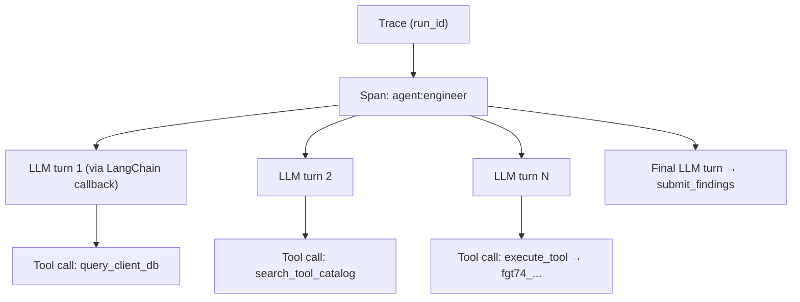

# Observability

> Langfuse integration for trace/span visibility across the agent pipeline.

## Overview

The system integrates with [Langfuse](https://langfuse.com) for observability. Every run creates a trace; the Engineer node creates a span, and the LangChain callback handler auto-instruments every LLM turn and tool call inside the ReAct loop. This provides full visibility into agent reasoning, tool execution, and LLM call latency.

The integration targets the OTel-based Langfuse SDK (v4 API compatible) and is managed through a singleton `LangfuseManager` in `src/core/langfuse_integration.py`.

## Trace Model (Engineer mode)



### Trace Structure

| Level | Name Pattern | Metadata |
|---|---|---|
| Trace | `run_id` (32-char hex) | `ticket_id`, `customer_id`, `thread_id` |
| Agent Span | `agent:engineer` | `run_id`, `customer_id` |
| LLM turns + tool calls | (auto via LangChain `CallbackHandler` scoped to the engineer span) | model, tokens, latency, tool args |

> If the legacy 13-agent graph runs (`PIPELINE_MODE=pipeline`, `main.py test`, or `run_mock.py`), traces instead show one span per legacy agent node.

### Context Propagation

Trace and span references are propagated through the async pipeline using `contextvars`:

- `set_current_trace(trace)` / `get_current_trace()` - run-level trace
- `set_current_span(span)` / `get_current_span()` - current agent span

The `audit_node` wrapper in `src/agents/audit_wrapper.py` (applied in `src/agent_graph_v2.py`) automatically creates and closes the engineer span; `src/agents/engineer.py` attaches the Langfuse callback handler to the ReAct invocation so all inner LLM/tool activity nests under it.

## SDK Integration Details

### TraceRef

The OTel-based Langfuse SDK has no explicit trace object. `TraceRef` is a lightweight wrapper carrying `trace_id` and `client` reference, enabling span creation under a trace.

```
TraceRef(trace_id: str, client: Langfuse)
```

Trace IDs are derived from `run_id` by stripping dashes (32-char lowercase hex, as required by OTel).

### Span Lifecycle

1. **Create**: `langfuse_manager.create_span(parent, name, input, metadata)`
2. **Update** (optional): `span.update(output=..., level=..., status_message=...)`
3. **End**: `LangfuseManager.end_span(span, output, level, status_message)`

The `end_span` static method calls `span.update()` before `span.end()` because the OTel-based SDK's `end()` only accepts `end_time`.

### LangChain Callback Handler

For agents that use LLM calls, `get_callback_handler_for_span(span)` returns a `langfuse.langchain.CallbackHandler` configured with `trace_context` pointing to the current span. This auto-instruments LangChain LLM calls with token counts and latency.

## Sampling

Traces are sampled based on `LANGFUSE_SAMPLE_RATE` (0.0-1.0). When a trace is sampled out, `create_trace()` returns `None`, and all downstream span creation is silently skipped. This is evaluated per-pipeline-execution using `random.random()`.

## Configuration

| Variable | Type | Default | Description |
|---|---|---|---|
| `LANGFUSE_ENABLED` | `bool` | `False` | Master enable/disable |
| `LANGFUSE_PUBLIC_KEY` | `str?` | `None` | Langfuse public key |
| `LANGFUSE_SECRET_KEY` | `str?` | `None` | Langfuse secret key |
| `LANGFUSE_HOST` | `str` | `http://localhost:3000` | Langfuse server URL |
| `LANGFUSE_SAMPLE_RATE` | `float` | `1.0` | Trace sampling rate |
| `LANGFUSE_FLUSH_AT` | `int` | `15` | Batch size before flush |
| `LANGFUSE_FLUSH_INTERVAL` | `int` | `5` | Flush interval (seconds) |

## Flush Lifecycle

The Langfuse client buffers events and flushes in batches. On application shutdown, the FastAPI `lifespan` handler calls `langfuse_manager.flush()` to ensure all pending events are sent.

## Key Implementation Details

- Source: `src/core/langfuse_integration.py`
- Audit wrapper: `src/agents/audit_wrapper.py:audit_node()` (wired in `src/agent_graph_v2.py`)
- Lazy initialization: client is created on first use, not at import time
- Graceful degradation: if Langfuse is unavailable, all span operations are no-ops
- Error spans: failed agent nodes set `level="ERROR"` and `status_message` on their span

## See Also

- [Architecture Overview](overview.md) - System components
- [Configuration Reference](../setup/configuration.md) - All Langfuse env vars
- [Deployment Guide](../setup/deployment.md) - Production observability setup
