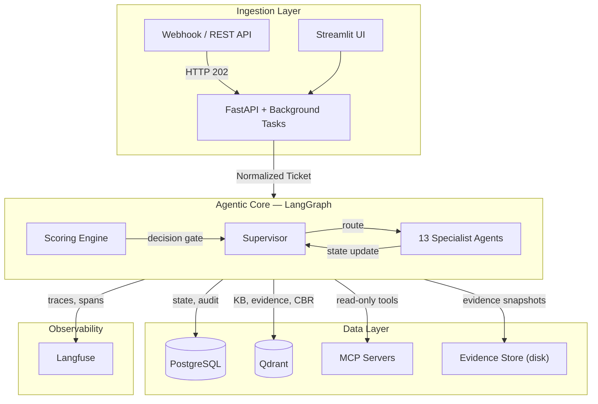

# Architecture Overview

> System-level design of the multi-agent L1/L2 technical support framework.

## Overview

The system receives IT support tickets (incidents, changes, requests) via webhooks or API, orchestrates a pipeline of 13 specialized LangGraph agents to diagnose, enrich, hypothesize, and generate resolution plans. No write actions are executed on external systems without human approval.

The architecture follows three core principles:
- **Configuration-First**: Verify via existing configuration before live traffic analysis
- **Evidence-Only**: All conclusions must be backed by tool output
- **Tenant Isolation**: All data queries filter by `customer_id`

## System Diagram

## Components

### Ingestion Layer
- **FastAPI server** (`src/ingestion/api.py`): Receives tickets via webhook (HTTP 202 async pattern). Returns `ticket_id` + `job_id` for polling.
- **Streamlit UI** (`streamlit_app.py`): Interactive frontend for ticket submission and result viewing.
- **Normalizers**: Convert source-specific payloads into the standard `Ticket` model.

### Agentic Core
- **LangGraph StateGraph** (`src/agent_graph.py`): Stateful, checkpointed graph with 13 nodes. The Supervisor acts as the entry point and router.
- **Sub-chains**: `evidence_collector → enricher → hypothesis → scoring` and `investigator → enricher → hypothesis → scoring` bypass the supervisor for tightly coupled sequences.
- **Scoring Engine**: Deterministic decision gate (no LLM) that computes risk, confidence, and routes to plan/investigate/escalate.

### Data Layer
- **PostgreSQL**: Relational state (cases, audit logs, tenant config, LangGraph checkpoints). All tables enforce `customer_id` FK.
- **Qdrant**: 5 vector collections (`knowledge_base`, `evidence`, `tool_knowledge`, `resolved_tickets`, `adaptive_fixes`). All queries filter by `customer_id`.
- **Evidence Store**: Content-addressable disk storage for immutable evidence snapshots. Namespaced by tenant.
- **MCP Servers**: External tool providers (stdio or SSE transport). Auto-discovered at startup via `CapabilityRegistry`.

### Observability
- **Langfuse**: Optional trace/span integration for pipeline visibility. Each agent node creates a span; tool calls create child spans.

## Tech Stack

| Component | Technology |
|---|---|
| Orchestration | LangGraph (StateGraph) |
| API | FastAPI |
| LLM | OpenAI-compatible models via `LLMFactory` |
| Relational DB | PostgreSQL + SQLAlchemy (async) |
| Vector DB | Qdrant |
| Tool Protocol | MCP (Model Context Protocol) via FastMCP |
| Migrations | Alembic |
| Package Manager | uv |
| Observability | Langfuse (SDK >= 2.44.0) |

## Data Flow

1. Ticket arrives via webhook → normalized to `Ticket` model → HTTP 202 returned
2. Background task launches LangGraph pipeline with `GlobalState`
3. Supervisor routes through agents based on state completeness
4. Evidence collection → enrichment → hypothesis → scoring loop repeats until confident
5. Resolution plan generated → final report compiled → stored in PostgreSQL
6. Client polls `/api/v1/tickets/{id}/report` for the result

## See Also

- [Agent Pipeline](../agents/README.md) - Detailed agent routing and I/O contracts
- [Data Layer](data_layer.md) - Schema and collections
- [Observability](observability.md) - Langfuse integration
- [Safety and Governance](safety_and_governance.md) - Tool safety model
