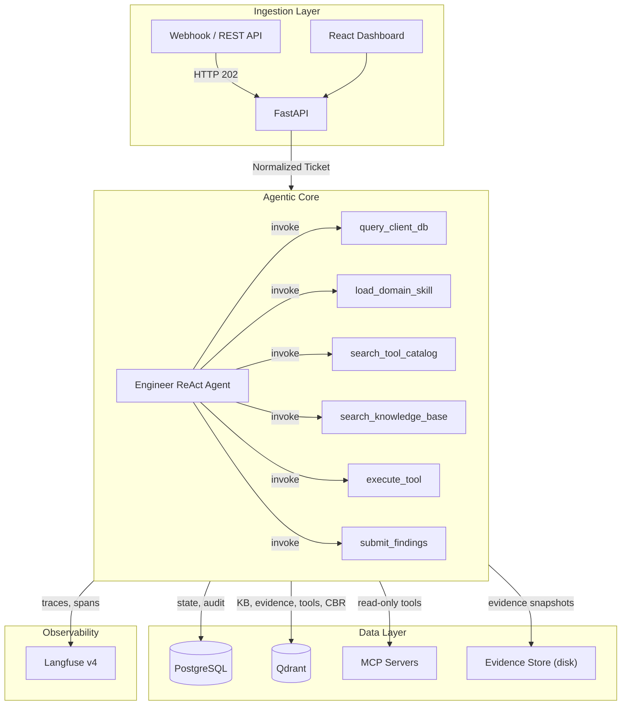

# Architecture Overview

> System-level design of the single-agent L1/L2 technical support framework. For how each component works in detail, see the [Components Guide](components.md).

## Overview

The system receives IT support tickets (incidents, changes, requests) via webhooks, REST API, or the React dashboard. A single Engineer ReAct agent processes each ticket through an autonomous reasoning loop, using six meta-tools to gather context, load domain methodology, discover and execute tools, and produce a structured resolution report. No write actions are executed on external systems without human approval.

The architecture follows three core principles:
- **Configuration-First**: Verify via existing configuration before live traffic analysis
- **Evidence-Only**: All conclusions must be backed by tool output
- **Tenant Isolation**: All data queries filter by `customer_id`

## System Diagram

## Components

### Ingestion Layer
- **FastAPI server** (`src/api/app.py`): Receives tickets via webhook (HTTP 202 async pattern). Returns `ticket_id` + `run_id` for polling.
- **React frontend** (`frontend/`): Dashboard for ticket submission, run monitoring, and report viewing.
- **Normalizers**: Convert source-specific payloads into the standard `Ticket` model.

### Agentic Core
- **LangGraph StateGraph** (`src/agent_graph_v2.py`): Single-node graph containing the Engineer agent. Built using `langgraph.prebuilt.create_react_agent` for autonomous ReAct reasoning.
- **Engineer ReAct Agent**: Operates in a think-act-observe loop. Six meta-tools provide structured access to all system capabilities:
  - `query_client_db` -- retrieve tenant context, topology, and configuration
  - `load_domain_skill` -- load domain-specific methodology (investigation steps, key questions, common patterns)
  - `search_tool_catalog` -- semantic search over available MCP tools
  - `search_knowledge_base` -- search KB articles, resolved tickets, and evidence
  - `execute_tool` -- invoke an MCP tool with parameters (read-only enforcement)
  - `submit_findings` -- finalize the structured report (diagnosis, remediation, validation, rollback)
- **Skills system**: Domain-specific methodology files loaded on demand. Each skill provides investigation guidance, key questions, and common failure patterns for a given domain.

### Data Layer
- **PostgreSQL**: Relational state (cases, audit logs, tenant config, runs). All tables enforce `customer_id` FK constraints with cascade deletes.
- **Qdrant**: 6 vector collections:
  - `knowledge_base` -- KB articles and documentation
  - `evidence` -- evidence snapshots from tool executions
  - `tool_catalog` -- MCP tool descriptions for semantic discovery
  - `tool_knowledge` -- learned tool usage patterns
  - `resolved_tickets` -- past resolutions for case-based reasoning
  - `adaptive_fixes` -- self-healing parameter corrections
  - All queries filter by `customer_id`.
- **Evidence Store**: Content-addressable disk storage for immutable evidence snapshots. Namespaced by tenant.
- **MCP Servers**: External tool providers (stdio or SSE transport). Auto-discovered at startup via `CapabilityRegistry`.

### Observability
- **Langfuse v4**: Trace and span integration for full pipeline visibility. Callbacks propagated to the react agent via `react_agent.ainvoke` config. Each tool invocation creates a child span.

## Tech Stack

| Component | Technology |
|---|---|
| Orchestration | LangGraph (StateGraph + `create_react_agent`) |
| API | FastAPI |
| LLM | OpenAI-compatible models via `LLMFactory` |
| Relational DB | PostgreSQL + SQLAlchemy (async) |
| Vector DB | Qdrant |
| Tool Protocol | MCP (Model Context Protocol) via FastMCP |
| Migrations | Alembic |
| Package Manager | uv |
| Observability | Langfuse v4 |
| Frontend | React |

## Data Flow

1. Ticket arrives via webhook or dashboard submission, normalized to `Ticket` model, HTTP 202 returned
2. Background task creates a run and launches the Engineer ReAct agent with initial state
3. Engineer queries tenant context (`query_client_db`)
4. Engineer loads the appropriate domain skill (`load_domain_skill`)
5. Engineer searches for relevant tools (`search_tool_catalog`) and knowledge (`search_knowledge_base`)
6. Engineer executes tools to gather evidence (`execute_tool`), repeating as needed
7. Engineer submits structured findings (`submit_findings`) -- diagnosis, remediation steps, validation, rollback
8. Report stored in PostgreSQL; client polls for the result

## See Also

- [Components Guide](components.md) - How each component works (medium depth)
- [Engineer Agent](../agents/engineer.md) - Meta-tools, skills system, reasoning loop
- [MCP Gateway](mcp_gateway.md) - The bundled OpenAPI→MCP tool server
- [Data Layer](data_layer.md) - Schema and collections
- [Observability](observability.md) - Langfuse integration
- [Safety and Governance](safety_and_governance.md) - Tool safety model
- [Operations Manual](../operations/README.md) - Runbooks
