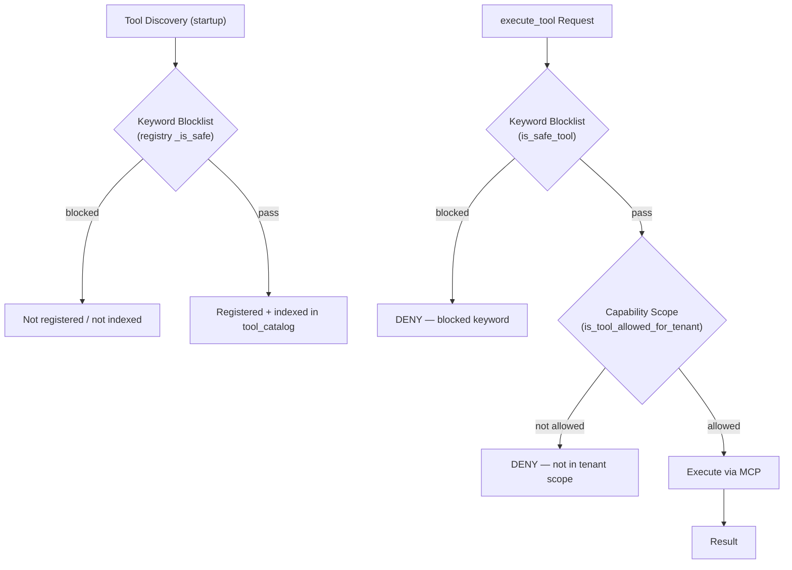

# Safety and Governance

> Tool safety model, blocked keywords, capability scopes, and the read-only stance.

## Overview

The system enforces a multi-layer safety model to prevent unauthorized or dangerous tool execution. All tools accessed via MCP are read-only by design. Write actions (configuration changes, deployments, etc.) are never executed autonomously — the Engineer's `submit_findings` output *proposes* remediation steps in its plan; executing them is up to a human. (An in-band human-in-the-loop approval gate is planned, not yet implemented.)

Safety is enforced at two active levels: keyword blocklist and per-tenant capability scopes. The blocklist applies twice — at tool registration (unsafe tools are never registered/indexed: 2776 gateway-exposed tools are filtered to 2220) and again at execution time inside `execute_tool`. The blocklist has two config lists: `SAFETY_BLOCKED_KEYWORDS` is matched against tool names **and** string argument values; `SAFETY_BLOCKED_NAME_KEYWORDS` (mutating verbs: `update`, `create`, `upload`, `upgrade`, `isolate`, `reset`, ...) is matched against tool names only, because argument values legitimately contain substrings like `createdBy` or `lastUpdateTime`.

## Safety Layers

## Layer 1: Keyword Blocklist

The `SAFETY_BLOCKED_KEYWORDS` list in `src/config.py` blocks any tool call whose name or arguments contain dangerous keywords (traffic capture, write/config verbs, database mutations, deployment verbs). This is a hard deny — no override.

The canonical keyword table lives in the [Configuration Reference](../setup/configuration.md#safety-and-governance); the list is configurable via the `SAFETY_BLOCKED_KEYWORDS` env var (JSON list).

## Layer 2: Capability Scopes

Each tenant has a `CapabilityScope` ORM record that defines which tools are allowed for that tenant. The `is_tool_allowed_for_tenant(tool_name, customer_id)` check enforces this allowlist.

This enables:
- Tenant A can use FortiGate tools but not AWS tools
- Tenant B can use AWS tools but not FortiGate tools
- New tools must be explicitly allowed per tenant

## API Access Governance

- **API keys** authenticate machine clients and always carry role `operator` with `tickets:write` permission only — they can submit tickets but cannot manage users, keys, or tenants.
- **JWT users** carry the role hierarchy (`viewer` / `operator` / `tenant_admin` / `platform_admin`) and are required for key management and administrative endpoints.

See the [API Keys & Users runbook](../operations/api_keys_and_users.md).

## Configuration-First Principle

Beyond tool-level safety, the system follows a configuration-first diagnostic approach:
- Prefer reading existing configuration (routes, policies, rules) over live traffic
- Never suggest traffic capture, packet sniffing, or debug flows
- Analyze static state before dynamic state

This principle is embedded in the Engineer's base investigation skill and system prompt.

## LLM Model Governance

The Engineer agent's model is set via `LLM_MODEL_ENGINEER`. Model selection is deterministic and logged. (Per-agent model profiles exist only for the deprecated legacy pipeline — see the legacy-labeled table in the [Configuration Reference](../setup/configuration.md).)

## Key Implementation Details

- Safety check: `src/core/safety.py` — `is_safe_tool()`, `is_tool_allowed_for_tenant()`
- Registration-time filter: `src/core/registry.py` — `_is_safe()`
- Capability scope ORM: `src/core/orm.py` — `CapabilityScope` model
- Blocked keywords: `src/config.py` — `SAFETY_BLOCKED_KEYWORDS`

## See Also

- [Configuration Reference](../setup/configuration.md) - Safety keyword list
- [Architecture Overview](overview.md) - System-level design
- [Components Guide](components.md) - CapabilityRegistry and safety filtering
- [API Keys & Users runbook](../operations/api_keys_and_users.md)
