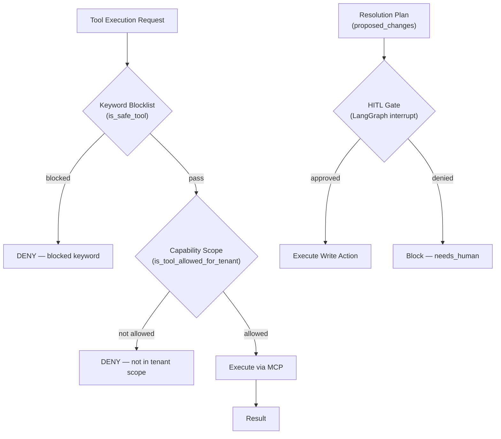

# Safety and Governance

> Tool safety model, blocked keywords, capability scopes, and human-in-the-loop gates.

## Overview

The system enforces a multi-layer safety model to prevent unauthorized or dangerous tool execution. All tools accessed via MCP are read-only by design. Write actions (configuration changes, deployments, etc.) are never executed autonomously — they are proposed in the resolution plan and require explicit human approval.

Safety is enforced at three levels: keyword blocklist, per-tenant capability scopes, and HITL gates.

## Safety Layers

## Layer 1: Keyword Blocklist

The `SAFETY_BLOCKED_KEYWORDS` list in `src/config.py` blocks any tool call whose name or arguments contain dangerous keywords. This is a hard deny — no override.

Default blocked keywords:

| Category | Keywords |
|---|---|
| Traffic analysis | `debug flow`, `sniffer`, `packet capture`, `pcap`, `tcpdump`, `wireshark` |
| Write operations | `execute`, `configure`, `set`, `edit`, `delete`, `rm`, `shutdown`, `reboot` |
| Database mutations | `drop database`, `truncate`, `format`, `destroy`, `purge`, `kill` |
| Deployment | `deploy`, `push`, `publish`, `migrate`, `alter`, `grant`, `revoke` |

The blocklist is configurable via the `SAFETY_BLOCKED_KEYWORDS` env var (JSON list).

## Layer 2: Capability Scopes

Each tenant has a `CapabilityScope` ORM record that defines which tools are allowed for that tenant. The `is_tool_allowed_for_tenant(tool_name, customer_id)` check enforces this allowlist.

This enables:
- Tenant A can use FortiGate tools but not AWS tools
- Tenant B can use AWS tools but not FortiGate tools
- New tools must be explicitly allowed per tenant

## Layer 3: HITL Gates

LangGraph's interrupt mechanism is used for write action approval. When the Resolution Planner generates `proposed_changes`, these are flagged for human review. The Response Agent can pause execution and emit a `PendingRequirement` if critical information is missing.

HITL pause artifacts:
- `data/needs.json` — structured list of information needed from the user
- `data/paused_state.json` — full pipeline state checkpoint for resume

## Configuration-First Principle

Beyond tool-level safety, the system follows a configuration-first diagnostic approach:
- Prefer reading existing configuration (routes, policies, rules) over live traffic
- Never suggest traffic capture, packet sniffing, or debug flows
- Analyze static state before dynamic state

This principle is embedded in all agent prompts and the evidence collector's intent generation.

## LLM Model Governance

Each agent has its own LLM model profile, configurable via env vars. This allows:
- Cost optimization: use smaller models for simple tasks (classification, context)
- Quality optimization: use larger models for complex reasoning (hypothesis, investigation)
- Auditability: model selection is deterministic and logged

See [Configuration Reference](../setup/configuration.md) for the full LLM profile table.

## Key Implementation Details

- Safety check: `src/core/safety.py` — `is_safe_tool()`, `is_tool_allowed_for_tenant()`
- Capability scope ORM: `src/core/orm.py` — `CapabilityScope` model
- Blocked keywords: `src/config.py` — `SAFETY_BLOCKED_KEYWORDS`
- HITL interrupts: handled by `src/agents/response.py` and LangGraph interrupt mechanism
- Adaptive executor safety: `src/core/adaptive_executor.py` — diagnosis prompts enforce grounding rules to prevent fabricated parameters

## See Also

- [Configuration Reference](../setup/configuration.md) - Safety keyword list, LLM profiles
- [Architecture Overview](overview.md) - System-level design
- [Adaptive Execution](adaptive_execution.md) - Self-healing with safety constraints
- [Evidence Collector](../agents/evidence_collector.md) - Tool selection with safety checks
