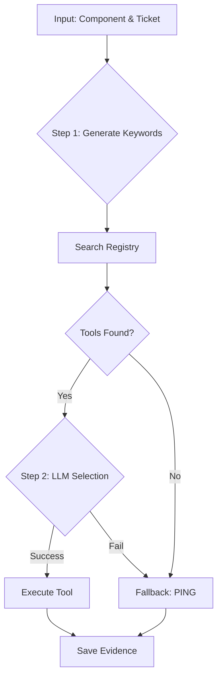

# Evidence Collector Agent: Technical Deep Dive

The **Evidence Collector** is the "hands" of the Support AI Agent. Its role is to take a list of suspect components (e.g., a firewall, a server) and gather diagnostic data to prove or disprove hypotheses.

## 🧠 Smart Tool Selection Logic

Instead of hardcoding tool mappings (e.g., "If firewall, run command X"), the agent uses a **Dynamic 3-Step Process** to navigate the 2500+ available tools.

### 1. Context Analysis & Keyword Generation
First, the agent asks a "Fast LLM" (e.g., GPT-4o-mini) to analyze the **Ticket Text** and the **Component Role**. It generates a list of search keywords.

*   **Input**: Ticket about "AWS connection", Component "FortiGate Firewall".
*   **Prompt Instruction**: Prioritize terms like "monitor", "status", "health".
*   **Output**: `["fortigate monitor", "firewall health", "vpn status"]`

### 2. Registry Search
The agent queries the **Capability Registry** using these keywords.
*   It performs a fuzzy/substring search against the names and descriptions of all registered tools (Internal & External MCP).
*   **Result**: A short list of candidate tools (e.g., `fgt_monitor_fw_get_firewall_health`, `fgt_monitor_vpn_get_ipsec`).

### 3. Semantic Selection
The agent presents the candidate tools **along with their Argument Schemas** back to the LLM.
*   **Task**: "Select the ONE best tool to diagnose the issue for this component. Construct the arguments."
*   **Reasoning**: The LLM looks at the tool descriptions and required arguments (e.g., `device_id`) and matches them against the component's metadata.
*   **Output**:
    ```json
    {
        "name": "fgt_monitor_fw_get_firewall_health",
        "args": { "device": "onprem-firewall" }
    }
    ```

## 🛡️ The Fallback Mechanism

If the "Smart Selection" fails, the agent has a built-in safety net to ensure *some* data is always collected.

**When does it trigger?**
1.  **Search yielded no results**: The registry contains no tools for "quantum-router".
2.  **LLM Confusion**: The LLM cannot decide which tool to use or fails to generate valid arguments.
3.  **Execution Failure**: The selected tool crashes or returns an error.

**What happens?**
The agent defaults to the **Ping Tool** (`ping`).
*   **Logic**: "If I can't run a specialized health check, I will at least check if the device is online."
*   **Argument**: It uses the component's ID (hostname/IP) as the target.
*   **Result**: The evidence log will contain a basic connectivity check `UP` or `DOWN`, which is still valuable for diagnosis.

## 🔗 Architecture flow


