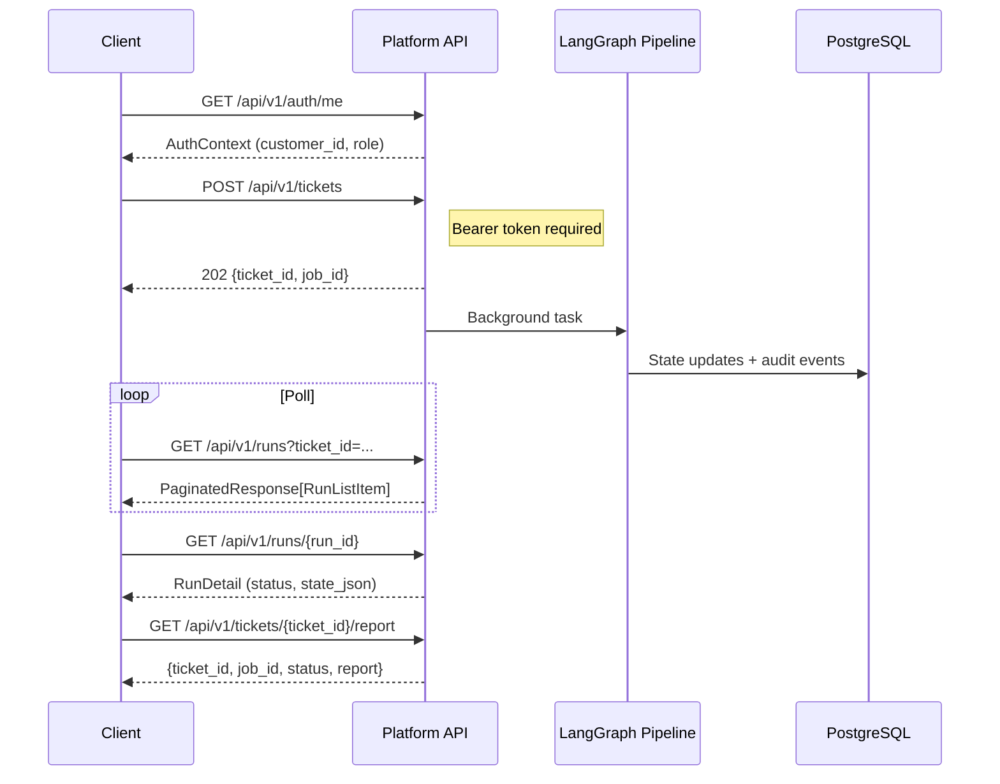

# Platform API Reference

> REST API v1 — Bearer token authentication, tenant-scoped endpoints, JSON error responses.

## Overview

The Platform API (`src/api/app.py`) provides ~77 authenticated endpoints across nine routers (`auth`, `tickets`, `runs`, `audit`, `users`, `profiles`, `tenants`, `assignments`, `inventory`) plus a public health check and legacy webhook endpoints. All endpoints return JSON.

The four core routers (auth, tickets, runs, audit) are documented in full below; the remaining five have per-endpoint summary tables in [Router Summaries](#router-summaries).

**Base URL**: `http://localhost:8000`

**Authentication**: Bearer token via `Authorization` header:
```
Authorization: Bearer sk_live_...
```

**Error format** (all non-2xx responses):
```json
{"error": "error_code", "detail": "Human-readable message"}
```

**Role hierarchy** (ascending privilege, applies to **JWT users**):
```
viewer < operator < tenant_admin < platform_admin
```

Each endpoint enforces a minimum role for JWT users. **API keys always resolve to role `operator`** with `tickets:write` permission — they authenticate ticket ingestion only; administrative endpoints require a JWT user session.

**Pagination**: Paginated endpoints accept `page` (default 1) and `page_size` (default 25, max 100) query params and return:
```json
{
  "items": [...],
  "total": 142,
  "page": 1,
  "page_size": 25,
  "total_pages": 6
}
```

## Authentication

The auth middleware (`src/api/middleware/auth.py`) extracts the Bearer token, validates it against the `api_keys` table, and resolves an `AuthContext`:

```json
{"customer_id": "acme_corp", "role": "operator", "key_id": "uuid"}
```

**Platform admin impersonation**: A `platform_admin` key can act on behalf of any tenant by passing `?customer_id=<target>` as a query parameter. Non-platform keys ignore this parameter.

## Lifecycle



## Common Patterns

### Pagination

All list endpoints use `PaginatedResponse<T>`:

| Parameter | Type | Default | Description |
|---|---|---|---|
| `page` | `int` | `1` | Page number (1-indexed) |
| `page_size` | `int` | `25` | Items per page (1-100) |

### Date Filters

Most list endpoints accept optional date range filters:

| Parameter | Type | Format | Description |
|---|---|---|---|
| `date_from` | `datetime` | ISO 8601 | Inclusive start |
| `date_to` | `datetime` | ISO 8601 | Inclusive end |

### Error Responses

| Status | Error Code | When |
|---|---|---|
| `401` | `invalid_auth` | Missing or malformed `Authorization` header |
| `401` | `invalid_key` | API key is invalid, expired, or revoked |
| `403` | `insufficient_role` | Caller role below endpoint minimum |
| `404` | `not_found` | Resource does not exist or not owned by tenant |
| `422` | `validation_error` | Request body fails Pydantic validation |
| `500` | `internal_error` | Unhandled server exception |

---

## Auth Endpoints

Router prefix: `/api/v1/auth` — Source: `src/api/routers/auth.py`

### `GET /api/v1/auth/me`

Return the authenticated caller's context. Min role: **viewer**.

**Response** `200`:
```json
{
  "customer_id": "acme_corp",
  "role": "operator",
  "key_id": "550e8400-e29b-41d4-a716-446655440000"
}
```

---

### `POST /api/v1/auth/keys`

Issue a new API key. The raw key is returned **only once**. Requires a **JWT user session** (not an API key).

**Body** (`ApiKeyCreate`):

| Field | Type | Required | Default | Description |
|---|---|---|---|---|
| `name` | `str` | yes | — | Key name (1-128 chars) |
| `role` | `str` | no | `operator` | **Ignored by the handler** — created keys always carry role `operator` with `tickets:write` permission |
| `expires_at` | `datetime` | no | `null` | Expiration (ISO 8601). Null = never expires |

**Response** `201` (`ApiKeyCreatedResponse`):
```json
{
  "id": "550e8400-e29b-41d4-a716-446655440000",
  "key_prefix": "sk_live_abc1",
  "name": "CI Pipeline Key",
  "role": "operator",
  "is_active": true,
  "expires_at": null,
  "last_used_at": null,
  "created_at": "2026-03-20T10:00:00Z",
  "raw_key": "sk_live_abc1234567890abcdef..."
}
```

**Errors**: `401` if the caller is not an authenticated JWT user.

> **Role model note:** the `viewer`/`operator`/`tenant_admin`/`platform_admin` hierarchy applies to **JWT users**. API keys always resolve to role `operator` and can only ingest tickets — they cannot manage keys, users, or tenants. See the [API Keys & Users runbook](../operations/api_keys_and_users.md).

---

### `GET /api/v1/auth/keys`

List all API keys for the authenticated tenant. Min role: **tenant_admin**.

**Response** `200` (`ApiKeyResponse[]`):
```json
[
  {
    "id": "550e8400-...",
    "key_prefix": "sk_live_abc1",
    "name": "CI Pipeline Key",
    "role": "operator",
    "is_active": true,
    "expires_at": null,
    "last_used_at": "2026-03-19T14:30:00Z",
    "created_at": "2026-03-10T10:00:00Z"
  }
]
```

---

### `DELETE /api/v1/auth/keys/{key_id}`

Revoke an API key. Min role: **tenant_admin**.

| Parameter | Location | Type | Description |
|---|---|---|---|
| `key_id` | path | `str` | UUID of the key to revoke |

**Response**: `204 No Content`

**Errors**: `404` if key not found or already revoked.

---

### `POST /api/v1/auth/keys/{key_id}/rotate`

Revoke an existing key and issue a replacement with the same metadata. Min role: **tenant_admin**.

| Parameter | Location | Type | Description |
|---|---|---|---|
| `key_id` | path | `str` | UUID of the key to rotate |

**Response** `200` (`ApiKeyCreatedResponse`): Same shape as `POST /keys` — includes the new `raw_key`.

**Errors**: `404` if key not found, already revoked, or not owned by tenant.

---

## Ticket Endpoints

Router prefix: `/api/v1/tickets` — Source: `src/api/routers/tickets.py`

### `POST /api/v1/tickets`

Submit a new ticket for pipeline processing. Min role: **operator**.

**Body** (`TicketSubmit`):

| Field | Type | Required | Default | Description |
|---|---|---|---|---|
| `source` | `str` | no | `api` | Source identifier (e.g., `api`, `servicenow`) |
| `mode` | `str` | no | `incident` | One of: `incident`, `change`, `validation`, `inquiry` |
| `severity` | `str` | no | `medium` | One of: `low`, `medium`, `high`, `critical` |
| `text` | `str` | yes | — | Ticket description |
| `external_id` | `str` | no | `null` | External system ticket ID |
| `raw_payload` | `object` | no | `null` | Additional source-specific fields |

**Response** `202`:
```json
{
  "status": "accepted",
  "ticket_id": "TKT-abc123",
  "job_id": "550e8400-e29b-41d4-a716-446655440000"
}
```

---

### `GET /api/v1/tickets`

Paginated ticket list with filters. Min role: **operator**.

| Parameter | Location | Type | Description |
|---|---|---|---|
| `severity` | query | `str` | Filter by severity |
| `mode` | query | `str` | Filter by mode |
| `status` | query | `str` | Filter by latest run status |
| `search` | query | `str` | Search ticket text (case-insensitive) |
| `date_from` | query | `datetime` | Created at >= |
| `date_to` | query | `datetime` | Created at <= |
| `page` | query | `int` | Page number |
| `page_size` | query | `int` | Items per page |

**Response** `200` (`PaginatedResponse[TicketListItem]`):
```json
{
  "items": [
    {
      "id": "TKT-abc123",
      "external_id": "INC0012345",
      "mode": "incident",
      "severity": "high",
      "source": "api",
      "text": "VPN tunnel down between sites",
      "created_at": "2026-03-20T10:00:00Z",
      "updated_at": "2026-03-20T10:05:00Z",
      "latest_run_status": "completed",
      "latest_run_decision": "resolved_l1"
    }
  ],
  "total": 42,
  "page": 1,
  "page_size": 25,
  "total_pages": 2
}
```

---

### `GET /api/v1/tickets/{ticket_id}`

Ticket detail with latest run summary. Min role: **operator**.

| Parameter | Location | Type | Description |
|---|---|---|---|
| `ticket_id` | path | `str` | Ticket ID |

**Response** `200` (`TicketDetail`):
```json
{
  "id": "TKT-abc123",
  "external_id": "INC0012345",
  "mode": "incident",
  "severity": "high",
  "source": "api",
  "text": "VPN tunnel down between sites",
  "created_at": "2026-03-20T10:00:00Z",
  "updated_at": "2026-03-20T10:05:00Z",
  "raw_payload": {},
  "run_count": 2,
  "latest_run_id": "550e8400-...",
  "latest_run_status": "completed",
  "latest_run_decision": "resolved_l1",
  "latest_run_final_answer": "# Diagnosis Report\n..."
}
```

---

### `GET /api/v1/tickets/{ticket_id}/timeline`

Agent events for all runs of this ticket, ordered by timestamp and sequence. Min role: **operator**.

**Response** `200` (`TicketTimelineEvent[]`):
```json
[
  {
    "id": 1,
    "run_id": "550e8400-...",
    "seq": 0,
    "node": "engineer",
    "created_at": "2026-03-20T10:00:01Z",
    "input_summary": {},
    "output_summary": {"summary": "..."}
  }
]
```

---

### `GET /api/v1/tickets/{ticket_id}/evidence`

Evidence snapshots collected for this ticket. Min role: **operator**.

**Response** `200` (`EvidenceItem[]`):
```json
[
  {
    "id": "ev-abc123",
    "tool_name": "get_interface_status",
    "content_hash": "sha256:abcdef...",
    "storage_ref": "evidence/acme_corp/TKT-abc123/ev-abc123.json",
    "summary": "Interface GigabitEthernet0/1 status: up/up",
    "created_at": "2026-03-20T10:01:00Z"
  }
]
```

---

### `GET /api/v1/tickets/{ticket_id}/hypotheses`

Hypotheses from the latest run's `state_json`. Min role: **operator**.

**Response** `200` (`HypothesisItem[]`):
```json
[
  {
    "id": "hyp-001",
    "title": "IPSec Phase 2 SA expired",
    "description": "The IKE Phase 2 security association...",
    "confidence": 0.85,
    "status": "confirmed",
    "evidence_refs": ["ev-abc123", "ev-def456"]
  }
]
```

---

### `GET /api/v1/tickets/{ticket_id}/facts`

Structured facts from the latest run's `state_json`. Prefers `structured_facts` when available, falls back to flat `facts` dict. Min role: **operator**.

**Response** `200` (`FactItem[]`):
```json
[
  {
    "key": "tunnel_status",
    "value": "down",
    "source_evidence_id": "ev-abc123",
    "confidence": 0.95
  }
]
```

---

### `GET /api/v1/tickets/{ticket_id}/plan`

Resolution plan from the latest run's `state_json`. Min role: **operator**.

**Response** `200` (`PlanResponse`):
```json
{
  "diagnosis_steps": [{"step": "Verify IKE Phase 1 status", "tool": "show_crypto_isakmp_sa"}],
  "remediation_steps": [{"step": "Clear and re-establish tunnel", "command": "clear crypto sa"}],
  "validation_steps": [{"step": "Confirm tunnel UP", "tool": "show_crypto_ipsec_sa"}],
  "rollback_steps": [{"step": "Restore previous crypto map configuration"}]
}
```

---

### `GET /api/v1/tickets/{ticket_id}/report`

Final markdown report. Min role: **viewer**.

**Response** `200` (`TicketReportResponse`):
```json
{
  "ticket_id": "TKT-abc123",
  "job_id": "550e8400-...",
  "status": "completed",
  "report": "# Diagnosis Report\n\n## Summary\n..."
}
```

**Errors**: `404` if no runs exist for this ticket.

---

### `POST /api/v1/tickets/{ticket_id}/retry`

Re-run the pipeline for an existing ticket. Creates a new run. Min role: **operator**.

| Parameter | Location | Type | Description |
|---|---|---|---|
| `ticket_id` | path | `str` | Ticket ID to re-process |

**Response** `202`:
```json
{
  "status": "accepted",
  "ticket_id": "TKT-abc123",
  "job_id": "550e8400-new-run-uuid"
}
```

---

## Run Endpoints

Router prefix: `/api/v1/runs` — Source: `src/api/routers/runs.py`

### `GET /api/v1/runs`

Paginated run list with filters. Min role: **operator**.

| Parameter | Location | Type | Description |
|---|---|---|---|
| `status` | query | `str` | Filter by run status |
| `ticket_id` | query | `str` | Filter by ticket |
| `date_from` | query | `datetime` | Started at >= |
| `date_to` | query | `datetime` | Started at <= |
| `page` | query | `int` | Page number |
| `page_size` | query | `int` | Items per page |

**Response** `200` (`PaginatedResponse[RunListItem]`):
```json
{
  "items": [
    {
      "id": "550e8400-...",
      "ticket_id": "TKT-abc123",
      "status": "completed",
      "decision": "resolved_l1",
      "hypothesis_count": 3,
      "started_at": "2026-03-20T10:00:00Z",
      "ended_at": "2026-03-20T10:05:30Z"
    }
  ],
  "total": 15,
  "page": 1,
  "page_size": 25,
  "total_pages": 1
}
```

---

### `GET /api/v1/runs/stats`

Aggregate run statistics for the tenant. Min role: **operator**.

| Parameter | Location | Type | Description |
|---|---|---|---|
| `date_from` | query | `datetime` | Started at >= |
| `date_to` | query | `datetime` | Started at <= |

**Response** `200` (`RunStats`):
```json
{
  "total_runs": 150,
  "by_status": {"completed": 130, "running": 5, "failed": 15},
  "by_decision": {"resolved_l1": 90, "escalate_l2": 30, "needs_human": 10},
  "avg_duration_seconds": 45.23,
  "success_rate": 0.8667
}
```

---

### `GET /api/v1/runs/{run_id}`

Full run detail including `state_json` and `cost_json`. Min role: **operator**.

| Parameter | Location | Type | Description |
|---|---|---|---|
| `run_id` | path | `str` | Run UUID |

**Response** `200` (`RunDetail`):
```json
{
  "id": "550e8400-...",
  "ticket_id": "TKT-abc123",
  "trace_id": "trace-uuid",
  "status": "completed",
  "decision": "resolved_l1",
  "hypothesis_count": 3,
  "final_answer": "# Diagnosis Report\n...",
  "cost_json": {"total_tokens": 15000, "total_cost_usd": 0.045},
  "state_json": {"hypotheses": [], "facts": {}, "plan": {}},
  "started_at": "2026-03-20T10:00:00Z",
  "ended_at": "2026-03-20T10:05:30Z"
}
```

---

### `GET /api/v1/runs/{run_id}/timeline`

Agent events for a specific run, ordered by sequence. Min role: **operator**.

**Response** `200` (`RunTimelineEvent[]`):
```json
[
  {
    "id": 1,
    "seq": 0,
    "node": "engineer",
    "created_at": "2026-03-20T10:00:01Z",
    "input_json": {},
    "output_json": {"summary": "..."}
  }
]
```

---

### `GET /api/v1/runs/{run_id}/tool-calls`

Tool execution audit trail for a run. Min role: **operator**.

**Response** `200` (`RunToolCall[]`):
```json
[
  {
    "id": "tc-uuid",
    "tool_name": "get_interface_status",
    "args_redacted": {"device": "router-1", "interface": "GigabitEthernet0/1"},
    "result_meta": {"rows": 1, "truncated": false},
    "status": "success",
    "error": null,
    "started_at": "2026-03-20T10:01:00Z",
    "ended_at": "2026-03-20T10:01:02Z"
  }
]
```

---

## Audit Endpoints

Router prefix: `/api/v1/audit` — Source: `src/api/routers/audit.py`

### `GET /api/v1/audit/logs`

Paginated audit log with filters. Min role: **viewer**.

| Parameter | Location | Type | Description |
|---|---|---|---|
| `ticket_id` | query | `str` | Filter by ticket |
| `actor` | query | `str` | Filter by actor |
| `action` | query | `str` | Filter by action type |
| `date_from` | query | `datetime` | Timestamp >= |
| `date_to` | query | `datetime` | Timestamp <= |
| `page` | query | `int` | Page number |
| `page_size` | query | `int` | Items per page |

**Response** `200` (`PaginatedResponse[AuditLogResponse]`):
```json
{
  "items": [
    {
      "id": 1,
      "ticket_id": "TKT-abc123",
      "actor": "system",
      "action": "run_started",
      "details": {"run_id": "550e8400-..."},
      "timestamp": "2026-03-20T10:00:00Z"
    }
  ],
  "total": 200,
  "page": 1,
  "page_size": 25,
  "total_pages": 8
}
```

---

### `GET /api/v1/audit/tool-calls`

Paginated tool call audit with filters. Min role: **viewer**.

| Parameter | Location | Type | Description |
|---|---|---|---|
| `run_id` | query | `str` | Filter by run |
| `tool_name` | query | `str` | Filter by tool name |
| `status` | query | `str` | Filter by status |
| `date_from` | query | `datetime` | Started at >= |
| `date_to` | query | `datetime` | Started at <= |
| `page` | query | `int` | Page number |
| `page_size` | query | `int` | Items per page |

**Response** `200` (`PaginatedResponse[ToolCallResponse]`):
```json
{
  "items": [
    {
      "id": "tc-uuid",
      "run_id": "550e8400-...",
      "tool_name": "get_interface_status",
      "args_redacted": {"device": "router-1"},
      "result_meta": {"rows": 1},
      "status": "success",
      "error": null,
      "started_at": "2026-03-20T10:01:00Z",
      "ended_at": "2026-03-20T10:01:02Z"
    }
  ],
  "total": 50,
  "page": 1,
  "page_size": 25,
  "total_pages": 2
}
```

---

## Health and Legacy Endpoints

### `GET /health`

Public health check (no authentication).

**Response** `200`:
```json
{"status": "ok", "app": "SupportAI-Agent"}
```

---

### `POST /api/v1/webhook/{source_id}` (Legacy)

Legacy webhook ingestion. Uses `X-Customer-ID` header instead of Bearer auth.

| Parameter | Location | Type | Required | Description |
|---|---|---|---|---|
| `source_id` | path | `str` | yes | Source identifier |
| `X-Customer-ID` | header | `str` | yes | Tenant identifier |
| body | body | `JSON` | yes | Ticket payload |

**Response** `202`:
```json
{
  "status": "accepted",
  "message": "Ticket ingested. Processing launched in background.",
  "ticket_id": "TKT-abc123",
  "job_id": "550e8400-..."
}
```

---

### `GET /api/v1/jobs/{job_id}` (Legacy)

Legacy job status polling. Optional `X-Customer-ID` header.

| Parameter | Location | Type | Required | Description |
|---|---|---|---|---|
| `job_id` | path | `str` | yes | Job/run ID |
| `X-Customer-ID` | header | `str` | no | Tenant scope |

**Response** `200`:
```json
{
  "job_id": "550e8400-...",
  "status": "running",
  "current_agent": "engineer",
  "iteration": 4
}
```

---

## Router Summaries

The five routers below are summarized per endpoint (all mounted under `/api/v1`, JWT user auth with the listed permission). Request/response schemas live in `src/api/schemas/`.

### Users — `src/api/routers/users.py` (prefix `/users`)

| Method | Path | Permission | Purpose |
|---|---|---|---|
| GET | `/users` | `users:read` | List users |
| POST | `/users` | `users:manage` | Create a user |
| GET | `/users/{user_id}` | `users:read` | User detail |
| PATCH | `/users/{user_id}` | `users:manage` | Update a user |
| POST | `/users/{user_id}/reset-password` | `users:manage` | Reset a user's password |

### Profiles — `src/api/routers/profiles.py` (prefix `/profiles`)

| Method | Path | Permission | Purpose |
|---|---|---|---|
| GET | `/profiles` | `profiles:read` | List permission profiles |
| POST | `/profiles` | `profiles:manage` | Create a profile |
| GET | `/profiles/permissions` | `profiles:read` | List all available permissions |
| GET | `/profiles/{profile_id}` | `profiles:read` | Profile detail |
| PATCH | `/profiles/{profile_id}` | `profiles:manage` | Update a profile |
| DELETE | `/profiles/{profile_id}` | `profiles:manage` | Delete a profile |

### Tenants — `src/api/routers/tenants.py` (prefix `/tenants`)

| Method | Path | Permission | Purpose |
|---|---|---|---|
| GET | `/tenants` | `tenants:read` | List tenants |
| POST | `/tenants` | `tenants:manage` | Create a tenant |
| GET | `/tenants/{customer_id}` | `tenants:read` | Tenant detail |
| PATCH | `/tenants/{customer_id}` | `tenants:manage` | Update tenant metadata |
| DELETE | `/tenants/{customer_id}` | `tenants:manage` | Delete a tenant (cascades) |
| POST | `/tenants/{customer_id}/suspend` | `tenants:manage` | Suspend a tenant |
| POST | `/tenants/{customer_id}/activate` | `tenants:manage` | Reactivate a tenant |
| GET | `/tenants/{customer_id}/cascade-warning` | `tenants:read` | Preview what a delete would cascade to |
| GET | `/tenants/{customer_id}/endpoints` | `tenants:read` | Infrastructure endpoint pointers |
| PUT | `/tenants/{customer_id}/endpoints` | `tenants:manage` | Upsert endpoint pointers |
| GET | `/tenants/{customer_id}/scopes` | `tenants:read` | List capability scopes (tool allowlists) |
| POST | `/tenants/{customer_id}/scopes` | `tenants:manage` | Create a capability scope |
| PATCH | `/tenants/{customer_id}/scopes/{scope_id}` | `tenants:manage` | Update a capability scope |
| DELETE | `/tenants/{customer_id}/scopes/{scope_id}` | `tenants:manage` | Delete a capability scope |

### Assignments — `src/api/routers/assignments.py` (prefix `/tenants/{customer_id}/users`)

| Method | Path | Permission | Purpose |
|---|---|---|---|
| GET | `/tenants/{customer_id}/users` | `assignments:read` | List users assigned to a tenant |
| POST | `/tenants/{customer_id}/users` | `assignments:manage` | Assign a user to a tenant |
| PATCH | `/tenants/{customer_id}/users/{user_id}` | `assignments:manage` | Update an assignment (profile/role) |
| DELETE | `/tenants/{customer_id}/users/{user_id}` | `assignments:manage` | Remove a user from a tenant |

### Inventory — `src/api/routers/inventory.py` (prefix `/inventory`)

Manages the tenant's logical inventory (the `ClientContext` the Engineer reads via `query_client_db`).

| Method | Path | Permission | Purpose |
|---|---|---|---|
| GET | `/inventory` | `inventory:read` | Inventory overview (counts) |
| GET | `/inventory/full` | `inventory:read` | Full inventory document |
| POST | `/inventory/import` | `inventory:manage` | Bulk import (replaces context content) |
| GET | `/inventory/components` | `inventory:read` | List components/devices |
| POST | `/inventory/components` | `inventory:manage` | Create a component |
| GET | `/inventory/components/{component_id}` | `inventory:read` | Component detail |
| PATCH | `/inventory/components/{component_id}` | `inventory:manage` | Update a component |
| DELETE | `/inventory/components/{component_id}` | `inventory:manage` | Delete a component |
| GET | `/inventory/dependencies` | `inventory:read` | List dependencies (topology edges) |
| POST | `/inventory/dependencies` | `inventory:manage` | Create a dependency |
| DELETE | `/inventory/dependencies` | `inventory:manage` | Delete a dependency |
| GET | `/inventory/baselines` | `inventory:read` | List metric baselines |
| POST | `/inventory/baselines` | `inventory:manage` | Create a baseline |
| PATCH | `/inventory/baselines/{component_id}/{metric}` | `inventory:manage` | Update a baseline |
| DELETE | `/inventory/baselines/{component_id}/{metric}` | `inventory:manage` | Delete a baseline |
| GET | `/inventory/changes` | `inventory:read` | List known changes |
| POST | `/inventory/changes` | `inventory:manage` | Record a known change |
| PATCH | `/inventory/changes/{index}` | `inventory:manage` | Update a known change |
| DELETE | `/inventory/changes/{index}` | `inventory:manage` | Delete a known change |

## See Also

- [Quickstart](../setup/quickstart.md) — Running the API server
- [Deployment](../setup/deployment.md) — Docker Compose production setup
- [Webhooks](webhooks.md) — Legacy webhook flow details
- [API Keys & Users runbook](../operations/api_keys_and_users.md)
- [Ticket Operations runbook](../operations/ticket_operations.md)
