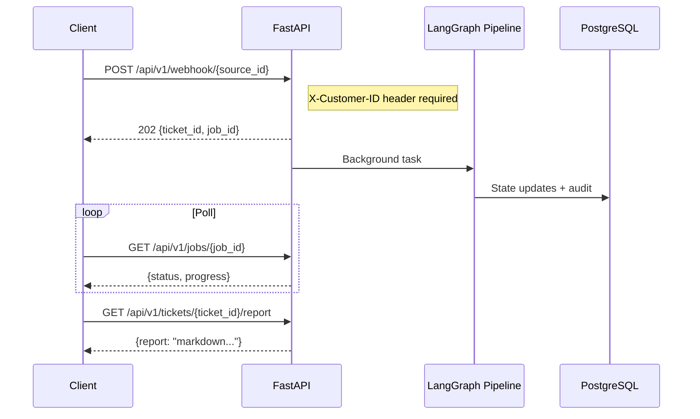

# API Reference

> REST API endpoints for ticket ingestion, job status, and report retrieval.

## Overview

The FastAPI server (`src/ingestion/api.py`) exposes an async job pattern: submit a ticket via webhook (HTTP 202), then poll for results. All tenant-scoped endpoints require the `X-Customer-ID` header.

Base URL: `http://localhost:8000` (default)

## Lifecycle



## Endpoints

### Health Check

```
GET /health
```

**Response** `200`:
```json
{"status": "ok", "app": "SupportAI-Agent"}
```

---

### Submit Ticket (Webhook)

```
POST /api/v1/webhook/{source_id}
```

| Parameter | Location | Type | Required | Description |
|---|---|---|---|---|
| `source_id` | path | `str` | yes | Source identifier (e.g., `servicenow`, `jira`, `email`) |
| `X-Customer-ID` | header | `str` | yes | Tenant identifier |
| body | body | `JSON` | yes | Ticket payload (source-specific) |

**Request**:
```bash
curl -X POST http://localhost:8000/api/v1/webhook/servicenow \
  -H "Content-Type: application/json" \
  -H "X-Customer-ID: acme_corp" \
  -d '{"text": "VPN tunnel down between sites", "severity": "high"}'
```

**Response** `202`:
```json
{
  "status": "accepted",
  "message": "Ticket ingested. Processing launched in background.",
  "ticket_id": "TKT-abc123",
  "job_id": "JOB-def456"
}
```

**Errors**:
- `400` — Missing `X-Customer-ID` header
- `500` — Internal processing error

---

### Job Status

```
GET /api/v1/jobs/{job_id}
```

| Parameter | Location | Type | Required | Description |
|---|---|---|---|---|
| `job_id` | path | `str` | yes | Job ID from webhook response |
| `X-Customer-ID` | header | `str` | no | Tenant scope (recommended) |

**Response** `200`:
```json
{
  "job_id": "JOB-def456",
  "status": "running",
  "current_agent": "evidence_collector",
  "iteration": 4
}
```

**Errors**:
- `404` — Job not found

---

### Ticket Report

```
GET /api/v1/tickets/{ticket_id}/report
```

| Parameter | Location | Type | Required | Description |
|---|---|---|---|---|
| `ticket_id` | path | `str` | yes | Ticket ID |
| `X-Customer-ID` | header | `str` | no | Tenant scope (recommended) |

**Response** `200`:
```json
{
  "ticket_id": "TKT-abc123",
  "report": "# Diagnosis Report\n\n## Conclusion\n..."
}
```

**Errors**:
- `404` — Report not generated yet or ticket not found

---

### List Tenants

```
GET /api/v1/tenants
```

**Response** `200`:
```json
[
  {"customer_id": "acme_corp", "name": "Acme Corporation"},
  {"customer_id": "fake_client", "name": "Test Client"}
]
```

---

### Tenant Jobs

```
GET /api/v1/tenants/{customer_id}/jobs
```

| Parameter | Location | Type | Required | Description |
|---|---|---|---|---|
| `customer_id` | path | `str` | yes | Tenant identifier |
| `limit` | query | `int` | no | Max results (default: 20) |

**Response** `200`:
```json
[
  {"job_id": "JOB-def456", "ticket_id": "TKT-abc123", "status": "completed"},
  {"job_id": "JOB-ghi789", "ticket_id": "TKT-xyz987", "status": "running"}
]
```

## Startup Behavior

On startup, the FastAPI `lifespan` handler:
1. Loads builtin capability packs via `CapabilityRegistry.load_builtin_packs()`
2. Discovers external MCP tools via `CapabilityRegistry.load_external_tools()`
3. Logs the total number of available tools

On shutdown:
1. Flushes Langfuse client to ensure all traces are sent

## Key Implementation Details

- Source: `src/ingestion/api.py`
- Service layer: `src/ingestion/service.py` — `IngestionService` handles normalization and pipeline dispatch
- Background execution: Uses FastAPI `BackgroundTasks` for async pipeline execution
- Tenant isolation: `X-Customer-ID` header is propagated through the entire pipeline
- App title and version from `src/config.py` — `APP_NAME` and hardcoded `0.1.0`

## See Also

- [Quickstart](../setup/quickstart.md) - Running the API server
- [Webhooks](webhooks.md) - Webhook flow details
- [Architecture Overview](../architecture/overview.md) - System diagram
