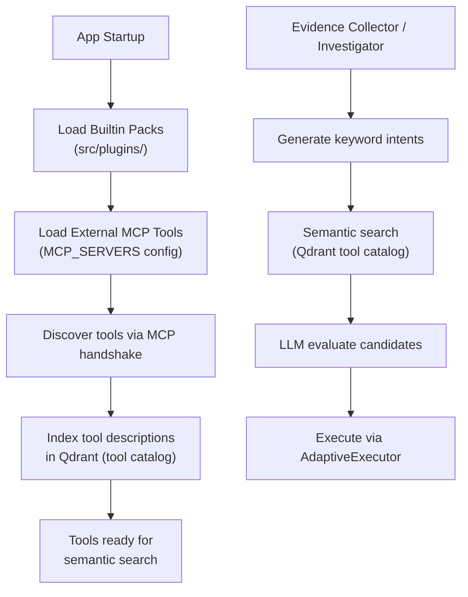

# MCP Tools

> MCP server setup, tool discovery, and capability pack architecture.

## Overview

The system uses the [Model Context Protocol (MCP)](https://modelcontextprotocol.io/) to connect to external tool servers. Tools are auto-discovered at startup via `CapabilityRegistry` and indexed in Qdrant for semantic search. All tool execution is read-only — write actions are only proposed in resolution plans.

Two transport modes are supported: **stdio** (local processes) and **SSE** (remote HTTP servers).

## Tool Discovery Flow



## MCP Server Configuration

Servers are defined in `MCP_SERVERS` (env var or `src/config.py`):

### SSE Transport (Remote)

```json
{
  "mcp-gateway": {
    "transport": "sse",
    "url": "http://localhost:8001/sse"
  }
}
```

The default entry points at the bundled [MCP Gateway](../architecture/mcp_gateway.md) (`mcp_gateway/`), which generates its tools from vendor OpenAPI specs.

### Stdio Transport (Local)

```json
{
  "filesystem": {
    "transport": "stdio",
    "command": "npx",
    "args": ["-y", "@modelcontextprotocol/server-filesystem", "/tmp"]
  }
}
```

## Capability Packs

Capability packs are vendor-specific plugins under `src/plugins/` that bundle:
- Tool definitions and schemas
- Playbooks (diagnostic workflows)
- Output normalizers
- Vendor-specific knowledge

The `generic/` pack provides baseline tools that work across all vendors. Vendor-specific packs (e.g., FortiGate, AWS) extend with specialized tools.

Packs implement the `PluginInterface` from `src/core/interfaces.py`.

## Capability Scopes (Tenant Allowlists)

Each tenant has a `CapabilityScope` ORM record defining which tools are allowed. The check `is_tool_allowed_for_tenant(tool_name, customer_id)` is enforced before every execution.

This prevents:
- Tenant A from accessing Tenant B's tools
- Unauthorized tool categories from being used

## Tool Selection Pipeline

When an agent needs to execute tools:

1. **Intent generation**: LLM generates 1-3 keyword queries per component (2-6 words each)
2. **Semantic search**: Each intent is searched against the Qdrant tool catalog
3. **Candidate evaluation**: LLM scores each candidate for relevance and priority
4. **Argument binding**: LLM maps component data to tool parameters
5. **Safety check**: `is_safe_tool()` + `is_tool_allowed_for_tenant()`
6. **Execution**: `AdaptiveExecutor` runs the tool with retry and learning

## Key Implementation Details

- MCP client: `src/mcp/client.py` — transport abstraction (stdio/SSE)
- Registry: `src/core/registry.py` — `CapabilityRegistry` (discovery + indexing)
- Safety: `src/core/safety.py` — `is_safe_tool()`, `is_tool_allowed_for_tenant()`
- Plugin interface: `src/core/interfaces.py` — `PluginInterface`, `MCPToolInterface`
- Timeout: `MCP_SERVER_TIMEOUT` (default 30s) per tool call

## Configuration

| Variable | Type | Default | Description |
|---|---|---|---|
| `MCP_SERVERS` | `dict` | See config.py | MCP server definitions |
| `MCP_SERVER_TIMEOUT` | `int` | `30` | Tool call timeout (seconds) |

## See Also

- [Evidence Collector](../agents/evidence_collector.md) - Primary tool consumer
- [Adaptive Execution](../architecture/adaptive_execution.md) - Self-healing execution
- [Safety and Governance](../architecture/safety_and_governance.md) - Tool safety model
- [Configuration Reference](../setup/configuration.md) - MCP_SERVERS setup
