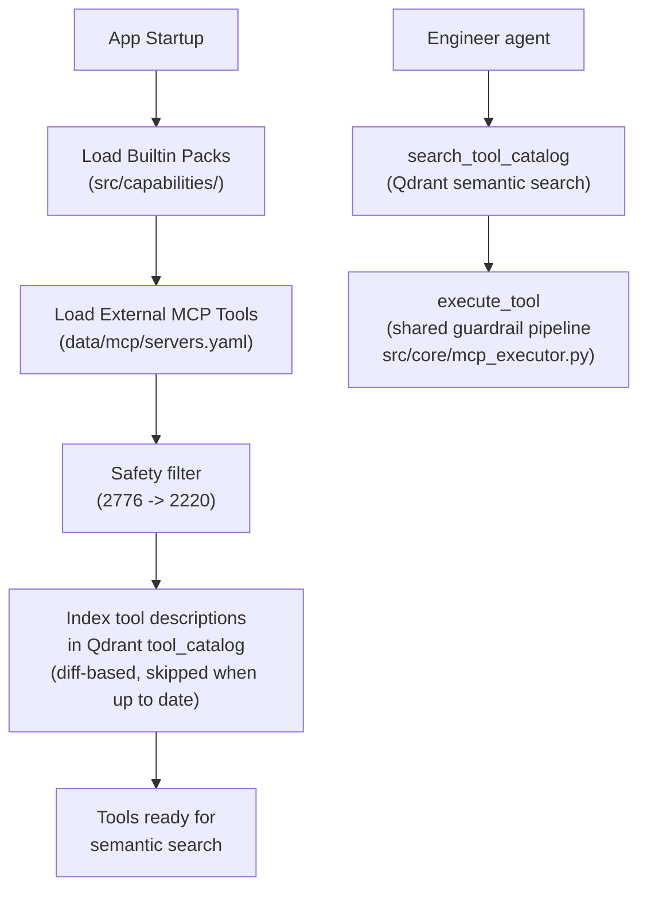

# MCP Tools

> MCP server setup, tool discovery, and capability pack architecture.

## Overview

The system uses the [Model Context Protocol (MCP)](https://modelcontextprotocol.io/) to connect to external tool servers. Tools are auto-discovered at startup via `CapabilityRegistry` and indexed in Qdrant for semantic search. All tool execution is read-only — write actions are only proposed in the Engineer's plan.

The bundled [MCP Gateway](../architecture/mcp_gateway.md) (`mcp_gateway/`) is the primary server: it generates **2776** tools from vendor OpenAPI specs, which the registry safety-filters to **2220** registered and indexed tools.

Two transport modes are supported: **stdio** (local processes) and **SSE** (remote HTTP servers).

## Tool Discovery Flow



## MCP Server Configuration

Servers are defined in `data/mcp/servers.yaml`, loaded at startup by `src/config.py` (which expands `${VAR:-default}` placeholders from the environment). The full field reference lives in the [Configuration Reference](../setup/configuration.md#mcp-model-context-protocol).

```yaml
# data/mcp/servers.yaml
servers:
  mcp-gateway:                # bundled OpenAPI→MCP gateway (mcp_gateway/)
    transport: sse
    url: ${MCP_GATEWAY_URL:-http://localhost:8001/sse}

  filesystem:                 # stdio example
    transport: stdio
    command: npx
    args: ["-y", "@modelcontextprotocol/server-filesystem", "/tmp"]
```

See `data/mcp/servers.example.yaml` for more examples (vendor tagging, per-server timeout).

## Capability Packs

Capability packs are in-process plugins under `src/capabilities/` that can bundle tool definitions, playbooks, and vendor-specific knowledge. They implement `CapabilityPackInterface` from `src/core/interfaces.py`.

Today only the `generic/` pack exists and is essentially a stub — **the MCP server route (servers.yaml + the gateway's appliance packs) is the primary way to add vendor tooling**, requiring no agent-side code.

## Capability Scopes (Tenant Allowlists)

Each tenant has a `CapabilityScope` ORM record defining which tools are allowed. The check `is_tool_allowed_for_tenant(tool_name, customer_id)` is enforced before every execution.

This prevents:
- Tenant A from accessing Tenant B's tools
- Unauthorized tool categories from being used

## Tool Selection (Engineer mode)

1. **Semantic search**: the agent calls `search_tool_catalog` with an intent query; Qdrant returns matching tools with descriptions, parameter schemas, vendor and categories — scoped to the appliance-pack versions matching the tenant's managed devices (`src/core/pack_matching.py`).
2. **Guardrail pipeline**: `execute_tool` delegates to the shared `src/core/mcp_executor.py::execute_mcp_tool` — keyword blocklist (`is_safe_tool`) → tenant capability scope (`is_tool_allowed_for_tenant`) → registry resolution → framework-side `tenant` header injection → execution → error classification. The Device Assessment collector uses the same pipeline with the additional `enforce_read_only` name allowlist.
3. **Execution**: direct MCP call via `ExternalToolWrapper` (no retry middleware); the Engineer path stores results as evidence and records the tool-call audit trail.

(The legacy pipeline's 4-phase `ToolSelector` + `AdaptiveExecutor` flow is archived in [docs/legacy/architecture/tool_selection_pipeline.md](../legacy/architecture/tool_selection_pipeline.md).)

## Key Implementation Details

- MCP client: `src/mcp/client.py` — transport abstraction (stdio/SSE)
- Shared execution pipeline: `src/core/mcp_executor.py` — `execute_mcp_tool()` (Engineer + Assessment collector)
- Registry: `src/core/registry.py` — `CapabilityRegistry` (discovery + safety filter + indexing)
- Safety: `src/core/safety.py` — `is_safe_tool()`, `is_tool_allowed_for_tenant()`
- Pack interface: `src/core/interfaces.py` — `CapabilityPackInterface`, `MCPToolInterface`
- Timeouts: no per-tool-call timeout is enforced on the Engineer path (`MCP_SERVER_TIMEOUT` and the per-server `timeout` field in servers.yaml are defined but **not applied** by the current client); the run-level `ENGINEER_TIMEOUT_SECONDS` bounds the whole investigation. Assessments pass an explicit per-step `timeout_s` (default `ASSESSMENT_STEP_TIMEOUT_S`) through `execute_mcp_tool`

## See Also

- [MCP Gateway](../architecture/mcp_gateway.md) - The bundled OpenAPI→MCP server
- [Gateway Operations runbook](../operations/gateway_operations.md)
- [Tool Catalog runbook](../operations/tool_catalog.md) - Indexing lifecycle and forced re-index
- [Safety and Governance](../architecture/safety_and_governance.md) - Tool safety model
- [Configuration Reference](../setup/configuration.md) - servers.yaml field reference
