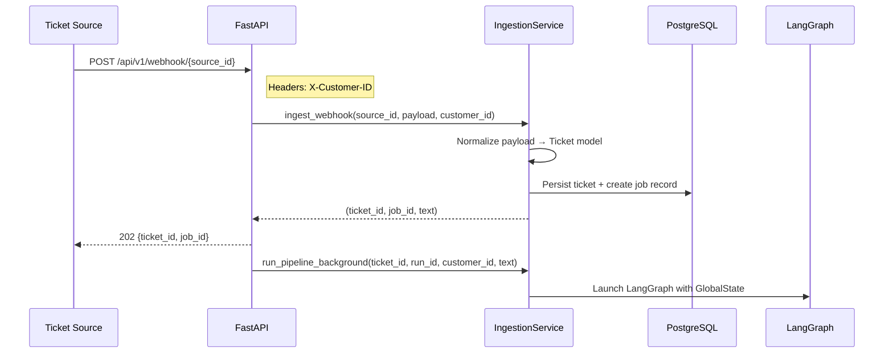

# Webhooks

> Webhook ingestion flow, normalizer pattern, and tenant identification.

## Overview

Tickets enter the system via the webhook endpoint `POST /api/v1/webhook/{source_id}`. The `source_id` path parameter identifies the ticket source (e.g., `servicenow`, `jira`, `email`). Each source has a normalizer that converts the source-specific payload into the standard `Ticket` model.

## Ingestion Flow



## Tenant Identification

The `X-Customer-ID` header is **required** on all webhook submissions. This header:
- Identifies the tenant for data isolation
- Is propagated through the entire pipeline (`customer_id` field in `GlobalState`)
- Scopes all DB queries and Qdrant searches
- Must match a registered tenant in the system

Missing or empty `X-Customer-ID` returns HTTP 400.

## Payload Format

The webhook accepts any JSON payload. The `IngestionService` normalizes it into a `Ticket`:

```python
class Ticket(BaseModel):
    id: str                              # Generated or extracted
    mode: TicketMode                     # "incident", "change", "validation", "inquiry"
    text: str                            # Main ticket description
    severity: Severity                   # "low", "medium", "high", "critical"
    source: str                          # "webhook:{source_id}"
    timestamps: Dict[str, str] = {}      # Optional timestamps
    raw_payload: Optional[Dict] = None   # Original payload preserved
```

### Example Payloads

**ServiceNow-style**:
```json
{
  "number": "INC0012345",
  "short_description": "VPN tunnel down between sites",
  "description": "Users at site B cannot access resources at site A...",
  "priority": "2",
  "category": "Network"
}
```

**Simple format**:
```json
{
  "text": "Database connection timeouts on production app server",
  "severity": "high"
}
```

## Normalizer Pattern

The `IngestionService` (`src/ingestion/service.py`) handles normalization:

1. Extracts ticket text from the payload (checks `text`, `description`, `short_description` fields)
2. Maps source-specific severity/priority to the standard `Severity` enum
3. Generates a ticket ID if not provided
4. Creates a job record in PostgreSQL for status tracking
5. Preserves the raw payload for audit

## Background Execution

After returning HTTP 202, the API dispatches `run_pipeline_background()` via FastAPI `BackgroundTasks`. This:
1. Constructs the initial `GlobalState` with the normalized ticket
2. Launches the LangGraph pipeline (`app.ainvoke()`)
3. Updates the job record with progress and final status
4. Stores the final report in PostgreSQL

## Key Implementation Details

- Endpoint: `src/ingestion/api.py` — `receive_webhook()`
- Service: `src/ingestion/service.py` — `IngestionService`
- Supported `source_id` values: any string (used for traceability, not validation)
- Job polling: `GET /api/v1/jobs/{job_id}` — see [API Reference](api_reference.md)

## See Also

- [API Reference](api_reference.md) - Full endpoint documentation
- [Architecture Overview](../architecture/overview.md) - System diagram
- [Quickstart](../setup/quickstart.md) - Running the API
