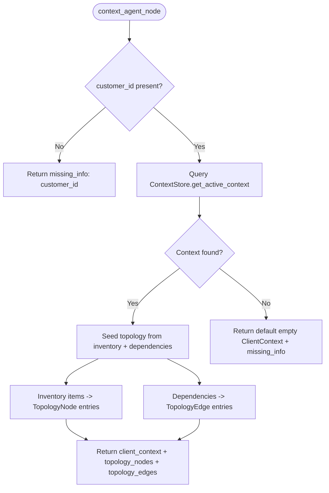

# Context Agent

> Loads tenant context from the PostgreSQL-backed ContextStore and seeds the initial topology graph from inventory and dependencies.

## Overview

The context agent is the first data-fetching node in the pipeline. It reads the `customer_id` from state, queries the `ContextStore` for the active `ClientContext` record, and returns it along with seeded topology data.

Topology seeding converts inventory items into `TopologyNode` entries and known dependencies into `TopologyEdge` entries. These pre-populated graph elements provide downstream agents (mapper, enricher, hypothesis) with a structural baseline before any tool execution occurs.

If no context is found for the tenant, the agent returns a default empty `ClientContext` and flags `missing_info` with `"client_context_not_found"`. This allows the pipeline to continue with degraded information rather than halting.

## When Called

Routed by the supervisor when `client_context` is absent (priority 2, first data-fetching step).

```python
if not state.get("client_context"):
    return "context_agent"
```

Return: Fixed edge to supervisor.

## Flow Diagram



## Input / Output Contract

### Input (read from `GlobalState`)

| Field | Type | Source |
|---|---|---|
| `customer_id` | `str` | Ingestion layer / ticket metadata |

### Output (written to `GlobalState`)

| Field | Type | Description |
|---|---|---|
| `client_context` | `ClientContext` | Tenant context with inventory, dependencies, baselines, known_changes |
| `topology_nodes` | `List[TopologyNode]` | One node per inventory item (id, role, ref, metadata) |
| `topology_edges` | `List[TopologyEdge]` | One edge per dependency (source_id, target_id, relation); confidence=1.0 |
| `missing_info` | `List[str]` | Set when customer_id is absent or context not found |

### Input Example

```json
{
  "customer_id": "tenant_acme"
}
```

### Output Example

```json
{
  "client_context": {
    "customer_id": "tenant_acme",
    "version": "2.1",
    "inventory": [
      { "id": "dc-north", "ref": "DC-NORTH", "role": "server", "vendor": "microsoft" },
      { "id": "ntp-pool", "ref": "ntp-pool.corp.local", "role": "service" }
    ],
    "dependencies": [
      { "source_id": "dc-north", "target_id": "ntp-pool", "relation": "depends_on" }
    ]
  },
  "topology_nodes": [
    { "id": "dc-north", "node_type": "server", "label": "DC-NORTH" },
    { "id": "ntp-pool", "node_type": "service", "label": "ntp-pool.corp.local" }
  ],
  "topology_edges": [
    { "source_id": "dc-north", "target_id": "ntp-pool", "relation": "depends_on", "confidence": 1.0, "evidence_ref": "inventory" }
  ]
}
```

### Where Output Goes

`client_context` is consumed by the [Mapper](mapper.md) (inventory for reconciliation), [Evidence Collector](evidence_collector.md) (component context), [Hypothesis Agent](hypothesis.md) (baselines, known changes), [Investigator](investigator.md) (baselines, topology context), [Goal Decomposer](goal_decomposer.md) (component context), and [Response Agent](response.md) (report context). `topology_nodes` and `topology_edges` are merged by the [Enricher](enricher.md) and used by the [Hypothesis Agent](hypothesis.md) for path analysis.

## Configuration

| Variable | Default | Description |
|---|---|---|
| `LLM_MODEL_CONTEXT` | `gpt-5-nano` | Configured but not currently used by this agent (no LLM calls) |

## Key Implementation Details

- Uses `async_session_factory` for database access; all queries are tenant-scoped by `customer_id`.
- Topology nodes inherit `id`, `role` (as `node_type`), `ref` (as `label`), and `metadata` from inventory items.
- Topology edges set `confidence=1.0` and `evidence_ref="inventory"` since they come from known inventory data.
- Edge direction is always `"uni"` (unidirectional) for dependency-sourced edges.
- Does not set `case_status`; the classifier sets it to `"triaged"` in the next step.

## See Also

- [architecture/data_layer.md](../../architecture/data_layer.md)
- [agents/mapper.md](mapper.md)
- [agents/classifier.md](classifier.md)
