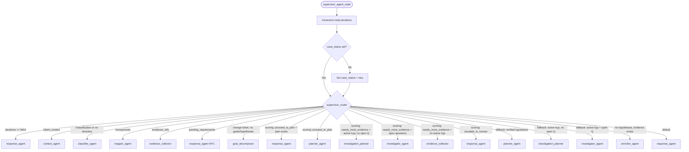

# Supervisor Agent

> Deterministic entry point and router for the LangGraph pipeline; directs state to the correct next agent without LLM calls.

## Overview

The supervisor is the first node executed on every iteration of the pipeline. It increments the iteration counter, initializes `case_status` to `"new"` on the first pass, and then yields control to the router.

The router (`supervisor_router`) is a pure conditional-edge function. It inspects the current `GlobalState` and returns one of 13 possible next-node literals. Routing follows a strict priority order: safety limits first, then progressive pipeline stages (context, classification, mapping, evidence), then scoring-driven decisions, then fallback heuristics. No LLM is involved at any point.

The safety break ensures the pipeline terminates after `MAX_ITERATIONS` (15 in normal mode, 8 when `TEST_MODE_FAST` is enabled), preventing infinite loops regardless of downstream agent behavior.

## When Called

Entry point — always the first node executed. The supervisor is not conditionally routed to; it is the graph's `set_entry_point`. Every iteration of the pipeline starts here.

```python
workflow.set_entry_point("supervisor")
```

Return: Conditional edges to all 12 agents + END.

## Flow Diagram



## Input / Output Contract

### Input (read from `GlobalState`)

| Field | Type | Source |
|---|---|---|
| `meta` | `Dict` | Previous iteration state |
| `scoring` | `ScoringResult` | Scoring agent |
| `case_status` | `CaseStatus` | Any prior agent |
| `client_context` | `ClientContext` | Context agent |
| `classification` | `Classification` | Classifier agent |
| `components` | `List[Component]` | Mapper agent |
| `evidence_refs` | `List[EvidenceSnapshot]` | Evidence collector / Investigator |
| `pending_requirements` | `List[PendingRequirement]` | Evidence collector |
| `ticket` | `Ticket` | Ingestion layer |
| `fulfillment_goals` | `List[FulfillmentGoal]` | Goal decomposer |
| `hypotheses` | `List[Hypothesis]` | Hypothesis agent |
| `open_questions` | `List[OpenQuestion]` | Investigation planner |
| `plan` | `ResolutionPlan` | Resolution planner |

### Input Example

```json
{
  "meta": { "iterations": 3 },
  "scoring": { "decision": "needs_more_evidence", "confidence": 0.45 },
  "hypotheses": [{ "id": "h1", "status": "verifying", "rank": 1 }],
  "open_questions": [{ "id": "q1", "status": "open" }]
}
```

### Output (written to `GlobalState`)

| Field | Type | Description |
|---|---|---|
| `meta.iterations` | `int` | Incremented iteration counter |
| `case_status` | `CaseStatus` | Set to `"new"` on first pass only |

### Output Example

```json
{
  "meta": { "iterations": 4 },
  "case_status": "new"
}
```

Note: `case_status` is only set on the first iteration.

### Where Output Goes

`meta.iterations` is consumed by the [Supervisor](supervisor.md) itself on subsequent passes for safety-break evaluation. `case_status` initializes the lifecycle and is read by all downstream agents.

## Configuration

| Variable | Default | Description |
|---|---|---|
| `TEST_MODE_FAST` | `false` | When `true`, reduces `MAX_ITERATIONS` from 15 to 8 |
| `MAX_ITERATIONS` | 15 (or 8) | Hard ceiling on pipeline iterations before forced exit |

## Key Implementation Details

- Routing is fully deterministic; no LLM calls, no randomness.
- Priority order matters: earlier conditions short-circuit later ones.
- The `scoring.decision` field drives the core investigation loop once scoring exists.
- Supports both `ScoringResult` objects and plain dicts (for JSON-resumed state).
- Active hypotheses are those with `status in ("proposed", "verifying")`.
- Change/request tickets are routed to `goal_decomposer` instead of hypothesis generation when no goals or hypotheses exist yet.
- The fallback block (priorities 14-16) handles the first iteration before any scoring result is available.

## See Also

- [agents/README.md](README.md)
- [agents/scoring.md](scoring.md)
- [architecture/data_layer.md](../../architecture/data_layer.md)
