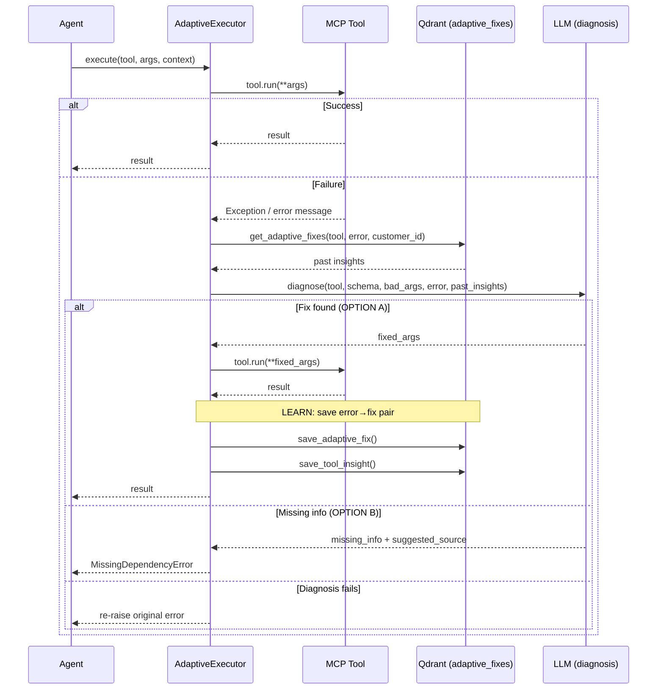

> **LEGACY DOCUMENT.** Describes the retired 13-agent pipeline (gated behind
> `PIPELINE_MODE=pipeline`; also run unconditionally by `main.py test` and
> `run_mock.py`). The current architecture is documented in
> [overview](../../architecture/overview.md) and [components](../../architecture/components.md).

# Adaptive Execution

> Self-healing tool execution with knowledge retrieval, auto-diagnosis, and continuous learning.

## Overview

The `AdaptiveExecutor` (`src/core/adaptive_executor.py`) wraps all MCP tool calls with a retry-and-learn loop. When a tool call fails, the executor queries the vector DB for past successful fixes, asks an LLM to diagnose the failure, and retries with corrected arguments. Successful recoveries are persisted back to the vector DB for future use.

This creates a learning loop: each tenant's tool usage patterns improve over time as error→fix pairs accumulate.

## Flow Diagram

## Execution Loop

1. **Execute**: Call the MCP tool with provided arguments
2. **Soft failure detection**: If the tool returns a short string containing "error", "fail", "invalid", or "unknown", treat it as a failure
3. **Retry limit**: Normal mode allows 2 retries; `TEST_MODE_FAST` allows 1
4. **Diagnose**: On failure, the executor:
   - Queries Qdrant `adaptive_fixes` collection for past fixes matching this tool + error pattern (tenant-scoped)
   - Sends the error, tool schema, bad args, context, and past insights to the LLM
   - LLM returns either fixed arguments (OPTION A) or a missing info signal (OPTION B)
5. **Learn**: If retry succeeds, the executor persists the error→fix pair to both `tool_knowledge` and `adaptive_fixes` collections

## Diagnosis Prompt

The LLM diagnosis follows strict grounding rules:
- **No fabrication**: Parameters must come from known sources (ticket, inventory, previous tool outputs)
- **Provenance required**: Every parameter value must have a traceable origin
- **Semantic type checking**: Identifiers (e.g., "asset:fw01") must be resolved to actual values (e.g., "192.168.1.1")
- **OPTION B (missing info)**: If the LLM cannot ground a parameter, it returns a `missing_info` signal instead of guessing

Sources of truth (ordered):
1. Current case payload / user-provided facts
2. Client inventory (CMDB snapshot)
3. Previous tool outputs from this case
4. Deterministic derivations from 1-3
5. Discovery via dedicated read-only tools

## MissingDependencyError

When the LLM determines that a parameter cannot be grounded, it returns OPTION B. The executor raises `MissingDependencyError(dependencies, suggested_source)`, which bubbles up to the Evidence Collector or Investigator. These agents convert it to a `PendingRequirement` that pauses the pipeline for human input.

## Input / Output Contract

| Field | Type | Description |
|---|---|---|
| `tool` | `MCPToolInterface` | The MCP tool to execute |
| `args` | `Dict[str, Any]` | Tool arguments |
| `context` | `str` | Case context for diagnosis (ticket text, component info) |
| **Returns** | `str` | Tool output on success |
| **Raises** | `MissingDependencyError` | When parameter cannot be grounded |
| **Raises** | `Exception` | When max retries exceeded |

## Configuration

| Parameter | Default | Description |
|---|---|---|
| `max_retries` | 2 (normal) / 1 (fast) | Retry attempts per tool call |
| LLM model | `LLM_MODEL_HYPOTHESIS` | Model used for diagnosis |
| `customer_id` | required | Tenant scope for Qdrant queries |

## Key Implementation Details

- Source: `src/core/adaptive_executor.py`
- Qdrant collections used: `adaptive_fixes` (error→fix pairs), `tool_knowledge` (general insights)
- Learning: `_learn_from_recovery()` asks LLM to summarize the fix as a one-sentence rule, then persists it
- Langfuse: Creates `tool:{name}` spans with input args and result length or error
- JSON parsing: Robust cleanup for LLM output (strips markdown fences, fixes trailing commas)
- Tenant-scoped: All Qdrant queries and persisted fixes are filtered by `customer_id`

## See Also

- [Evidence Collector](../agents/evidence_collector.md) - Primary consumer of AdaptiveExecutor
- [Investigator](../agents/investigator.md) - Also uses AdaptiveExecutor for verification
- [Safety and Governance](../../architecture/safety_and_governance.md) - Tool safety layers
- [Data Layer](../../architecture/data_layer.md) - Qdrant collections for adaptive fixes
